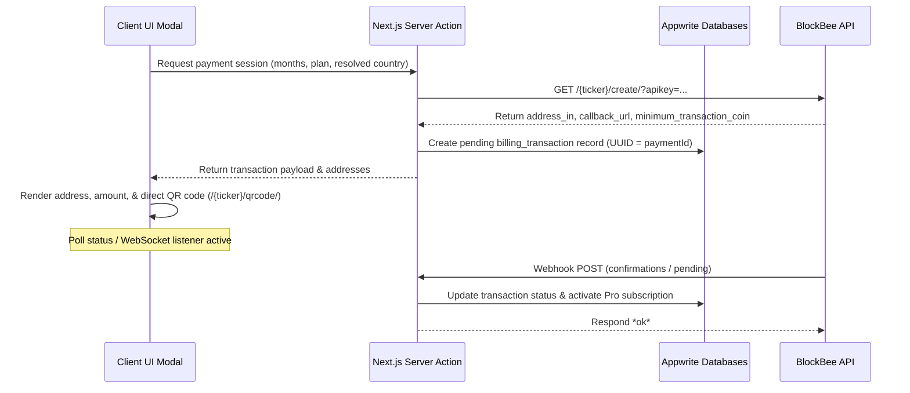

# BlockBee Custom Payment Flow Integration Guide

> **Status: RETIRED for Pro/Teams billing.** Production checkout uses **BlockBee Hosted Checkout** — see `.agents/skills/blockbee.hosted-checkout/SKILL.md` and `ARCHITECTURE.md` § VII.A. This document is kept for historical context only.

Procedural specification for constructing a fully in-app, multi-chain cryptocurrency payment experience. 

## Architectural Protocol

### Security Directives
1. **Webhook Signature Verification**: Never accept webhooks blindly. Match request signatures against BlockBee public keys.
2. **Strict Callback Mappings**: Include the custom parameter `?order_id=UUID` in the callback URL to map incoming confirmations to unique Appwrite transaction IDs.
3. **Volatility & Expiration**: Display a 10-minute payment countdown window. Cancel the local session if unpaid to clear memory mappings.
4. **Limits Validation**: Query `/{ticker}/info/` and validate that the converted crypto total remains strictly above `minimum_transaction_coin`.
