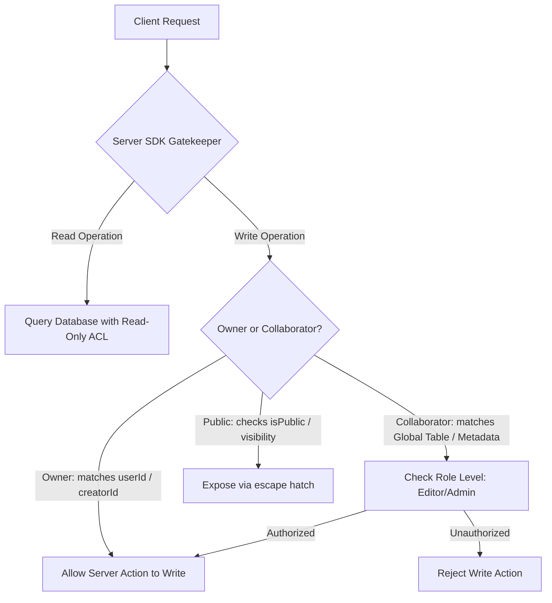

# Why: Read-Only Database RLS & Server-Side Security Gates

To prevent clients from bypassing business rules and modifying data directly, Kylrix enforces a strict **Read-Only Database Permission Boundary**. 

At the database level, no user (including the owner) is ever granted `create`, `update`, or `delete` permissions. The database only allows `read` access. The Server SDK acts as the sole gatekeeper for all write operations.

---

## 1. The Core Security Principles



### A. The Read-Only Database ACL Rule
Database-level permissions are locked down. For any row, the owner and collaborators receive **only `read` access**:

```typescript
// Example: Creating a note with read-only permissions on the database
await databases.createRow(
  databaseId, 
  tableId, 
  rowId, 
  payload, 
  [
    Permission.read(Role.user(ownerId)),
    ...collaboratorIds.map(id => Permission.read(Role.user(id)))
  ]
);
```

### B. Prevention of Client SDK Havoc
By yanking `create`, `update`, and `delete` permissions from database schemas:
- A malicious user with browser console access cannot call `databases.updateRow` or `databases.deleteRow` directly.
- The client SDK is mathematically prevented from bypassing business rules. All mutations must go through **Server-Side Secure Actions**, ensuring granular validation.

---

## 2. Dynamic Server-Side Escalation

Since everyone has the same `read` permission on the database level, how does the system distinguish the owner from collaborators?

### A. Owner Verification (`userId` or `creatorId`)
The Server SDK queries the row using elevated credentials and dynamically checks the owner column (`userId` or `creatorId` in ghost note discussions). If it matches the active `actorId`, the server executes the mutation:

```typescript
export async function updateNoteSecure(noteId: string, data: any, jwt: string) {
  const actor = await getActor(jwt);
  const adminTables = createSystemTablesDB();
  
  const note = await adminTables.getRow({ databaseId, tableId, rowId: noteId });
  
  // Owner validation
  if (note.userId !== actor.$id) {
    throw new Error('Forbidden: Only the owner can mutate this resource.');
  }
  
  // Safe mutation via Admin execution context
  await adminTables.updateRow({ databaseId, tableId, rowId: noteId, data });
}
```

### B. Collaborator Role Resolution (Viewer vs. Editor vs. Admin)
To support different access levels (e.g. read-only viewers, read-write editors, group admins) without granting direct database write access, the system checks the **Global Collaborators Table** (or `metadata.collaborators` dictionary):

```typescript
const isAuthorized = await (async () => {
  if (note.userId === actor.$id) return true; // Owner has full access
  
  // 1. Resolve collaborator role
  const collaboratorsMap = note.metadata?.collaborators || {};
  const roleLevel = collaboratorsMap[actor.$id]; // 'viewer' | 'editor' | 'admin'
  
  if (roleLevel === 'editor' || roleLevel === 'admin') {
    return true; // Dynamic write escalation
  }
  
  // 2. Query fallback: check the Polymorphic Collaborators Table
  const collabRows = await adminTables.listRows({
    databaseId: FLOW_DB,
    tableId: 'Collaborators',
    queries: [Query.equal('resourceId', noteId), Query.equal('userId', actor.$id)]
  });
  
  if (collabRows.total > 0) {
    const role = collabRows.rows[0].role;
    if (role === 'editor' || role === 'admin') return true;
  }
  
  return false;
})();
```

---

## 3. Strict Ban on `Role.any()` Read (The Scraping Exploit)

A common architectural mistake is slapping `Permission.read(Role.any())` on "public" assets.

### Why `Role.any()` is Banned:
In many backend architectures, any client can iterate over standard numeric or UUID primary keys using the client SDK. If `Role.any()` read permissions are configured on rows, a malicious script running in a browser can scrape the entire database, leaking private public-marked documents of every user in the ecosystem.

### The Escape Hatch: `isPublic` / `visibility = 'public'`
We solve this by keeping row database permissions strictly private. When an asset is marked public, we store it as a column value (`isPublic: true` or `visibility: 'public'`) **without modifying the database-level ACL permissions**.

The Server SDK queries this column as an explicit escape hatch to expose the row safely:

```typescript
export async function getPublicResource(rowId: string) {
  const adminTables = createSystemTablesDB();
  const row = await adminTables.getRow({ databaseId, tableId, rowId });
  
  // Server-side escape hatch
  if (row.isPublic === true || row.visibility === 'public') {
    return sanitizeOutput(row);
  }
  
  throw new Error('Unauthorized');
}
```

This hybrid model combines performance and absolute privacy, protecting the ecosystem from data scraping exploits.
