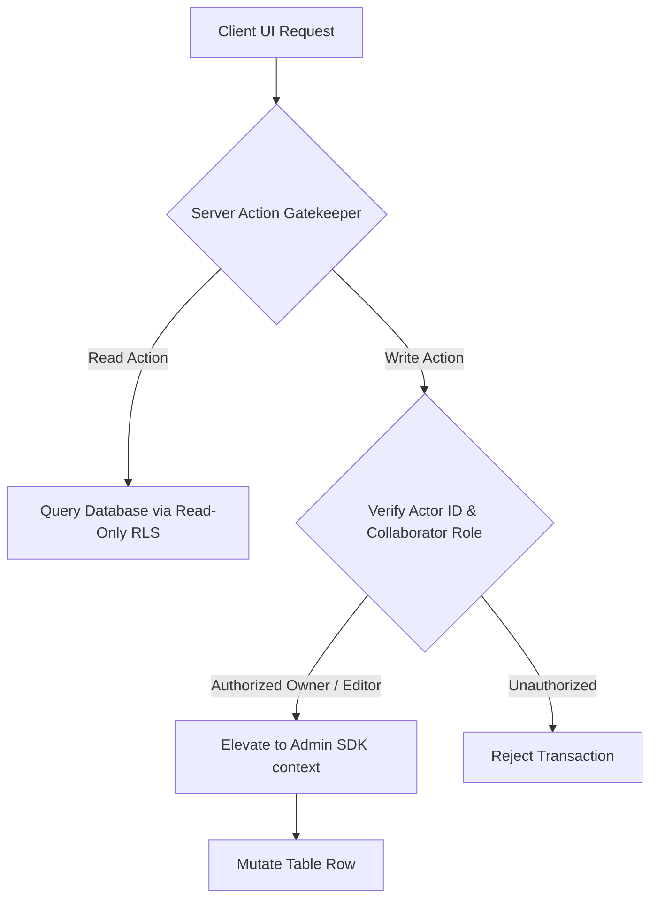

# Kylrix System Architecture & Unified Manifest 🏴

This blueprint serves as the single, authoritative architectural guide and features manifest for the Kylrix ecosystem. It defines the core security boundaries, cryptographic protocols, data infrastructure models, and execution flows within the codebase. It acts as an active conceptual ingest for engineers and agentic AI systems to understand the codebase's mechanics, synergies, and future expansion paths.

---

## 🏗️ Core Architectural Mandates & Design Patterns

All operations in the Kylrix ecosystem must adhere to four foundational architectural paradigms:

1.  **Web Ecosystem Security Protocol (WESP)**: We mathematically isolate active keys and decryption contexts in ephemeral, tab-scoped RAM. We enforce a zero-leak policy; no key material ever touches the database in plaintext, and all product chrome avoids opaque or solid gradients to maintain visual velocity.
2.  **Cascading-on-Demand (CoD) CRUD & Data Nexus**: A hybrid offline-first design. We aggressively minimize remote database reads using a high-performance in-memory and `localStorage` caching layer (Data Nexus). Any write operations asynchronously escalate privileges server-side while keeping the client snappier than traditional SPAs.
3.  **Global Unmount & Portal Containment**: To prevent hidden DOM trees from capturing mouse clicks or causing layout thrashing, all overlays, drawers, and sidebars are physically unmounted from the DOM when closed (`{isOpen && <Component />}`). We disable standard portal extraction (`disablePortal: true`) to keep components contextually native.
4.  **Least Privilege & Sovereign Data Control**: Database tables are configured with read-only RLS default policies. Client-side SDK calls cannot modify records directly. All modifications are routed through verified Server Actions which perform server-side verification before executing mutations via the Admin SDK context.

---

## I. CORE PLATFORM & SECURITY SUBSTRATE



### 1. Master Encryption Key (MEK) & PBKDF2 Stretching
The root cryptographic authority in Kylrix is the **Master Encryption Key (MEK)**. 
- **Generation**: A cryptographically secure 256-bit symmetric key generated locally using `window.crypto.subtle.generateKey` inside `lib/masterpass-crypto.ts`.
- **Zero-Knowledge RAM Isolation**: The raw MEK is never written to disk (`localStorage`, `sessionStorage`, or cookies). It lives exclusively in volatile, tab-scoped JavaScript memory and is lost instantly upon page close or tab termination.
- **Key Stretching**: The user's master password undergoes key stretching via PBKDF2 with **600,000 iterations** of HMAC-SHA-256 to derive the **Key Encryption Key (KEK)**. The KEK is used to wrap/unwrap the MEK envelope before syncing it with Appwrite user preferences. This computational cost prevents hardware-accelerated brute-force attacks on compromised envelopes.
- **Argon2id Double-Lock**: Modern vaults stretch the PBKDF2 key further through WebAssembly-compiled Argon2id (Memory: 64MB, Iterations: 3, Parallelism: 4) before unlocking the MEK.
- **PIN Piggybacking Deprecation**: Earlier iterations utilized temporary PIN-derived key wrappers. To mathematically prevent account lockouts and protect against memory-dumper exploits, **PIN logins are completely removed and prohibited** in favor of biometric WebAuthn credentials and temporal Sudo validation gates.

### 2. Row-Level Security (RLS) & Write Escalation
Kylrix operates a zero-trust database permission model:
- **Strict Read-Only Database ACL**: Appwrite database tables enforce read-only policies. Standard user sessions cannot write, update, or delete rows directly from the client.
- **Server Action Escalation**: All database mutations must go through Next.js Server Actions (defined inside `lib/actions/secure-ops.ts`). The Server SDK parses the caller's JWT to authenticate the `actorId`, verifies ownership or collaborator roles against the global collaborators database or row metadata, and dynamically executes writes using the elevated Admin SDK.
- **Appwrite Server Client Factory (`createServerClient`)**: To prevent scattered environment variable access and duplicated cookies/session parsing boilerplate across server routes, all user-scoped server-side operations utilize a centralized client factory (`lib/appwrite/server.ts`). It automates cookies discovery (`a_session_projectId`, `session`, etc.) to propagate user sessions, parses authorization headers (Bearer JWT) for stateless cross-origin operations, and wraps the client constructor under React's `cache` to prevent redundant network handshakes and duplicate instantiations within a single request context.

- **Ban on `Role.any()` Public Reads & The Universal Guest Rule**: Slapping `Role.any()` on public assets enables scraping attacks. To prevent database scraping, public visibility is governed by an `isPublic: true` column value. The Row's ACL permissions remain private, and the Server SDK exposes the row through an explicit server-side escape hatch after sanitizing output. Furthermore, **by default, taking a resource public automatically and simultaneously toggles `isGuest: true` in the database**. This establishes a global ecosystem mandate that all public resources inherently allow guest viewership without requiring separate manual configuration.
- **Next.js React Taint Security Boundary**: To prevent high-privilege credentials and system client objects from leaking to the client via Server Actions, the experimental React Taint API is globally enabled (`taint: true` in `next.config.js`). High-privilege API keys (e.g. `APPWRITE_API`, `BLOCKBEE_API`, `CLOUDFLARE_API`, `GOOGLE_API_KEY`, `TELEGRAM_BOT_API`) are registered under `experimental_taintUniqueValue` on server startup. Elevated executor clients and database proxies (`cachedSystemClient`, `adminClient`, `adminTablesDB`, `cachedSystemTablesDB`) are bound under `experimental_taintObjectReference`. If any Server Action or Server Component attempts to serialize and transmit these secrets to a client component, React instantly throws a boundary violation error at runtime, mathematically preventing credential leaks.
- **Dual-Factor Admin-Level Access Guarantee**: Admin-level Server Actions utilized in the `/admin` console and subroutes (e.g. `getAdminStatsAction`, `getAdminUsersAction`, `listCouponsAction`, `createCouponAction`, `sendAdminEmailsAction`) are mathematically gated at both the routing and SDK client levels. The callers are validated by executing a server-side authentication fetch against Appwrite's `/account` endpoint. The `createAdminClient(actorEmail)` and `createAdminTablesDB(actorEmail)` helper functions mandate a non-empty `actorEmail: string` and instantly throw an access exception if the email is not explicitly present in the comma-separated `ADMINS` environment variable. This ensures complete immunity against privilege-escalation bypasses.

### 3. Temporal MFA & Sudo Gates
- **Session Alignment Check**: To prevent session hijacking where an attacker bypasses MFA on a session created before MFA was enabled, `lib/mfa-session.ts` verifies that the `mfaUpdatedAt` timestamp is greater than or equal to the session's `$createdAt` timestamp.
- **Sudo Mode Gate**: High-risk actions (e.g. master password change, database wipe, full JSON export) require the user to re-enter their master credentials. Upon validation, the client enters a temporal Sudo Mode window lasting exactly **5 minutes** (stored as an in-memory timestamp in `context/SudoContext.tsx`). The Sudo token is strictly non-persistent and cannot be cached.

---

## II. HYBRID DATA INFRASTRUCTURE

### 1. Data Nexus Local Caching (3-Tier Hierarchy)
To achieve snappiness and eliminate the "thundering herd" network problem on page load, `context/DataNexusContext.tsx` establishes a **3-tier caching hierarchy**:
1. **Tier 1 — In-Memory Map Ref**: Ephemeral JavaScript `Map` for instant reads within the current tab session.
2. **Tier 2 — RxDB (IndexedDB)**: Persistent local database via `lib/webrtc/RxDBManager.ts`. Creates `kylrix_nexus_db_v2` with 6 collections (`notes`, `tags`, `tasks`, `forms`, `events`, `cache`). Uses the CRDT plugin for conflict-free replication. Legacy `localStorage` keys are auto-migrated to RxDB on cold start.
3. **Tier 3 — Appwrite Network**: Remote fetch only when Tier 1 and Tier 2 miss.
- **Deduplication**: Merges concurrent identical in-flight promises into a single request, executing a single network fetch and distributing the resolved data to all waiting widgets.
- **Temporal TTL**: Caches read-only queries with customizable time-to-live parameters, serving data instantly from local cache while fetching fresh updates in the background.
- **SimpleListCache**: A secondary named TTL cache (`lib/services/list-cache.ts`) provides per-list deduplication and debounce on force-refresh, used alongside the primary Data Nexus for high-frequency list views.

### 2. RxDB CRDT Replication Layer
The offline-first architecture uses RxDB with the CRDT plugin to replicate data between the local IndexedDB substrate and Appwrite:
- **Replication Engine**: `lib/services/collaboration.ts` uses `replicateRxCollection` for bidirectional Appwrite-to-RxDB CRDT replication. Pull/push handlers are defined in `lib/actions/secure-ops.ts` (lines ~1380-1422).
- **Collaborative Notes**: `hooks/useCollaborativeNote.ts` implements character-level CRDT sync, enabling multiple users to edit the same note concurrently without conflicts.
- **Cold-Start Hydration**: Both `context/NotesContext.tsx` and `context/TaskContext.tsx` hydrate from the RxDB substrate on page load before hitting the network, providing instant offline-accessible state.
- **Auth-Triggered Sync**: `context/auth/AuthContext.tsx` triggers RxDB replication re-initialization upon successful authentication.

### 3. Client SDK Proxy Write Interception
A critical but invisible architectural pattern in `lib/appwrite/client.ts`: all client-side database mutation calls (`createRow`, `updateRow`, `deleteRow`, `listRows` on `databases` and `tablesDB`) are intercepted via JavaScript `Proxy` and silently redirected through Server Actions (`createRowSecure`, etc.) via dynamic `import()`. This means client code writes naturally against the Appwrite SDK interface, but all mutations automatically route through the verified Server Action layer without the caller knowing. This enforces the Least Privilege mandate transparently.

### 4. Localized Draft Autosaves
Accidental page refreshes or network drops do not result in data loss. The drafts system inside `lib/services/drafts.ts` uses the **RxDB substrate** (not just localStorage) for persistent draft storage:
- **Draft Manifest**: A lightweight map (`kylrix_flow_drafts_manifest`) containing only draft IDs, titles, and update times.
- **Draft Content**: Full JSON draft states cached under unique keys in RxDB/IndexedDB.
- **SSR Safety**: All storage calls are wrapped in runtime guards (`typeof window === 'undefined'`) to prevent server-side rendering crashes during Next.js hydration.

### 5. KylrixPulse Session Cookie
`lib/appwrite/client.ts` implements a `KylrixPulse` cookie-based session hint mechanism. This lightweight cookie signals authentication state to the middleware and client-side routing logic without exposing session tokens. The middleware reads `kylrix_pulse_v2` and `a_session_*` cookies to detect authenticated sessions and route users to their last active path.

### 6. Multi-Layer User Cache
`getCurrentUser` in `lib/appwrite/client.ts` implements a 3-layer user resolution strategy:
1. **In-memory pointer** (instant, zero-latency).
2. **localStorage snapshot** (survives page refresh, hydrated on cold start).
3. **Network fetch with 30s TTL** (fallback, with promise deduplication to prevent thundering herds).
This ensures the user identity is always available instantly without redundant network calls.

---

## III. SDK ABSTRACTION LAYER

The codebase implements a modular SDK facade (`lib/sdk/`, 48 files) that wraps all core services into testable, isolated modules. This layer sits between the UI components and the raw service/action implementations.

- **Domain Modules**: `vault.ts`, `flow.ts`, `connect.ts`, `note.ts`, `social.ts`, `messaging/`, `calls/`, `huddles/`, `wallet/`, `identity/`.
- **Security SDK**: `lib/sdk/security/` — master password operations, passkey management.
- **Token SDK**: `lib/sdk/token/` — token contract, client, operations for the in-app economy.
- **UI SDK**: `lib/sdk/design/`, `lib/sdk/topbar/`, `lib/sdk/bottombar/`, `lib/sdk/fab/` — design system and chrome component abstractions.
- **Infrastructure SDK**: `lib/sdk/appwrite/`, `lib/sdk/ecosystem/`, `lib/sdk/api/`, `lib/sdk/routing/`.
- **Cross-Cutting SDK**: `lib/sdk/crosslinks/`, `lib/sdk/extensions/`, `lib/sdk/orchestration/`, `lib/sdk/forward/`.
- **Testing**: Each SDK module has co-located `.test.ts` files (14 total). The `vitest.config.ts` targets `lib/sdk/**` and `utils/**` with 85% statement/function/line thresholds and 80% branch coverage.

---

## IV. MIDDLEWARE DEFENSE MECHANISMS

`middleware.ts` (158 lines) implements multiple defense layers beyond simple auth routing:

1. **Reload Storm Defense**: Cookie-based `k_rld` counter tracks rapid page reloads. If 30 reloads occur within a 5-second window, the middleware returns a `429` status with an HTML retry page and `Retry-After` header. Prevents accidental or malicious reload floods.
2. **Redirect Loop Circuit Breaker**: Cookie-based `_rd` parameter counter detects chained redirects. If 5 consecutive redirects are detected, the circuit breaks and returns the user to the root path, preventing infinite redirect loops.
3. **Legacy Route Migration**: Permanent 301 redirects for deprecated URL patterns: `/note/notes/*` → `/note/*`, `/vault/dashboard/*` → `/vault/*`, `/flow/tasks/*` and `/flow/goals/*` → `/flow/*`.
4. **Authenticated Session Detection**: Reads `kylrix_pulse_v2` cookie and `a_session_*` cookies to determine auth state. Authenticated users are routed to their last active path (stored in a cookie); unauthenticated users stay on the current route.
5. **Static Asset Bypass**: Skips middleware processing for `/_next`, `/api`, `/favicon`, and files with extensions.

---

## V. APPWRITE FUNCTIONS ECOSYSTEM

16 Appwrite serverless functions handle background jobs, cleanup, notifications, and orchestration:

| Function | Purpose |
|---|---|
| `ghost-cleanup` | Daily automated purge of expired Ghost Notes (7-day lifecycle), cascading to storage files, comments, reactions, and voice files. |
| `flow-agent-orchestrator` | AI agent task orchestration with guardrail integration and context aggregation. |
| `agent-action-guardrail` | Safety gate for AI agent actions — protects privileged tables, gates vault deletion, controls email spam. |
| `ecosystem-context-aggregator` | Fetches notes + tasks to build context payloads for AI operations. |
| `data-porter` | Full import/export function (1,269 lines) with Bitwarden support, V2 workspace format, batch processing, dedup, rate limiting, and security logging. |
| `permission-updater` | Grant/revoke ACL propagation, epoch rotation, ghost note pinning. |
| `notify-on-share` | Permission updates + push/email notifications on share events. |
| `sync-user-profile` | Profile creation and synchronization across tables, welcome email dispatch with HTML templates. |
| `connect-call-cleanup` | Stale call link cleanup and state reset. |
| `account-cleanup` | Multi-database scrubbing on user account deletion. |
| `notify-on-social-activity` | Message, follow, and reaction notification dispatch. |
| `search-users` | Directory search with authentication fallback. |
| `log-security-event` | Security audit trail and activity log entries. |
| `flow-event-sync` | Event invitation notifications and synchronization. |
| `sync-subscription-status` | Auth label synchronization and subscription activity notifications. |

---

## VI. INTERNAL RUNTIME JOBS SYSTEM

`app/api/internal/runtime-functions/route.ts` exposes a secret-protected HTTP endpoint for cron-triggered system jobs. Protected by `KYLRIX_INTERNAL_JOBS_SECRET` (minimum 32 characters) bearer authentication with timing-safe string comparison. Dispatches system jobs (ghost cleanup, subscription sync, etc.) on schedule.

---

## VII. SUBSCRIPTION & BILLING TIER SYSTEM

- **Tier Resolution**: `lib/subscription/tier-resolution.ts` normalizes subscription states across `FREE`, `PRO`, `TEAMS`, `ORG`, and `LIFETIME` tiers with expiry validation.
- **Pricing Engine**: `lib/subscription/ppp.ts` — fixed global USD pricing with a bundled yearly discount (see below). `calculateSubscriptionPrice` is the single canonical charge calculator for UI, BlockBee, and IPN verification.
- **Purchasing Power Parity (PPP)**: Geo multipliers are deprecated; pricing is a flat global rate surfaced through `SubscriptionContext`.
- **Payment Providers**: BlockBee (cryptocurrency via hosted checkout) and Stripe.
- **Entitlement Resolution**: `lib/services/internal/subscription-entitlement.ts` maps subscription tiers to feature entitlements.
- **Prefs Merging**: `lib/services/internal/subscription-prefs-merge.ts` merges subscription preferences across user profile updates.
- **UI Components**: `SubscriptionBadge` and `PaywallWrapper` gate premium features visually.
- **Coupon System**: Full coupon management with redemption limits in the admin console.

### VII.A. BlockBee Hosted Checkout (Current Architecture)

We **migrated from the BlockBee Custom Payment Flow** (`/{ticker}/create/` with in-app address + QR modals) to **BlockBee Hosted Checkout** (`GET https://api.blockbee.io/checkout/request/`). The legacy custom-flow spec remains in `.agents/skills/blockbee.custom-flow.md` for historical reference only.

#### Why hosted checkout

| Custom flow (retired for Pro billing) | Hosted checkout (current) |
|---|---|
| App renders per-chain address, QR, and minimum-coin math | BlockBee renders coin picker, address, and receipt |
| Client must poll status and handle chain volatility | User pays on `pay.blockbee.io`; we fulfill on IPN |
| More UI surface (`CryptoPaymentDrawer`, ticker selection) | One redirect; fewer moving parts at checkout time |
| Each chain integrated separately | BlockBee maintains supported assets centrally |

**Product rationale**: Pro/Teams checkout should be as fast as possible. The only in-app intercept before payment is **login** (auth drawer). After authentication, the user goes **straight to BlockBee** — no intermediate “you are about to pay” drawer.

#### Checkout flow (canonical)

```
/pricing (or /accounts/subscription/pro/checkout)
  → createBillingCheckoutSessionAction (billing.ts)
  → CryptoPaymentProvider.createCheckoutSession (crypto-provider.ts)
  → BlockBee returns payment_url
  → window.location.href = payment_url
  → user pays on BlockBee
  → POST IPN → /accounts/api/pro/notify
  → registerBlockBeePendingCheckout consumed; subscription stacked via meta.months
  → redirect_uri → https://www.kylrix.space/accounts/pro/success
```

**Auth gate on `/pricing`**: If the user is not logged in, cache checkout intent in `sessionStorage` (`kylrix_pricing_checkout_v1`), open the **Unified auth drawer** (`openUnified('login')`), then auto-resume checkout after session is established. Do **not** use `openIDMWindow` or popup windows for billing.

**Server entry points**:
- `app/(app)/(auth)/accounts/actions/billing.ts` — `createBillingCheckoutSessionAction` (primary)
- `app/(app)/(auth)/accounts/actions/checkout.ts` — thin wrapper delegating to billing for legacy callers
- `lib/billing/providers/crypto-provider.ts` — BlockBee API call
- `lib/services/internal/blockbee-pending-checkout.ts` — pending registry rows before IPN fulfillment

#### BlockBee URL whitelist & canonical origins

BlockBee dashboard URIs are **fixed production URLs** (not per-request localhost). Callback construction is centralized in `lib/billing/blockbee-urls.ts`:

| Purpose | Canonical URI |
|---|---|
| Notify / payout webhook | `https://www.kylrix.space/accounts/api/pro/notify` |
| Post-payment redirect | `https://www.kylrix.space/accounts/pro/success` |

**Rules learned from production bugs**:
1. **Never pass `window.location.origin` to BlockBee** — localhost is rejected as a malformed/unregistered redirect URI.
2. **Always append `/accounts`** when resolving from `NEXT_PUBLIC_APP_URL` (`https://www.kylrix.space` → `https://www.kylrix.space/accounts`). Omitting `/accounts` produced invalid paths like `/pro/success` instead of `/accounts/pro/success`.
3. **Use BlockBee’s hosted-checkout parameter names**: `redirect_url`, `notify_url`, `currency`, `post=1`. Do **not** use `return_url`, `cancel_url`, or ad-hoc `custom` fields from older integrations.
4. Query parameters on notify/redirect (e.g. `order_id`, `plan_id`, `months`) are allowed and echoed in IPN payloads for correlation.

Overrides: `BLOCKBEE_NOTIFY_URL`, `BLOCKBEE_REDIRECT_URL`, `BLOCKBEE_BILLING_BASE_URL`.

#### Yearly discount vs. subscription months (do not conflate)

Pricing uses a **10-for-12 bundle** per full year: pay for 10 months, receive 12.

- **Charged USD** (`calculateSubscriptionPrice` / `calculateTotalSubscriptionPrice`): e.g. 12 months → $100 Pro / $500 Teams.
- **Granted months** (`months` in notify URL, pending checkout metadata, `calculateStackedSubscriptionCredit`): still the **actual slider value** (12, 24, …).
- **Free months copy**: `getBundledFreeMonths(months)` → `floor(months / 12) * 2` (12 → 2 free, 24 → 4 free).

A common bug was charging `monthly × months` on BlockBee while the UI showed the discounted total. **All charge paths must call the same `ppp.ts` calculator** so BlockBee `value`, pending `expectedAmountUsd`, and IPN floor checks agree.

#### Appwrite row access on the server

Server-side billing rows (`billing_transactions`, pending checkout events) use **TablesDB row APIs**, not legacy `Databases` document methods.

- `createSystemTablesDB()` — direct TablesDB for new server code (see token minting in `kylrix-token.ts`).
- `createSystemClient().databases` — proxied in `lib/appwrite-admin.ts` so `listRows` / `createRow` / `getRow` delegate to TablesDB with positional args for older call sites.

Calling `target.listRows` on a raw `Databases` instance throws (`listRows is not a function`) and breaks checkout session persistence.

#### IPN security

- Route: `app/(app)/(auth)/accounts/api/pro/notify/route.ts`
- Verify webhook signatures (`lib/billing/blockbee-webhook-verify.ts`) unless `BLOCKBEE_ALLOW_UNSIGNED_WEBHOOKS=true` (dev only).
- Require a matching `blockbee-pending-checkout` registry row before fulfillment.
- Respond `*ok*` to stop retries; use `payment_id` idempotency locks.

---

## VIII. IN-APP TOKEN ECONOMY

A complete internal token ledger system powers merit-based distributions and micropayments:

- **Client Ledger**: `lib/services/token.ts` — balance tracking, transaction history, mint/burn/transfer operations.
- **Server Operations**: `lib/services/internal/kylrix-token.ts` (700 lines) — mint, transfer, fine, request operations with thermal scoring, risk escalation, and email notifications.
- **SDK Layer**: `lib/sdk/token/` — contract definitions, client abstraction, operation interfaces.
- **React Context**: `context/TokenOpsContext.tsx` — exposes `mint`, `send`, `request`, `fine` actions to the UI.
- **Thermal Scoring**: `lib/services/internal/thermal-score-service.ts` computes activity-based thermal scores with half-life decay, modulating token distribution rates.
- **Risk Levels**: Token operations are classified by risk level, with high-risk operations requiring additional verification.
- **Idempotency**: All token operations use idempotency keys to prevent double-spending on network retries.
- **Database Table**: `kylrix_token_ledger` stores append-only transaction records.

---

## IX. AI SUBSYSTEM

- **Context Provider**: `context/AIContext.tsx` — BYOK (Bring Your Own Key) manager, privacy filter, analysis modes, and `generateAIContent` Server Action integration.
- **Local Context Engine**: Builds context payloads from the user's notes, tasks, and vault metadata to ground AI responses.
- **Server Action**: `lib/actions/ai.ts` — server-side AI content generation with privacy sanitization.
- **Hooks**: `hooks/useAI.ts` — client-side AI interaction hook.
- **Agentic Layer**: `lib/services/agentic.ts` and `lib/actions/agentic.ts` — AI agent management and action execution.
- **Drawer Context**: `context/AgenticDrawerContext.tsx` — manages the AI agent drawer UI state.
- **Guardrails**: The `agent-action-guardrail` Appwrite function enforces safety boundaries on AI agent actions (privileged table protection, vault deletion gates, email spam control).

---

## X. ECOSYSTEM MESH PROTOCOL

`hooks/useEcosystemNode.ts` implements a `BroadcastChannel`-based inter-tab mesh network:
- **PULSE Heartbeats**: Each tab broadcasts periodic PULSE signals to announce its presence to sibling tabs.
- **Neighbor Health Tracking**: The mesh tracks which tabs are alive and their health status.
- **Global Lock Commands**: The mesh can broadcast lock/unlock commands across all tabs (connected to WESP).
- **Ecosystem Bridge**: `hooks/useEcosystemIntents.ts` parses URL intents (e.g., `create_task`) via `EcosystemBridge` to enable cross-tab action dispatching.

---

## XI. SERVICE WORKER VOLATILE CONTEXT

`public/sw.js` (v1.0.2) implements a specialized Service Worker for volatile cryptographic context preservation:
- **Zero-Interception Policy**: The SW does not intercept fetch requests — it exists solely for MEK context management.
- **Context Store/Recover/Wipe**: `hooks/useServiceWorker.ts` communicates with the SW via `postMessage` to store, recover, and wipe the volatile MEK context. This allows the MEK to survive page reloads within the same browser session without touching persistent storage.
- **Integration**: Used by `lib/masterpass-crypto.ts` for MEK context preservation during navigation.
- **No PWA Manifest**: The app does not use a `manifest.json` — this is not a full PWA.

---

## XII. PRESENCE & REAL-TIME SERVICE

`lib/services/presence.ts` implements real-time presence tracking via Appwrite Realtime subscriptions:
- **Typing Indicators**: Broadcasts typing start/stop events to conversation participants.
- **Focus Status**: Tracks which resource (note, task, project) a user is currently viewing.
- **Cursor Positions**: Supports collaborative cursor position sharing for concurrent editing.
- **App Activity**: `app_activity` table stores user online/offline status and current app location.
- **Live Call Reconciliation**: `lib/services/internal/live-call-presence-reconcile.ts` synchronizes call participant state with the presence system.

---

## XIII. ENGAGEMENT ANALYTICS ENGINE

A privacy-respecting analytics system tracks content engagement:
- **View Tracking**: `lib/services/internal/engagement-views.ts` records content views with fingerprinting, idempotency keys, and daily/monthly bucketing.
- **Signal Analysis**: `lib/services/internal/engagement-analyzer.ts` computes engagement signals: velocity, like-comment ratio, save rate, anomaly detection, and nerf coefficients.
- **Feed Ranking**: `lib/services/internal/feed-ranker.ts` uses engagement signals to rank Moment Feed content.
- **Database Tables**: `engagement_views` stores individual view records; `engagement_view_rollups` stores aggregated metrics.
- **Privacy**: Viewer identities are hashed (SHA-256 with salt) — no raw IP addresses or user agents are stored.

---

## XIV. NOTIFICATION DISPATCH SYSTEM

A multi-channel notification orchestration layer:
- **In-App**: `context/NotificationContext.tsx` with Appwrite Realtime subscription for live notification delivery.
- **Email**: `lib/unorganic-email-api.ts` (1,075 lines) — priority scoring (source + event priority → low/medium/high/critical), multi-layer anti-spam (rapid succession 10min block, token transfer rate limit 1/hr, project invite dedup 24hr, repeated action threshold 2/day), quota system (5 ordinary emails/month, 2/week; bypassed events: 3/week), in-memory `EmailQueueCache` for deduplication, HTML template builder with per-source themes.
- **Telegram**: `lib/services/internal/telegram-dispatch.ts` — push notifications via Telegram Bot API, bypassing Apple APNs and Google FCM.
- **Dispatcher**: `lib/services/internal/notification-dispatcher.ts` orchestrates channel selection and delivery.
- **Toast**: `react-hot-toast` library with `position="top-center"` and dark theme styling (`#161412` background), configured in `components/ClientToaster.tsx`.

---

## XV. INPUT VALIDATION LAYER

`lib/validations/schemas.ts` defines comprehensive Zod schemas for all Server Action inputs:
- **Core Schemas**: `IDSchema`, `DatabaseIDSchema`, `TableIDSchema`, `JWTSchema`, `CRUDParamsSchema`, `ListParamsSchema`.
- **Mutation Schemas**: `CreateRowSchema`, `UpdateRowSchema`, `MutatePermissionsSchema`.
- **Domain Schemas**: `NoteSchema`, `ProjectSchema`, `EventSchema`, `FormSchema`, `CallParamsSchema`, `DiscussionParamsSchema`, `ChatMessageSchema`, `ReactionSchema`, `JoinRequestSchema`.
- **Token Schemas**: `TokenOperationSchema`, `TelemetrySchema`.
- **Ephemeral Schemas**: `EphemeralNoteSchema`, `SuggestionParamsSchema`.
- **Usage**: Schemas validate inputs at Server Action boundaries before any database operations execute.

---

## XVI. UI/UX ARCHITECTURE

### 1. Layout Shell
`components/GlobalShell.tsx` orchestrates the primary application layout:
- **UnifiedLeftSidebar**: `components/UnifiedLeftSidebar.tsx` — primary left navigation with conditional visibility.
- **DynamicSidebar**: Context-driven right panel system (`DynamicSidebarContext`, `DynamicSidebarPanel`, `useDynamicSidebar` hook) that can host any component (NoteDetailSidebar, ProjectDiscussionSidebar, PinnedNotesSidebar, PostDetailSidebar, TaskDetails, etc.).
- **UnifiedBottomBar**: `components/UnifiedBottomBar.tsx` — mobile bottom navigation bar.
- **Responsive Breakpoints**: `showLeftSidebar` logic adapts layout for mobile/desktop.
- **CSS Containment**: Layout wrappers use `contain: layout size style` for rendering performance (`chrome.css`).

### 2. CSS Token System
- **globals.css**: Tailwind v4 `@theme` block defining CSS custom properties (`--color-background`, `--color-surface`, `--color-foreground`, font families). Includes UI mood variants (`body[data-ui-mood="focus"]`, `body[data-ui-mood="serious"]`).
- **chrome.css**: Layout containment rules (`.kylrix-sidebar`, `.kylrix-topbar`, `.kylrix-main-content`) with responsive padding, skeleton pulse animations (`.nexus-skeleton-pulse`), and static surface utilities.
- **Auth CSS**: `app/(app)/(auth)/accounts/globals.css` — auth-specific token set (`--color-void`, `--color-titanium`, `--color-electric`) and glass-panel styling.
- **brand.md**: Openbricks 2.0 design tokens (`--ob-shell`, `--ob-surface`, `--ob-border`), typography (Clash, Satoshi, mono), chrome rules (no transparent chrome, pure black shell, deep-ash surfaces).

### 3. Animation System
Framer Motion is used extensively (112+ usages) for:
- Entrance/exit animations on drawers, modals, and overlays.
- Scroll-driven parallax and section reveals on the landing page.
- Micro-interactions on UI chrome (DynamicIsland, Logo, status indicators).
- Reduced-motion awareness via `useReducedMotion()` hook — all animations gracefully degrade.

### 4. Error Boundaries
- `components/ui/ErrorBoundary.tsx` — Class-based `ErrorBoundary` with `getDerivedStateFromError` + `componentDidCatch`, custom fallback, retry, and error detail display. Exports `NotesErrorBoundary` and `AuthErrorBoundary`.
- `components/RouteErrorBoundary.tsx` — Route-level error UI with retry/reload buttons.
- `app/(app)/note/error.tsx` — Next.js App Router `error.tsx` for the note route with dev-only error details.
- **No global root-level `error.tsx`** exists — unhandled errors outside the note route will white-screen.

### 5. Loading & Suspense
- No `loading.tsx` files exist anywhere in the app directory tree.
- `<Suspense>` is used in 20+ locations with fallbacks: `null`, inline spinners (`animate-spin rounded-full`), and page-level centered spinners.
- `.nexus-skeleton-pulse` CSS class provides hardware-accelerated skeleton loading animations.

### 6. Toast Notifications
`react-hot-toast` (490+ usages) configured in `components/ClientToaster.tsx` with `position="top-center"` and dark theme styling. Used for `toast.success()`, `toast.error()`, `toast.loading()` across all modules.

### 7. Global Keyboard Shortcuts
`components/GlobalShortcuts.tsx` registers system-wide keyboard shortcuts:
- `Cmd/Ctrl + Space` — Open Ecosystem Portal.
- `Cmd/Ctrl + K` — Focus topbar search.
- `Cmd/Ctrl + N` — Create new note.
- `Cmd/Ctrl + /` or `Cmd/Ctrl + ?` — Open keyboard shortcuts dialog.
- `Cmd/Ctrl + Shift + S` — Drawer Spark-to-Ghost Relay Snapshot (Feature 56).
- `Ctrl + G` (in chat) — Ghost Note upgrade (Feature 44).
- Smart typing detection avoids interfering with input fields.
- `components/KeyboardShortcuts.tsx` — Dialog showing shortcuts organized by category, platform-aware (Mac/Windows key symbols).

### 8. Custom Error Pages
- `app/(app)/not-found.tsx` — Generic 404 with "Lost in the flow?" messaging.
- `app/(app)/vault/not-found.tsx` — Vault-specific 404.
- `app/(app)/note/not-found.tsx` — Animated "4🤔4" with floating decorative notes.
- `app/(app)/note/error.tsx` — Route-level error page with dev-only details.
- **Missing**: No global `error.tsx` or 500 page at the root app level.

### 9. SEO & Metadata
- **No `robots.ts`** or `sitemap.ts` exists.
- 12+ pages use `generateMetadata()` for dynamic SEO (notes, shared notes, events, goals, projects, forms, user profiles, posts, send links, privacy policy, terms of service).

### 10. Open Graph Image Generation
`lib/connect/moment-og.tsx` generates dynamic OG images for Moments using `next/og` `ImageResponse`. Renders branded cards with avatar, caption excerpt, and engagement stats.

---

## XVII. DUAL CRYPTOGRAPHIC LAYER

The codebase implements two distinct cryptographic layers:
1. **Client-Side (SubtleCrypto)**: `lib/masterpass-crypto.ts` — Web Crypto API for MEK generation, PBKDF2/Argon2id key stretching, AES-GCM encryption/decryption. Runs entirely in the browser.
2. **Server-Side (Node crypto)**: `lib/encryption/ghost-crypto.ts` — Node.js `crypto` module for server-side AES-256-GCM encryption of Ghost Notes and Send URLs. Functions: `encryptGhostData`, `decryptGhostData`, `encryptGhostBinaryToBytes`, `decryptGhostBinaryFromBytes`. URL-safe base64 key format.
3. **Hybrid RSA Module**: `lib/encryption/crypto.ts` — RSA-4096 + AES-256-GCM hybrid encryption for note-level encryption. Contains stubs for Shamir's Secret Sharing (`generateKeyShares`, `reconstructKey`) and PBKDF2 derivation (`deriveKey`) that are not yet implemented and not called from any code path.

---

## XVIII. APPWRITE CLIENT FACTORY ARCHITECTURE

### Server Client (`lib/appwrite/server.ts`)
Centralized server-side Appwrite client factory using React's `cache()` for request-scoped deduplication. Cookie discovery iterates 4 fallback cookie names (`a_session_${projectId}`, `session`, etc.) to propagate user sessions. JWT propagation via `Authorization: Bearer` headers for stateless cross-origin operations.

### Admin Client (`createAdminClient`, `createAdminTablesDB`)
Elevated-privilege clients that mandate a non-empty `actorEmail` parameter. Instantly throw if the email is not in the `ADMINS` environment variable. Used exclusively by admin console Server Actions.

### Configuration Hub (`lib/appwrite/config.ts`)
Central registry of all database IDs, table IDs, bucket IDs, and function IDs. Under the **Single Database Mandate**, all tables across all platform workloads (such as `compute_balances`, `compute_ledger`, `notes`, `tasks`, etc.) reside within a single consolidated database ID: `passwordManagerDb`. Direct hardcoding of alternative database IDs (e.g. `whisperrflow`) is strictly prohibited.

### Keychain Service (`lib/appwrite/keychain.ts`)
`KeychainService` with deduplication guard that blocks duplicate master password entries, preventing keychain bloat from repeated setup calls.

### Discovery Engine Migration (`lib/appwrite/migrations/001-discovery-engine.ts`)
Database migration system for `system_pulse` metrics substrate.

---

## XIX. THE UNIFIED APPS SUITE

The mono-app is partitioned into four core workspaces that share the centralized WESP and identity frameworks:

1.  **Kylrix Note**: A markdown-first knowledge base featuring Doodle Canvas sketches serialized directly to JSON, and ephemeral Ghost Notes subject to automatic 7-day recursive purges.
2.  **Kylrix Vault**: High-security login, credential, and TOTP key manager with client-side zero-knowledge shared key mapping tables.
3.  **Kylrix Flow**: Productive checklist, task, and ingestion form manager. Enforces a strict limit of 8 collaborators per resource on the free tier to protect against WebSocket lag and concurrency conflicts.
4.  **Kylrix Connect**: Secure messaging and P2P video/audio huddles. Live group calls are strictly capped at 16 concurrent members to prevent database read permission overhead and WebSocket performance degradation.

---

## XX. TECHNICAL STACK & INTERACTIVITY SAFETY

### 1. Technical Stack
- **Frontend Framework**: Next.js 16 (Turbopack), React 19, TypeScript.
- **BaaS Substrate**: Appwrite (Authentication, Database with Tables DB, Buckets, Functions, Realtime).
- **Styling & Theme**: Tailwind CSS 4 and Vanilla CSS. MUI and its co-dependencies are deprecated.
- **Package Management**: PNPM only.
- **Offline-First**: RxDB (with CRDT plugin) on Dexie/IndexedDB storage backend. RxJS for reactive streams.
- **Validation**: Zod 4 for input schema validation at Server Action boundaries.
- **Animation**: Framer Motion with reduced-motion awareness.
- **Notifications**: react-hot-toast for in-app toasts.
- **DnD**: @dnd-kit (core, sortable, modifiers, utilities) for drag-and-drop interactions.
- **Markdown**: marked + DOMPurify for safe markdown rendering.
- **WebAuthn**: @simplewebauthn/browser for biometric authentication.
- **Cryptography**: @noble/ed25519, @noble/hashes, @noble/secp256k1, @scure/base, @scure/bip32, @scure/bip39, hash-wasm.
- **Web3**: viem for EVM blockchain interactions.
- **AI**: @google/generative-ai for AI content generation.
- **Rate Limiting**: @upstash/ratelimit + @upstash/redis for server-side rate limiting.
- **Export**: html-to-image for visual exports.
- **Build**: `output: 'standalone'` for Docker-optimized builds. `experimental.taint: true` for React Taint API. `optimizePackageImports` for tree-shaking (lucide-react, lodash, date-fns). Webpack fallbacks disable client-side `crypto`, `fs`, `path`, `stream`.
- **License**: AGPL-3.0-or-later.

### 2. Stacking Context & Interactivity Safety
To prevent 'Non-Responsive UI' locks caused by hidden DOM structures capturing clicks:
- **Global Unmount Policy**: Closed drawers, modals, and sidebars are physically unmounted from the DOM (`{isOpen && <Component />}`). We disable standard portal extraction (`disablePortal: true`) to contain stacking contexts.
- **Pointer-Event Determinism**: Fixed-position layout wrappers use `pointer-events: none;` with interactive children explicitly using `pointer-events: auto;`.
- **Memoized Providers**: Global context values are wrapped inside `useMemo` with stable callback references to prevent massive re-render cascades in scrolling lists.

---

## XXI. VERIFIED DIRECTORY LAYOUT

- `app/`: Next.js App Router mapping path-based routes (e.g. `/note`, `/vault`, `/flow`, `/connect`, `/accounts`).
- `components/`: 80+ specialized React UI widgets and dashboard elements grouped by function (e.g. `tasks/`, `chat/`, `calendar/`, `call/`, `projects/`, `social/`, `send/`, `ai/`, `ui/`, `overlays/`, `layout/`, `onboarding/`).
- `context/`: 27+ centralized React Context providers coordinating state (e.g. `AuthContext.tsx`, `DataNexusContext.tsx`, `SudoContext.tsx`, `TaskContext.tsx`, `NotesContext.tsx`, `AIContext.tsx`, `TokenOpsContext.tsx`, `NotificationContext.tsx`).
- `hooks/`: 16 custom state helpers and listeners (e.g. `useAutosave.ts`, `useRealtimeTable.ts`, `useWebRTC.ts`, `useCollaborativeNote.ts`, `useServiceWorker.ts`, `useEcosystemNode.ts`, `useEcosystemIntents.ts`).
- `lib/`: Core service logic and server-side utilities:
  - `lib/actions/`: High-privilege Server Actions (e.g. `secure-ops.ts`, `cascade-delete.ts`, `telegram.ts`, `chat.ts`, `call.ts`, `workflows.ts`, `ai.ts`, `permissions.ts`).
  - `lib/appwrite/`: Client/server Appwrite SDK factories, configuration hub, keychain service, auth helpers, and database migrations.
  - `lib/sdk/`: 48-file modular SDK abstraction layer over all core services.
  - `lib/services/`: Domain services (social, chat, drafts, billing, forms, collaboration, presence, contacts, wallets, storage, telemetry, tokens, activity, ecosystem).
  - `lib/services/internal/`: Server-side internal services (admin, billing, chat, calls, telegram, join requests, engagement views/analyzers, notification dispatcher, token operations, thermal scoring, feed ranking, email dispatch, permissions).
  - `lib/encryption/`: Dual cryptographic layer — `masterpass-crypto.ts` (client-side SubtleCrypto), `ghost-crypto.ts` (server-side Node crypto), `crypto.ts` (RSA-4096 hybrid).
  - `lib/ecosystem/`: Centralized WESP security, broadcast channels, identity contexts, and nexus fetcher.
  - `lib/subscription/`: Subscription tier resolution, PPP pricing, entitlement management.
  - `lib/connect/`: Identity services and OG image generation.
  - `lib/validations/`: Zod schema library for Server Action input validation.
- `functions/`: 16 Appwrite serverless functions for background jobs, cleanup, notifications, and orchestration.
- `theme/`: Theme tokens and ThemeProvider.
- `public/`: Static brand assets, SVG illustrations, and Service Worker (`sw.js`).
- `selfhost/`: Self-hosting infrastructure (Caddyfile, setup wizard, health checks).
- `scripts/`: Maintenance and deployment scripts.
- `types/`: 9 TypeScript type definition files.
- `__tests__/`: Vitest test suite (14 test files targeting SDK layer).

---

## XXII. COMPLETE FEATURE MANIFEST & FLOW BLUEPRINTS

The following catalog provides a highly detailed engineering breakdown of the active features, cryptographic systems, and integrations within the Kylrix suite.

---

### I. CORE PLATFORM & SECURITY (WESP & CRYPTO SUBSTRATE)

#### 1. Master Encryption Key (MEK)
*   **Mechanics & Substrate**: Local-first symmetric key generation utilizing the Web Crypto API (`window.crypto.subtle.generateKey` with `{ name: 'AES-GCM', length: 256 }`). Implemented in `lib/masterpass-crypto.ts`.
*   **Zero-Knowledge Boundary**: Plaintext key material never touches persistent storage (`localStorage`, `sessionStorage`, cookies) or remote databases. It resides purely within a volatile, private JavaScript memory variable inside the `WespContext` / `AuthContext`.
*   **Acute Architectural Rationale**: Prevents any browser extension, XSS payload, or malicious script from retrieving the key via standard disk-scraping vectors.
*   **Vivid End-to-End Execution Flow**:
    1.  User enters credentials / registers account.
    2.  `generateMEK()` triggers on the client, spawning a cryptographically secure 256-bit symmetric key.
    3.  Key is kept as a local RAM variable in `WespSecurity` state.
    4.  All subsequent decryption processes pull this volatile pointer.
*   **Ecosystem Synergy**: Functions as the root cryptographic authority for all local-first decryption, including Notes, Passwords, and chat sessions.
*   **Next-Gen Optimizations**: Hardware-backed MEK protection utilizing WebAuthn PRF (Pseudo-Random Function) extension, deriving the key directly from physical security keys or biometric hardware.

#### 2. PBKDF2 Key Stretching
*   **Mechanics & Substrate**: Master password derivation using PBKDF2 (Password-Based Key Derivation Function 2) configured with **600,000 iterations** of HMAC-SHA-256. Located inside `lib/masterpass-crypto.ts`.
*   **Zero-Knowledge Boundary**: Only the KEK (Key Encryption Key) is utilized to wrap the MEK before syncing the encrypted envelope to Appwrite user preferences. The raw password is encrypted and never sent to the network.
*   **Acute Architectural Rationale**: The massive iteration count introduces a significant computational delay (approx. 300-500ms on modern client devices), making offline dictionary and GPU/ASIC-accelerated brute-force attacks mathematically prohibitive.
*   **Vivid End-to-End Execution Flow**:
    1.  User enters Master Password.
    2.  `deriveKEKfromPassword()` runs PBKDF2 with 600,000 rounds of HMAC-SHA-256 using the user's static salt.
    3.  A 256-bit Key Encryption Key (KEK) is yielded.
    4.  The KEK wraps the MEK to allow safe persistence of the encrypted key block.
*   **Ecosystem Synergy**: Provides the initial secure handshake to unlock the MEK during user session recovery.
*   **Next-Gen Optimizations**: Dynamic iteration scaling based on client-side benchmark tests on signup, automatically adjusting the workload to optimize derivation time on high-performance devices.

#### 3. Double-Lock Argon2id Upgrade
*   **Mechanics & Substrate**: Key stretching migration wrapper utilizing WebAssembly-compiled Argon2id (`Argon2id` parameters: Memory: 64MB, Iterations: 3, Parallelism: 4) integrated inside `lib/masterpass-crypto.ts` and `components/onboarding/AccountHealthDrawers.tsx`.
*   **Zero-Knowledge Boundary**: Modernizes older PBKDF2 vaults by shifting key derivation to client-side Argon2id. It establishes a hybrid "Double-Lock" wrapping mechanism where the PBKDF2-derived key is subsequently stretched through Argon2id parameters before unlocking the MEK.
*   **Acute Architectural Rationale**: PBKDF2 is susceptible to ASIC parallelization. Argon2id is a memory-hard algorithm, meaning it requires dedicated RAM memory blocks to execute, leveling the playing field against ASIC-driven database cracks.
*   **Vivid End-to-End Execution Flow**:
    1.  Vault checks its health status inside `AccountHealthDrawers.tsx`.
    2.  If marked as legacy, the Double-Lock upgrade triggers.
    3.  The PBKDF2 stretched key is piped into the WebAssembly Argon2id runner.
    4.  The output Argon2id key re-wraps the MEK envelope.
    5.  The updated metadata is written to the user profile row.
*   **Ecosystem Synergy**: Connects directly with onboarding health flags to execute seamless migrations in the background.
*   **Next-Gen Optimizations**: Autonomous background credential rotation where keys are safely re-wrapped with updated WASM Argon2id profiles upon successful temporal Sudo validations.

#### 4. Web Ecosystem Security Protocol (WESP)
*   **Mechanics & Substrate**: Memory-space isolation and cross-tab lock orchestration utilizing tab-specific, RAM-only variable allocations and strict broadcast channel locks (`BroadcastChannel` API). Implemented in `lib/ecosystem/security.ts`.
*   **Zero-Knowledge Boundary**: If a tab is duplicated, cloned, or if an unauthorized script attempts to hijack the execution loop, the broadcast channel triggers an immediate lock, erasing all raw key pointers.
*   **Acute Architectural Rationale**: Avoids opaque or solid gradients on product chrome frames, forcing elements to remain transparent/glassmorphic. This allows users to visually inspect and track stacking contexts to easily spot clickjacking overlays.
*   **Vivid End-to-End Execution Flow**:
    1.  User opens a secondary tab.
    2.  `BroadcastChannel('kylrix_wesp_lock')` initiates handshakes.
    3.  If an unauthenticated state or clone is detected, a lock event is broadcast.
    4.  All open tabs clear their internal MEK RAM-cache instantly.
*   **Ecosystem Synergy**: Acts as the system-wide security context that guards all sub-app secrets.
*   **Next-Gen Optimizations**: Tab isolation using Web Workers for cryptographic computations, separating the main UI rendering thread entirely from raw cryptographic memory space.

#### 5. Zero-Knowledge Data-at-Rest
*   **Mechanics & Substrate**: Field-level E2EE (End-to-End Encryption). All Vault objects (passwords, usernames, TOTP secrets, file payloads) are encrypted client-side using `AES-GCM` with a 96-bit random IV before being written to Appwrite. Located in `lib/actions/secure-ops.ts`.
*   **Zero-Knowledge Boundary**: Appwrite database administrators only see base64-encoded encrypted ciphertexts. Column mappings use `dek` (Row Encryption Key) envelopes. A distinct DEK is generated per item, encrypted with the MEK, and stored alongside the encrypted payload.
*   **Acute Architectural Rationale**: Ensures that even if the host servers or database tables are completely compromised, the attacker acquires zero usable customer data.
*   **Vivid End-to-End Execution Flow**:
    1.  User enters password inside `VaultForm`.
    2.  A unique DEK (Row Encryption Key) is generated.
    3.  The password payload is encrypted with the DEK via AES-GCM.
    4.  The DEK itself is encrypted with the user's MEK.
    5.  The encrypted payload and encrypted DEK are written as a Row to the Appwrite `Vault` Table.
*   **Ecosystem Synergy**: Provides the core security model for the Password Vault and Note repositories.
*   **Next-Gen Optimizations**: Multi-recipient sharing via E2EE key wrapping, where an item's DEK is duplicated and wrapped separately with other users' public X25519 keys.

#### 6. X25519 Identity Substrate
*   **Mechanics & Substrate**: Key pairs for secure ephemeral handshakes. Every user profile generates a persistent X25519 key pair via SubtleCrypto. Located in `lib/connect/identity.ts`.
*   **Zero-Knowledge Boundary**: The private X25519 key is encrypted with the MEK and cached locally, while the public key is published openly to the Connect Directory Table.
*   **Acute Architectural Rationale**: Enables participants in a chat thread or call to verify each other's identity and derive shared secrets without passing raw server keys.
*   **Vivid End-to-End Execution Flow**:
    1.  User registers or activates profile.
    2.  Client generates X25519 identity keypair.
    3.  Public key is pushed to the global `ConnectDirectory` Table.
    4.  Private key is encrypted with MEK and saved in the user's profile Row.
*   **Ecosystem Synergy**: Serves as the substrate for WebRTC call handshake processes and secure messaging exchanges.
*   **Next-Gen Optimizations**: Fast-path huddle handshakes using local QR code scans containing raw public X25519 identity keys for instant invite resolution.

#### 7. Temporal Sudo Mode Gate
*   **Mechanics & Substrate**: High-risk action barrier inside `context/SudoContext.tsx` and `lib/sudo-mode.ts`.
*   **Zero-Knowledge Boundary**: Critical actions (master password change, database wipe, full JSON export) require the user to re-validate their master password. Once verified, the client enters a Sudo Mode window lasting exactly **5 minutes** (stored as an in-memory timestamp).
*   **Acute Architectural Rationale**: The Sudo token is strictly non-persistent and cannot be cached in disk storage, neutralizing attacks from temporary local device access.
*   **Vivid End-to-End Execution Flow**:
    1.  User clicks "Wipe Database".
    2.  `SudoContext` intercepts, checking if `sudoModeActive` is true.
    3.  If false, a Master Password modal prompts the user.
    4.  Upon verification, a 5-minute timer starts, and the action proceeds.
*   **Ecosystem Synergy**: Protects key settings and data exporter tools from automated scripting sweeps.
*   **Next-Gen Optimizations**: Dynamic, activity-based security scoring where Sudo Mode is triggered automatically if an agentic script attempts to fetch more than 10 credentials in quick succession.

#### 8. Non-Custodial Wallet Layer
*   **Mechanics & Substrate**: Embedded cryptocurrency keypair derivation inside `context/WalletOverlayContext.tsx`.
*   **Zero-Knowledge Boundary**: The MEK is used as entropy to deterministically derive a BIP-39 mnemonic seed phrase. From this seed, the client derives BIP-44 keypairs for Solana and EVM blockchains.
*   **Acute Architectural Rationale**: Enables zero-dependency Web3 funding, allowing autonomous agents in the workspace to stream micropayments to one another without third-party custodians.
*   **Vivid End-to-End Execution Flow**:
    1.  User opens Wallet view.
    2.  Mnemonic is derived from local MEK context.
    3.  Solana public/private keys are computed via SubtleCrypto and WASM libraries.
    4.  Transaction payloads are signed client-side and broadcasted to public RPCs.
*   **Ecosystem Synergy**: Connects with productivity and flow metrics, allowing merit-based distributions.
*   **Next-Gen Optimizations**: Zero-Knowledge proof generation for on-chain identity verification, allowing users to prove they own a secure credential without revealing the secret on-chain.

#### 9. Collaborative X25519 DH Sharing
*   **Mechanics & Substrate**: Zero-knowledge key exchange inside `lib/actions/secure-ops.ts`.
*   **Zero-Knowledge Boundary**: When a vault item is shared, the sender performs a Diffie-Hellman (DH) key exchange using their private X25519 key and the recipient's public key, deriving a shared secret. The item's encryption key (DEK) is encrypted with this shared secret and written to the `KeyMapping` Table.
*   **Acute Architectural Rationale**: The server acts as a simple mailbox, unable to read the derived shared secret or decrypt the mapping.
*   **Vivid End-to-End Execution Flow**:
    1.  User clicks "Share" on a credential, selecting a recipient.
    2.  Client fetches recipient's public X25519 key.
    3.  DH handshake yields a shared symmetric key.
    4.  The credential's DEK is encrypted with this shared key.
    5.  Encrypted mapping is saved as a Row in the Appwrite `KeyMapping` Table.
*   **Ecosystem Synergy**: Provides secure, trustless collaborative credential access.
*   **Next-Gen Optimizations**: Group DH key exchanges (e.g., using double ratchet algorithms) to support zero-knowledge multi-user workspace access controls.

#### 10. Universal JSON Export
*   **Mechanics & Substrate**: Ultimate portability exporter inside `lib/data-porter.ts`.
*   **Zero-Knowledge Boundary**: Fully decrypts the entire Vault (passwords, TOTP seeds, notes) client-side under active Sudo Mode and bundles them into a standardized, clear, non-proprietary JSON schema.
*   **Acute Architectural Rationale**: Zero lock-in. Promotes user data sovereignty, ensuring data remains completely portable and easily imported into competitor software.
*   **Vivid End-to-End Execution Flow**:
    1.  User initiates "Export All Data" under Settings.
    2.  Sudo Mode validates the user's master password.
    3.  Client fetches all encrypted Vault and Note records.
    4.  Local MEK decrypts all ciphertexts in-memory.
    5.  A clean JSON schema blob is compiled and triggered for download.
*   **Ecosystem Synergy**: Works alongside data import wizards to provide a seamless backup pipeline.
*   **Next-Gen Optimizations**: Fully encrypted offline HTML vault exports containing a mini WASM decryption engine, allowing users to unlock and read their backup directly in any offline browser.

#### 11. Progressive Rate Limiting
*   **Mechanics & Substrate**: Dual-layer rate limiting — client-side (`lib/rate-limiter.ts`) and server-side (`lib/auth-rate-limit.ts`).
    *   **Client-Side**: In-memory `Map`-based limiter with 5 attempts per 15-minute window and 30-minute block. Periodic cleanup of expired entries.
    *   **Server-Side**: Intelligent per-user rate limiter stored in Appwrite user preferences. Implements a progressive state machine (`normal` → `warning` → `caution` → `limited`) with violation clustering within 5-minute escalation windows. Configurable via environment variables. Email verification gating bypasses limits.
*   **Zero-Knowledge Boundary**: Tracks failed login and unlock attempts in memory (client-side) and via database logs (server-side). Successive failures trigger progressive state escalation.
*   **Acute Architectural Rationale**: Protects accounts from high-speed dictionary/brute-force attacks. The server-side progressive state machine learns user patterns and escalates restrictions based on violation clustering rather than simple counters.
*   **Vivid End-to-End Execution Flow**:
    1.  User enters an incorrect password.
    2.  Client-side `rate-limiter.ts` records the failure and enforces the 15-minute window.
    3.  Server-side `auth-rate-limit.ts` updates the user's violation state in Appwrite preferences.
    4.  Subsequent fast attempts return immediate errors before querying cryptographic layers.
    5.  If the user verifies their email, the server-side limit is bypassed.
*   **Ecosystem Synergy**: Forms the core defense shield against credential stuffing.
*   **Next-Gen Optimizations**: Network-wide coordinate-based heuristics that detect distributed bruteforce attempts targeting an account from multiple distinct IP addresses.

#### 12. Row-Level Security (RLS) & Hybrid Team Expansion
*   **Mechanics & Substrate**: Least-privileged database policies augmented by a background Appwrite Team wrapper. Detailed in `lib/actions/secure-ops.ts`.
*   **Zero-Knowledge Boundary**: Database tables are locked to read-only default policies. Clients cannot modify rows directly. Write operations escalate through Server Actions.
*   **Acute Architectural Rationale**: To bypass the free-tier 8-user limit without inflating database row permission payloads, Kylrix uses a **Hybrid Team Expansion Slot**. The first 8 collaborators are bound directly to the resource's ACL. For Pro users adding a 9th member, a background Appwrite Team is silently provisioned and linked to the row (`read("team:ID")`). 
*   **Vivid End-to-End Execution Flow**:
    1.  Pro user adds the 9th collaborator to a Project.
    2.  Server Action provisions a background Appwrite Team.
    3.  The original 8 members and the 9th member are added to this Team.
    4.  The resource ACL is updated to include the Team ID.
    5.  On downgrade, the background team is deleted. Access for members 9+ instantly vanishes, but the foundational 8 remain untouched, ensuring a safe, self-cleaning fallback.
*   **Ecosystem Synergy**: Provides infinite collaboration scaling while strictly enforcing Free/Pro boundaries without manual data migration.
*   **Next-Gen Optimizations**: Cryptographically signed write transactions, where the server only executes database mutations accompanied by a valid user signature.

#### 13. Cross-App Linking Service
*   **Mechanics & Substrate**: Uniform cross-link patterns in markdown parsed by `components/LinkRenderer.tsx`.
*   **Zero-Knowledge Boundary**: We map relationships between resources using uniform cross-link patterns in text fields (e.g., `source:kylrixnote:id`, `source:kylrixvault:id`), completely eliminating heavy, vulnerable database relational join tables.
*   **Acute Architectural Rationale**: Reduces schema complexity while allowing the UI to intercept links and render contextual rich widgets inline.
*   **Vivid End-to-End Execution Flow**:
    1.  User types a link referencing `source:kylrixvault:credentialId` in a Note.
    2.  Markdown renderer parses the note.
    3.  `LinkRenderer` intercepts this pattern and replaces it with the dynamic `VaultTotpLink` component.
*   **Ecosystem Synergy**: Unifies Notes, Tasks, and Vault items under a clean, relational UX.
*   **Next-Gen Optimizations**: Graphical node visualizer inside the workspace, rendering all cross-linked tags as interactive, draggable 3D networks.

#### 14. Data Nexus Caching
*   **Mechanics & Substrate**: 3-tier caching hierarchy managed by `context/DataNexusContext.tsx`: Tier 1 (in-memory `Map` ref), Tier 2 (RxDB/IndexedDB persistent substrate via `lib/webrtc/RxDBManager.ts`), Tier 3 (Appwrite network fetch). Legacy `localStorage` keys are auto-migrated to RxDB on cold start.
*   **Zero-Knowledge Boundary**: Encrypts cached assets locally using keys derived from the active session context.
*   **Acute Architectural Rationale**: Merges concurrent identical in-flight promises into a single request, eliminating the "thundering herd" network problem on page load, and making the mono-app highly responsive. The RxDB substrate provides offline-first persistence with CRDT conflict resolution.
*   **Vivid End-to-End Execution Flow**:
    1.  Three dashboard widgets request the active user profile simultaneously.
    2.  `DataNexusContext` intercepts the calls.
    3.  Tier 1 (memory) is checked first; on miss, Tier 2 (RxDB) is queried.
    4.  A single fetch promise is dispatched to Tier 3 (network) only if both local tiers miss.
    5.  All widgets resolve their data from the single completed request.
*   **Ecosystem Synergy**: Drives the high performance of all dashboard UI surfaces. A secondary `SimpleListCache` (`lib/services/list-cache.ts`) provides per-list TTL caching for high-frequency list views.
*   **Next-Gen Optimizations**: Offline mutation queueing with background reconciliation, allowing the app to queue writes during network drops and sync seamlessly when online.

---

### II. KYLRIX NOTE (KNOWLEDGE MANAGEMENT)

#### 15. Rich Markdown Editor
*   **Mechanics & Substrate**: GitHub Flavored Markdown (GFM) text processor styled with Pitch Black design tokens, located in `components/notes/NoteEditor.tsx`.
*   **Zero-Knowledge Boundary**: Note contents are encrypted client-side using GCM before save operations.
*   **Acute Architectural Rationale**: Combines absolute server-blindness with a clean, distraction-free typography system. Integrates with the cross-linking renderer to inject inline widgets inside text flows.
*   **Vivid End-to-End Execution Flow**:
    1.  User types markdown into the editor.
    2.  `useAutosave` hook tracks modifications.
    3.  The text block is parsed to render typography, lists, and code blocks.
*   **Ecosystem Synergy**: Forms the primary interface for guides, checklists, and notes.
*   **Next-Gen Optimizations**: Inline LaTeX formatting and Mermaid diagrams parsed on the fly with GPU-accelerated transition animations.

#### 16. Doodle Canvas
*   **Mechanics & Substrate**: HTML5 Canvas vector-based drawing board implemented in `components/DoodleCanvas.tsx`.
*   **Zero-Knowledge Boundary**: Stroke sequences are serialized to standard, lightweight JSON and stored directly within the note's encrypted content Row, avoiding external binary storage files.
*   **Acute Architectural Rationale**: Zero external dependencies. Keeps the canvas data fully integrated inside the note lifecycle, allowing pressure-sensitive drawings to load and sync instantly.
*   **Vivid End-to-End Execution Flow**:
    1.  User clicks the Doodle tool inside a Note.
    2.  Canvas renders and tracks mouse/stylus inputs.
    3.  Stroke coordinates are written to a lightweight JSON vector array.
    4.  Vector payload is encrypted and saved inside the parent Note row.
*   **Ecosystem Synergy**: Embedded directly inside Notes, adding vector-sketching capabilities.
*   **Next-Gen Optimizations**: Real-time collaborative canvas syncing, allowing multiple users in a WebRTC call to sketch on the same vector whiteboard simultaneously.

#### 17. Ghost Notes
*   **Mechanics & Substrate**: Ephemeral zero-knowledge items marked as `isGhost: true` inside database schemas. Detailed in `lib/actions/secure-ops.ts`.
*   **Zero-Knowledge Boundary**: These notes are encrypted, stored, and verified via temporal lifecycles.
*   **Acute Architectural Rationale**: Subject to an automated, recursive 7-day purge sweep that purges expired records. Deletion cascades to storage files, reactions, comments, and voice files, guaranteeing absolute data hygiene.
*   **Vivid End-to-End Execution Flow**:
    1.  User creates a Ghost Note.
    2.  The note is stored with a 7-day expiration timestamp.
    3.  On the 7th day, the server cron job invokes the cascade delete action.
    4.  All traces of the note and its attachments are permanently erased.
*   **Ecosystem Synergy**: Ideal for highly sensitive temporary credentials or brain-dumps.
*   **Next-Gen Optimizations**: Multi-tier ghost notes with custom self-destruct countdowns (e.g. read-once, 1 hour, or 24 hours).

#### 18. Polymorphic Relay (Send)
*   **Mechanics & Substrate**: Universal zero-knowledge sharing engine located at `/send`, implemented in `components/send/SendReceiveClient.tsx`.
*   **Zero-Knowledge Boundary**: The secret key is stored in the URL hash fragment (`/send/[id]#[key]`), which is never sent to the server.
*   **Acute Architectural Rationale**: Standard routing redirects unauthenticated traffic to `/send` immediately. This "Zero-Idle Onboarding" lets visitors experience E2EE sharing immediately, converting them to users organically.
*   **Vivid End-to-End Execution Flow**:
    1.  User drops a file or text block into the `/send` interface.
    2.  A 256-bit symmetric key is generated.
    3.  The payload is encrypted client-side.
    4.  Encrypted data is saved to Appwrite.
    5.  Client yields a sharing URL with the key appended in the hash fragment.
*   **Ecosystem Synergy**: Integrates with Vault and Chats to send secure ephemeral files instantly.
*   **Next-Gen Optimizations**: One-time-download ghost files that immediately delete themselves from Appwrite storage buckets the microsecond the download stream completes.

#### 19. Recursive Cascade Deletion
*   **Mechanics & Substrate**: Parallelized batch cleaning service implemented in `lib/actions/cascade-delete.ts`.
*   **Zero-Knowledge Boundary**: Absolute data hygiene. Deleting a parent Note or Task recursively purges all linked items in parallel.
*   **Acute Architectural Rationale**: Rather than performing slow, single-row fetches that block threads, the engine fetches and deletes child rows in concurrent batches using `Promise.all`. Fault-tolerant execution ensures missing files don't block the database purge.
*   **Vivid End-to-End Execution Flow**:
    1.  User deletes a Note.
    2.  `executeCascadeDeleteSecure` is called with the Note ID.
    3.  Parallel queries find all comments, reactions, resource tags, and voice files.
    4.  Storage files are wiped first; database rows are pruned in parallel batches of 10.
*   **Ecosystem Synergy**: Guarantees zero orphan records exist anywhere in the platform tables.
*   **Next-Gen Optimizations**: Offload cleanup triggers to server-side database hooks, ensuring recursive deletion executes even if the user closes their browser instantly.

#### 20. Note Revisions
*   **Mechanics & Substrate**: Encrypted delta revision history tracking inside `lib/revisions.ts`.
*   **Zero-Knowledge Boundary**: Every save operation generates a delta diff of the note content, which is encrypted client-side with the MEK and saved as sub-rows.
*   **Acute Architectural Rationale**: Retains complete history of note states without leaking note contents or context to the server admin.
*   **Vivid End-to-End Execution Flow**:
    1.  User edits a Note.
    2.  `useAutosave` triggers a save.
    3.  The client diffs the new text against the previous revision.
    4.  The generated delta diff is encrypted with the MEK and appended as a new revision row.
*   **Ecosystem Synergy**: Integrates directly with the markdown editor to show revision visual timelines.
*   **Next-Gen Optimizations**: Local branch-merging for notes, allowing users to fork version branches and merge them securely.

#### 21. Cross-Link Tagging
*   **Mechanics & Substrate**: Relational mappings parsed dynamically inside text fields by `components/LinkRenderer.tsx`.
*   **Zero-Knowledge Boundary**: Replaces complex database relational join tables with a clean, text-based schema: `[Link Name](source:kylrixvault:credentialId)`.
*   **Acute Architectural Rationale**: Maintains optimal database schema performance while enabling rich visual interactions contextually inside notes.
*   **Vivid End-to-End Execution Flow**:
    1.  User inputs `source:kylrixvault:id` into a Note.
    2.  `LinkRenderer` scans the text during render.
    3.  The link is swapped for a custom interactive component that displays a live 2FA code inline.
*   **Ecosystem Synergy**: Unifies knowledge records with other tools in the workspace.
*   **Next-Gen Optimizations**: Automatic cross-link recommendation, using local content hashes to suggest related credentials or tasks while typing.

#### 22. Note-to-Huddle Promotion
*   **Mechanics & Substrate**: Thread conversion utilities in `lib/actions/secure-ops.ts`.
*   **Zero-Knowledge Boundary**: Promotes static notes into live discussion channels. The note content forms the header, and an active huddle is spawned in the note's comments section.
*   **Acute Architectural Rationale**: Fuses knowledge management with real-time collaboration seamlessly without duplicate workspace setups.
*   **Vivid End-to-End Execution Flow**:
    1.  User clicks "Promote to Huddle" on a Note.
    2.  Notes service creates a related chat thread mapping.
    3.  Comments panel opens, enabling real-time WebSocket messaging.
*   **Ecosystem Synergy**: Links Notes with Connect communication grids.
*   **Next-Gen Optimizations**: Automatic huddle recording archiving, where audio/video calls in a promoted note are transcribed and attached directly as a note revision.

#### 22.a. Note Locking (T5 Encryption)
*   **Mechanics & Substrate**: Client-side DEK-based encryption integrated in `lib/appwrite/note.ts` and triggered from note cards and sidebars.
*   **Zero-Knowledge Boundary**: Employs the same zero-knowledge envelope architecture as the Password Vault. When a note is locked, the client generates a unique 256-bit symmetric Data Encryption Key (DEK), encrypts the note's title and content via AES-GCM, encrypts the DEK with the user's Master Encryption Key (MEK), and stores the wrapped key directly in the top-level `dek` database column.
*   **Acute Architectural Rationale**: Storing the wrapped DEK in a top-level `dek` column rather than nesting it inside a generic `metadata` JSON string allows rapid, query-efficient classification of locked vs unlocked notes without parsing string payloads. The database-level note title is set to a static, localized placeholder `'🔒 Locked Note'` to ensure server administrators and unauthorized clients see zero content hints.
*   **Vivid End-to-End Execution Flow**:
    1.  User clicks "Lock Note" on a note item.
    2.  Client checks if the vault is unlocked; generates a random AES-GCM DEK.
    3.  Title and content are encrypted with the DEK.
    4.  The DEK is wrapped using the user's MEK and saved to the `dek` column alongside `isEncrypted: true`.
    5.  On load, `decryptPublicEncryptedNote` resolves the wrapped DEK and recovers the original title/content in memory.
*   **Ecosystem Synergy**: Unifies Note security with the core master key wrapping structure of the Password Vault, protecting sensitive user knowledge with top-tier client-side keys.
*   **Next-Gen Optimizations**: Temporal auto-locking, which automatically discards in-memory decrypted note keys when the Sudo Mode window expires or when WESP detects cross-tab locks.

---

### III. KYLRIX VAULT (PASSWORD & SECRET MANAGER)

#### 23. Login Credential Management
*   **Mechanics & Substrate**: Zero-knowledge credential storage vaults managed in `lib/actions/secure-ops.ts`.
*   **Zero-Knowledge Boundary**: Encrypts logins, usernames, passwords, and custom fields client-side via AES-GCM before database writes.
*   **Acute Architectural Rationale**: Favicon URLs are fetched through a secure proxy or loaded from local cache to prevent DNS leakage of user accounts to external third parties.
*   **Vivid End-to-End Execution Flow**:
    1.  User enters login credentials.
    2.  Client encrypts values using the Vault DEK.
    3.  Row is written to the database.
    4.  UI loads icons via the secure favicon proxy.
*   **Ecosystem Synergy**: Main store of identity secrets across the ecosystem.
*   **Next-Gen Optimizations**: Browser extension auto-fill adapter, securely passing credentials from the vault to input fields using the local WESP context.

#### 24. TOTP Authenticator Seeds
*   **Mechanics & Substrate**: 2FA token generation utilizing `otplib` client-side, located in `components/vault/TotpCard.tsx`.
*   **Zero-Knowledge Boundary**: TOTP secret seeds are decrypted in volatile memory only and updated every second to generate 6-digit tokens.
*   **Acute Architectural Rationale**: Eliminates server-side TOTP generation, ensuring seeds never leave the browser client in plaintext.
*   **Vivid End-to-End Execution Flow**:
    1.  User displays TOTP list.
    2.  The encrypted seed is decrypted in memory using the MEK.
    3.  `otplib` derives the current 6-digit code.
    4.  A visual timer wheel tracks token expiration.
*   **Ecosystem Synergy**: High-fidelity authenticator embedded directly in the vault.
*   **Next-Gen Optimizations**: TOTP "Double-Pulse", allowing users to view both the current and next 2FA codes simultaneously for high-latency login environments.

#### 25. Secure Password Generator
*   **Mechanics & Substrate**: Cryptographically secure random character generation using `window.crypto.getRandomValues`.
*   **Zero-Knowledge Boundary**: Passwords are generated and mixed client-side before being encrypted for storage.
*   **Acute Architectural Rationale**: Prevents predictive password patterns by utilizing high-entropy browser-native entropy pools.
*   **Vivid End-to-End Execution Flow**:
    1.  User opens "Generate Password" tool.
    2.  Client requests random bytes from the OS entropy pool.
    3.  Bytes are mapped to a custom character set (Alpha-Numeric + Symbols).
    4.  The generated string is displayed and offered for encryption.
*   **Ecosystem Synergy**: Integrated inside the Vault creation drawer.
*   **Next-Gen Optimizations**: AI-driven password strength auditing, suggesting entropy upgrades for legacy credentials detected in the vault.

#### 26. Biometric Vault Unlock
*   **Mechanics & Substrate**: FIDO2/WebAuthn hardware integration located in `lib/webauthn.ts`.
*   **Zero-Knowledge Boundary**: The MEK is wrapped with a key derived from the WebAuthn PRF (Pseudo-Random Function) extension. The hardware device itself executes the decryption, ensuring raw secrets never touch the OS clipboard or disk.
*   **Acute Architectural Rationale**: Eliminates the "Master Password Fatigue" problem, allowing users to unlock their zero-knowledge workspace with a fingerprint or hardware key.
*   **Vivid End-to-End Execution Flow**:
    1.  User clicks "Unlock with Biometrics".
    2.  `navigator.credentials.get()` invokes the hardware key.
    3.  Hardware derives a secret based on the PRF salt.
    4.  The secret unwraps the local MEK envelope.
*   **Ecosystem Synergy**: Primary high-velocity unlock protocol for desktop and mobile.
*   **Next-Gen Optimizations**: Multi-device roaming authenticators, where a user can use their mobile phone's biometric sensor to unlock their desktop browser session via P2P Bluetooth handshakes.

---

### IV. KYLRIX FLOW (EXECUTION & AUTOMATION)

#### 27. Productive Goal Lists
*   **Mechanics & Substrate**: High-performance task management engine implemented in `context/TaskContext.tsx`.
*   **Zero-Knowledge Boundary**: All task titles and descriptions are encrypted with AES-GCM before being saved.
*   **Acute Architectural Rationale**: Focuses on "Outcome-Aware" execution, where goals are linked directly to project gravity wells to maintain alignment.
*   **Vivid End-to-End Execution Flow**:
    1.  User adds a high-priority Goal.
    2.  Local cache (Data Nexus) updates immediately.
    3.  Background sync writes the encrypted task row to the server.
*   **Ecosystem Synergy**: Fuses tasks with chat threads and calendar milestones.
*   **Next-Gen Optimizations**: Automatic priority re-ordering, using local activity metrics to suggest shifting goals based on deadlines and collaborator availability.

#### 28. Realtime Ingestion Forms
*   **Mechanics & Substrate**: Autonomous form response engine located in `app/(app)/flow/form/[id]/page.tsx`.
*   **Zero-Knowledge Boundary**: Public form submissions are encrypted with the project owner's public X25519 key immediately upon submission.
*   **Acute Architectural Rationale**: Eliminates the need for third-party form builders. Ingests data directly into the ecosystem where it can be converted to tasks or articles instantly.
*   **Vivid End-to-End Execution Flow**:
    1.  Guest submits a response to a public form.
    2.  Response data is encrypted client-side using the owner's public key.
    3.  Real-time worker detects the submission.
    4.  The project owner is notified via the Dynamic Island.
*   **Ecosystem Synergy**: Feeds data directly into the Goal Engine.
*   **Next-Gen Optimizations**: Conditional logic branching, allowing forms to dynamically show/hide sections based on real-time database lookups.

#### 29. Project Discussion Threads
*   **Mechanics & Substrate**: Contextual chat threads embedded in project detail views.
*   **Zero-Knowledge Boundary**: Chat messages are encrypted with project-specific X25519 keys.
*   **Acute Architectural Rationale**: Prevents "App Juggling" by keeping team communication inside the active project context.
*   **Vivid End-to-End Execution Flow**:
    1.  Collaborator posts a message in the project discussion.
    2.  WebSocket channels push the update to all active project members.
    3.  Clients decrypt and render message bubbles locally.
*   **Ecosystem Synergy**: Unifies Connect messaging with Flow projects.
*   **Next-Gen Optimizations**: Fully encrypted form responses, allowing users to submit feedback that only the project owner can decrypt with their MEK.

#### 30. Nested Subtask Arrays
*   **Mechanics & Substrate**: Recursive JSON trees inside tasks, managed in `context/TaskContext.tsx`.
*   **Zero-Knowledge Boundary**: Permissions automatically cascade from parent tasks to children.
*   **Acute Architectural Rationale**: Reduces database row lookups by nesting subtask states directly inside the parent Row, avoiding high-frequency database reads.
*   **Vivid End-to-End Execution Flow**:
    1.  User adds a subtask.
    2.  Client updates the local JSON task tree.
    3.  `updateNoteSecure` writes the updated tree to the database.
*   **Ecosystem Synergy**: Detailed sub-checklists inside task cards.
*   **Next-Gen Optimizations**: Inter-subtask dependency mapping, blocking a subtask from starting until its parent task is marked completed.

#### 31. Form-to-Article Pipeline
*   **Mechanics & Substrate**: Text compilation tools inside `lib/actions/secure-ops.ts`.
*   **Zero-Knowledge Boundary**: Aggregates verified form inputs and task results to generate public Markdown articles.
*   **Acute Architectural Rationale**: Minimizes manual copy-pasting by compiling raw database inputs into structured, publication-ready public guides.
*   **Vivid End-to-End Execution Flow**:
    1.  User runs the "Compile Article" action on a project.
    2.  Client gathers linked task updates and form texts.
    3.  Text is structured into clean Markdown.
    4.  A public Note Row is saved to the database.
*   **Ecosystem Synergy**: Promotes internal progress updates to public readouts.
*   **Next-Gen Optimizations**: Static site generator API export, publishing compiled articles directly to platforms like Vercel or Netlify.

#### 32. Ecosystem Calendar Sync
*   **Mechanics & Substrate**: High-performance calendar visualizer inside `components/events/EventDialog.tsx` and `lib/actions/secure-ops.ts`.
*   **Zero-Knowledge Boundary**: Only events verified by active user sessions are displayed.
*   **Acute Architectural Rationale**: Dynamically maps task due dates and project milestones onto a central calendar timeline, avoiding slow third-party API fetches.
*   **Vivid End-to-End Execution Flow**:
    1.  User opens Calendar view.
    2.  `EventDialog` queries active tasks.
    3.  Milestones are placed on the calendar grid.
*   **Ecosystem Synergy**: Launches instant live voice huddles directly from active calendar events.
*   **Next-Gen Optimizations**: Bi-directional external sync (iCal/Google Calendar) using zero-knowledge sync channels.

#### 33. Project Gravity Wells
*   **Mechanics & Substrate**: The flagship unified workspace dashboard implemented in `lib/services/workflows.ts` and `lib/actions/workflows.ts`.
*   **Zero-Knowledge Boundary**: Links notes, tasks, credentials, and huddle threads into a single, cohesive dashboard, where project owners inherit full read/write CRUD over child resources.
*   **Acute Architectural Rationale**: We build **retention through utility** rather than gimmicky paywalls, locking in users by providing an elite, zero-dependency collaborative workspace experience.
*   **Vivid End-to-End Execution Flow**:
    1.  User opens a Project workspace.
    2.  `getProjectContext` fetches the project row and all related resource mappings in parallel.
    3.  Dashboard populates tasks, notes, and huddle feeds contextually.
*   **Ecosystem Synergy**: The ultimate glue that synergizes the entire Kylrix product suite.
*   **Next-Gen Optimizations**: Drag-and-drop file organization, instantly generating a `/send` ghost link when dropping an external file into the workspace.

---

### V. KYLRIX CONNECT (COMMUNICATION & SOCIAL)

#### 34. Secure Messaging
*   **Mechanics & Substrate**: End-to-end encrypted messaging engine inside `lib/services/internal/chat.ts` and `lib/actions/chat.ts`.
*   **Zero-Knowledge Boundary**: Uses P2P-derived X25519 shared secrets to encrypt message payloads before database commits.
*   **Acute Architectural Rationale**: Messages are stored in the database in fully encrypted ciphertext forms, rendering them completely opaque to Appwrite database administrators.
*   **Vivid End-to-End Execution Flow**:
    1.  User types a chat message.
    2.  Client resolves participant public X25519 keys.
    3.  DH handshake yields a symmetric key.
    4.  Payload is encrypted and written to the database.
*   **Ecosystem Synergy**: Safe communications for workspaces.
*   **Next-Gen Optimizations**: Intelligent message threading, using local activity contexts to automatically group related chat messages into sub-discussions.

#### 35. Project Discussion Threads
*   **Mechanics & Substrate**: Contextual huddle threads managed in `components/chat/HuddleChatWindow.tsx`.
*   **Zero-Knowledge Boundary**: Comment rows inherit the parent object's encryption properties, enabling E2EE chat threads contextually.
*   **Acute Architectural Rationale**: Keeps communication next to the action items, avoiding external app switching.
*   **Vivid End-to-End Execution Flow**:
    1.  User opens a Task.
    2.  Comments drawer is activated.
    3.  WebSocket channels push updates matching the task ID.
*   **Ecosystem Synergy**: Fuses communication with project tasks.
*   **Next-Gen Optimizations**: Thread grouping using cryptographic thread-specific keys, allowing users to invite guests to a specific thread without exposing the parent note.

#### 36. Hangouts (Group Groups)
*   **Mechanics & Substrate**: Capped high-efficiency group communications inside `lib/actions/secure-ops.ts`.
*   **Zero-Knowledge Boundary**: Capped at exactly **16 concurrent members** to prevent database read-permission overhead, excessive WebSocket lag, and typing indicator latency.
*   **Acute Architectural Rationale**: Enforces optimal resource limits to preserve fluid P2P WebRTC calls and real-time state synchronization.
*   **Vivid End-to-End Execution Flow**:
    1.  User initiates group chat creation.
    2.  System checks participant count <= 16.
    3.  Group row is created.
*   **Ecosystem Synergy**: Bridges teams with immediate communication channels.
*   **Next-Gen Optimizations**: Dynamic group key rotations, regenerating group encryption keys whenever a member leaves or is removed.

#### 37. WebRTC Live Huddles
*   **Mechanics & Substrate**: Peer-to-peer audio/video mesh, supporting direct P2P connection or Cloudflare SFU transport fallback modes. Detailed in `hooks/useWebRTC.ts`.
*   **Zero-Knowledge Boundary**: Ephemeral connection handshakes are encrypted via X25519 keys.
*   **Acute Architectural Rationale**: Provides fluid communication grids. Embeds MediaRecording archives to record and save calls directly as audio binaries in Appwrite storage.
*   **Vivid End-to-End Execution Flow**:
    1.  User clicks "Start Huddle".
    2.  WebRTC handshakes exchange network configurations.
    3.  Direct P2P streams are established.
*   **Ecosystem Synergy**: Embedded directly inside Chats and Tasks.
*   **Next-Gen Optimizations**: Ephemeral screen-sharing channels utilizing the tab-scoped WESP keys to prevent video frame capturing outside the active viewport.

#### 38. Voice Note Mesh
*   **Mechanics & Substrate**: High-fidelity audio payloads managed by `components/notes/VoiceNotePlayer.tsx`.
*   **Zero-Knowledge Boundary**: Audio recordings are limited to exactly **2 minutes** and saved inside the voice storage bucket.
*   **Acute Architectural Rationale**: Integrates with recursive cascade deletion: deleting a note automatically cleans up all associated voice files, preventing database bloat.
*   **Vivid End-to-End Execution Flow**:
    1.  User records a 2-minute voice note.
    2.  File is uploaded to the secure bucket.
    3.  Audio waveform renders inline.
*   **Ecosystem Synergy**: Voice notes render perfectly in-line inside Notes and Chat lists.
*   **Next-Gen Optimizations**: Real-time, browser-based voice pitch visualization and offline voice note speed controllers.

#### 39. Unorganic Email Dispatch
*   **Mechanics & Substrate**: Full-featured notification email dispatch system in `lib/unorganic-email-api.ts` (1,075 lines).
*   **Priority Scoring**: Source priority + event priority mapped to low/medium/high/critical delivery tiers.
*   **Multi-Layer Anti-Spam**: Rapid succession blocking (10-minute cooldown), token transfer rate limiting (1/hour), project invite deduplication (24-hour window), repeated action threshold (2/day).
*   **Quota System**: 5 ordinary emails per month, 2 per week. Bypassed events (invites, transfers, reminders): 3 per week. In-memory `EmailQueueCache` for deduplication.
*   **Template System**: HTML email template builder with per-source themes and recipient resolution (userId or email lookup).
*   **Queue Tracking**: Status lifecycle: `queued` → `sending` → `sent` / `suppressed` / `failed`.
*   **Zero-Knowledge Boundary**: Mapped to clean email templates, logging transactions securely in the internal ledger.
*   **Acute Architectural Rationale**: Enforces nuanced, multi-layer anti-spam rules to keep communications organic and prevent inbox spamming while ensuring critical notifications (invites, security events) are never silently dropped.
*   **Vivid End-to-End Execution Flow**:
    1.  System generates a notification event.
    2.  `UnorganicEmail` computes priority score and checks quota.
    3.  Anti-spam filters run (rapid succession, dedup, rate limits).
    4.  If all gates pass, the email is dispatched via the template builder.
    5.  Transaction is logged in the internal ledger.
*   **Ecosystem Synergy**: Alerts users of collaborative changes safely. Works with the Telegram notification bridge for multi-channel delivery.
*   **Next-Gen Optimizations**: Zero-Knowledge notifications, sending encrypted emails that the user can decrypt locally inside their email client using their MEK.

#### 40. Moment Feed
*   **Mechanics & Substrate**: Real-time updates feed aggregator inside `components/moments/MomentFeed.tsx`.
*   **Zero-Knowledge Boundary**: Combines user activities, huddle events, and presence signals.
*   **Acute Architectural Rationale**: Keeps track of unread message offsets in local memory cache to keep rendering Snappy.
*   **Vivid End-to-End Execution Flow**:
    1.  User opens Moment feed.
    2.  Local cache offsets are checked.
    3.  Updates populate the stream instantly.
*   **Ecosystem Synergy**: The central social timeline of the platform.
*   **Next-Gen Optimizations**: Dynamic action links inside Moment Feed cards, enabling users to accept project invites or join active voice huddles in one click.

#### 41. Telegram Notification Bridge
*   **Mechanics & Substrate**: Push notification service integrated in `lib/services/internal/telegram-dispatch.ts` and `lib/actions/telegram.ts`.
*   **Zero-Knowledge Boundary**: Chat IDs are saved securely against user profiles.
*   **Acute Architectural Rationale**: Bypasses Apple APNs and Google FCM developer fee structures and platform audits, maintaining complete store detachment and developer autonomy.
*   **Vivid End-to-End Execution Flow**:
    1.  An event triggers a notification (e.g. key shared).
    2.  Server queries the user's Telegram Chat ID.
    3.  A secure POST request is dispatched via Telegram's Bot API.
*   **Ecosystem Synergy**: Instant notifications delivered to any device.
*   **Next-Gen Optimizations**: Bi-directional command executions, enabling users to query vault lock statuses or trigger database wipes by replying to Telegram messages.

#### 42. Group Join Request Gating
*   **Mechanics & Substrate**: Invite validation engine inside `lib/actions/secure-ops.ts`.
*   **Zero-Knowledge Boundary**: Generates invite hashes using SHA-256 derived from `inviterId + projectId + timestamp`.
*   **Acute Architectural Rationale**: Enforces strict temporal expiration checks, immediately rejecting join requests if invite links are expired or tampered with.
*   **Vivid End-to-End Execution Flow**:
    1.  Invite link is generated.
    2.  Recipient clicks the link.
    3.  Server computes the SHA-256 hash and verifies timestamp validity before granting access.
*   **Ecosystem Synergy**: Guards collaborative Project workspaces.
*   **Next-Gen Optimizations**: Blind signature join requests, allowing users to invite guests without revealing the host project's ID to unauthorized users.

---

### VI. COMPOSITE INTEGRATIONS & SHIPPED SYNERGIES

#### 43. Contextual TOTP Peek for Cross-Linked Vault Items
*   **shipped Mechanism & Substrate**: Intercepts `source:kylrixvault:credentialId` markdown links inside notes and tasks using the [VaultTotpLink](file:///home/nathfavour/code/kylrix/kylrix/components/LinkRenderer.tsx) component.
*   **Data Nexus Memory Optimization**: Checks the local `v_totp_total_${userId}` and `v_creds_total_${userId}` cache maps first to resolve the secret, preventing secondary database fetches.
*   **Inline Security Promotion**: If the security vault is locked, the link triggers the standard `MasterPassDrawer` inline. Once unlocked, the component swaps the lock placeholder for a premium glassmorphic tooltip containing the active 6-digit TOTP code and an interactive, decaying circular timer wheel with a copy button.
*   **Acute Architectural Rationale**: Fuses knowledge records with credential authenticators, eliminating context switching completely.
*   **Vivid End-to-End Execution Flow**:
    1.  User hovers over a vault link in a checklist.
    2.  `VaultTotpLink` checks the local cache.
    3.  If verified, the decrypted seed is used to compute the live TOTP.
    4.  A decaying visual wheel is rendered inline with a one-click copy tool.
*   **Next-Gen Optimizations**: Auto-focus copying, allowing the user to press a hotkey when hovering over the vault link to copy the code immediately without even showing the tooltip.

#### 44. Connect-to-Ghost Input Upgrader
*   **shipped Mechanism & Substrate**: Keyboard hotkey listener (`Ctrl + G`) configured inside chat textareas in `components/chat/ChatList.tsx` and detail views.
*   **Zero-Knowledge Upgrading**: Grabs the input buffer, encrypts it in-place using SubtleCrypto `encryptGhostData`, and registers an ephemeral Ghost Note object via `AppwriteService.createSendGhostObject` expiring in **7 days**.
*   **Relay Swapping**: Replaces the textarea buffer with the secure `/send/${noteId}/${noteKey}` link. The created note is cached inside `localStorage('kylrix_send_sparks')` so the user can easily manage and claim it on the `/send` dashboard.
*   **Acute Architectural Rationale**: Upgrades sensitive chat comments to zero-knowledge status on the fly without manual copy-pasting or switching views.
*   **Vivid End-to-End Execution Flow**:
    1.  User types an API secret into a chat input.
    2.  User presses `Ctrl + G`.
    3.  Input text is captured and encrypted client-side.
    4.  An ephemeral Ghost Note is saved.
    5.  Input is replaced with the secure Polymorphic Relay link.
*   **Next-Gen Optimizations**: Upgrader templates, allowing users to select preset formatting structures (e.g. code snippet, API credentials) when upgrading their input box.

#### 45. Autonomous Local Injection & Flap-Over Previews for Secure Relays
*   **shipped Mechanism & Substrate**: URL interceptor matching `/send/[id]/[key]` inside markdown content.
*   **Inline Preview Injection**: Resolves note metadata locally through `/note/api/shared/${id}` (caching results inside Data Nexus `send_relay_${id}`) and extracts the secure object kind to inject a custom, highly styled glassmorphic micro-card into the text.
*   **dedicated Flap-Over Drawer**: Bypasses traditional page redirection. Clicking the preview card slides out a dedicated right-hand panel (`SendFlapOver`) that decrypts and visualizes the secure object contextually (Username/Password fields, live TOTP circular counts, or inline file decryption and binary downloads) without breaking active viewport flow.
*   **Acute Architectural Rationale**: Enables rapid reading of shared assets without interrupting focus or dropping the active viewport state.
*   **Vivid End-to-End Execution Flow**:
    1.  User views a chat containing a `/send` link.
    2.  Client intercepts and fetches metadata.
    3.  A glassmorphic card renders inline.
    4.  User clicks the card; `SendFlapOver` drawer slides out, decrypts the contents locally, and displays it.
*   **Next-Gen Optimizations**: Multi-link stacks, displaying a unified sidebar with aggregated secure relay panels if multiple `/send` links are present inside the same row.

#### 46. Project -> Credential Delegation
*   **Mechanics & Substrate**: Delegated key envelopes managed in `lib/actions/secure-ops.ts`.
*   **Zero-Knowledge Boundary**: Project owners assign secure credentials to team members using shared keychain entries.
*   **Acute Architectural Rationale**: Prevents credential cloning; members can read and use the credential but cannot view the raw master key envelope.
*   **Vivid End-to-End Execution Flow**:
    1.  Owner shares project containing credentials.
    2.  Collaborators are assigned read access via key mappings.
    3.  Collaborator client decrypts credential values without seeing the root MEK.
*   **Ecosystem Synergy**: Unifies project execution with access control.
*   **Next-Gen Optimizations**: Automated key rotation, where the database dynamically re-encrypts the credential DEK whenever a workspace member is removed.

#### 47. Task -> Call Interface
*   **Mechanics & Substrate**: Collaborative Call anchors inside `context/TaskContext.tsx`.
*   **Zero-Knowledge Boundary**: Spawns an active WebRTC huddle directly inside a task milestone view.
*   **Acute Architectural Rationale**: Connects project milestones directly with live communication grids, boosting feedback loops.
*   **Vivid End-to-End Execution Flow**:
    1.  User views a Task.
    2.  Clicks "Start Milestone Call".
    3.  A huddle panel opens contextually, establishing WebRTC connections.
*   **Ecosystem Synergy**: Links productive tasks with real-time audio/video call meshes.
*   **Next-Gen Optimizations**: Action item extraction, using local WebRTC voice transcripts to automatically generate and link subtasks during the call.

#### 48. Wallet -> Agent Streaming
*   **Mechanics & Substrate**: Wallet micropayment dispatchers inside `context/WalletOverlayContext.tsx`.
*   **Zero-Knowledge Boundary**: Wallet keys are derived locally using MEK entropy.
*   **Acute Architectural Rationale**: Enables workspaces to stream micro-tokens (e.g. SOL, USDC) to autonomous code-sweeping or backup agents.
*   **Vivid End-to-End Execution Flow**:
    1.  Task completion triggers a micropayment.
    2.  Wallet derives keypair client-side.
    3.  Payment transaction is broadcasted to fund the target agent.
*   **Ecosystem Synergy**: Incentivizes workspace agents dynamically.
*   **Next-Gen Optimizations**: Programmable payment contracts, allowing users to set daily funding limits or performance milestones for active workspace agents.

#### 49. Zero-Idle Redirect & Auth Resume
*   **Mechanics & Substrate**: Route middleware in `middleware.ts` handles authenticated user routing and legacy path migration.
*   **Authenticated Resume**: When an authenticated user visits `/`, the middleware reads their last active route from a cookie (`LAST_ROUTE_COOKIE`) validated by `lib/ecosystem/resume-route.ts` and redirects them there. Guests stay on the landing page.
*   **Legacy Route Migration**: Permanent 301 redirects for deprecated URL patterns: `/note/notes/*` → `/note/*`, `/vault/dashboard/*` → `/vault/*`, `/flow/tasks/*` and `/flow/goals/*` → `/flow/*`.
*   **Acute Architectural Rationale**: Eliminates friction for returning authenticated users while maintaining clean URL hygiene through legacy redirects.
*   **Vivid End-to-End Execution Flow**:
    1.  Authenticated user visits the root domain.
    2.  Middleware checks `kylrix_pulse_v2` and `a_session_*` cookies.
    3.  Last route cookie is read and validated.
    4.  User is redirected to their previous workspace location.
*   **Ecosystem Synergy**: Works with KylrixPulse session cookie for seamless session continuity.
*   **Next-Gen Optimizations**: Single-keystroke onboarding, instantly generating a temporary guest account when a visitor types their first note on `/send`.

#### 50. Recursive Ghost Cleanup
*   **Mechanics & Substrate**: Multi-table automated pruning inside `lib/actions/cascade-delete.ts`.
*   **Zero-Knowledge Boundary**: Atomic cleanup sweep that purges all traces of expired Ghost Notes and Relays.
*   **Acute Architectural Rationale**: Cleans up all comments, files, and voice recordings attached to the purged note, keeping database tables pristine.
*   **Vivid End-to-End Execution Flow**:
    1.  Server cron job runs.
    2.  Finds Ghost Note rows expired for > 7 days.
    3.  Wipes linked audio and file storage.
    4.  Prunes comments and reaction rows.
*   **Ecosystem Synergy**: Hardened data hygiene.
*   **Next-Gen Optimizations**: Autonomous server-side cleanup triggers matching platform-specific TTL events.

#### 51. Connect Directory Profile Sync
*   **Mechanics & Substrate**: Global profile lookup and caching inside `lib/connect/identity.ts` and `context/DataNexusContext.tsx`.
*   **Zero-Knowledge Boundary**: Profile names and avatars are cached in the Data Nexus layer.
*   **Acute Architectural Rationale**: Eliminates redundant database read queries during list scrolling, providing fluid visual rendering.
*   **Vivid End-to-End Execution Flow**:
    1.  Chat list renders.
    2.  Profile details are fetched.
    3.  Identities cache holds data, neutralizing thundering herds on reload.
*   **Ecosystem Synergy**: Drives cohesive visual identities across Chats, Moments, and Teams.
*   **Next-Gen Optimizations**: Cryptographically signed user profiles, preventing profile spoofing across the ecosystem.

#### 52. Drawer State Auto-Caching (Unsaved Changes Preservation)
*   **Mechanics & Substrate**: High-fidelity local drafts manager utilizing `localStorage` and memory hooks inside `context/UnifiedDrawerContext.tsx` and `hooks/useAutosave.ts`.
*   **Zero-Knowledge Boundary**: Caches uncommitted item inputs locally. If the security vault is locked, the cached states are encrypted client-side using the tabSessionSecret key.
*   **Acute Architectural Rationale**: If a user is filling out a complex form (e.g. creating a credentials entry, composing a detailed checklist, or setting up an event) and closes the drawer accidentally, they lose all input momentum. Standard applications annoy users with popping alert windows. We solve this by caching the incomplete state silently. Re-opening the drawer loads the incomplete object instantly with zero context loss.
*   **Vivid End-to-End Execution Flow**:
    1.  User opens a creation drawer and types detailed information.
    2.  The `useAutosave` hook intercepts keystrokes and caches form fields to `localStorage` under `kylrix_drawer_spark_draft`.
    3.  User closes the drawer (intentionally or by clicking outside).
    4.  DOM unmounts the drawer completely to protect interaction threads.
    5.  User re-opens the drawer later.
    6.  Ecosystem checks the local spark cache, populates the inputs immediately, and displays the work intact.
*   **Ecosystem Synergy**: Deeply integrates with the Global Unmount Policy, providing safety without compromising UX.
*   **Next-Gen Optimizations**: Real-time cross-tab sync of incomplete drawer states, allowing users to start filling out a form in one tab and see it instantly in another.

#### 53. In-Line Typographic Voice Note Formatting (Markdown Waveforms)
*   **Mechanics & Substrate**: Markdown AST (Abstract Syntax Tree) compiler and waveform rendering wrapper inside `components/LinkRenderer.tsx` and `components/notes/VoiceNotePlayer.tsx`.
*   **Access Control**: Voice note recording and playback features are gated to paid tiers (Pro and Teams) to control storage resource costs.
*   **Acute Architectural Rationale**: Most editors treat voice recordings as block-level attachments that break paragraph flows. Kylrix parses a special inline tag `[Voice](source:kylrixvoice:fileId)` seamlessly within paragraph content. This ensures voice notes flow naturally in-between words or sections without clashing with standard markdown layout blocks.
*   **Vivid End-to-End Execution Flow**:
    1.  User clicks the microphone tool inside a paragraph and records a voice snippet (available on Pro/Teams tiers).
    2.  The audio file is encrypted and saved to the voice bucket.
    3.  A reference `[Voice](source:kylrixvoice:fileId)` is inserted inline inside the text content.
    4.  Markdown AST parses the note.
    5.  `LinkRenderer` intercepts the tag and replaces it with a stylish, compact waveform player that fits perfectly in-line with the surrounding text.
*   **Ecosystem Synergy**: Elevates Markdown Notes and Secure Chats with natural voice components.
*   **Next-Gen Optimizations**: Client-side speech-to-text generation, overlaying subtle, transparent transcripts beneath the waveform player on hover.

#### 54. Universal Browser-to-TUI Collaboration Sharing Protocol
*   **Mechanics & Substrate**: High-flexibility sharing protocol utilizing socket events, targeted public-key encryptions, and peer registration systems inside `app/(app)/connect/clients/page.tsx` and `/share`.
*   **Zero-Knowledge Boundary**: Supports targeted sharing to user IDs (`--to`), read-only (`--ro`) vs read-write (`--rw`) access control permissions, and secure client handshakes.
*   **Acute Architectural Rationale**: Developers frequently switch between browser viewports and Terminal User Interfaces (TUI). This protocol leverages a unified `baseUri/shared/{id}` structure (resolving with `DefaultBaseURI`) to bridge TUI and browser clients securely without creating central API attack surfaces.
*   **Vivid End-to-End Execution Flow**:
    1.  Developer runs a sharing request from their terminal client or browser workspace.
    2.  A sharing Row is generated under `baseUri/shared/{id}`.
    3.  If targeted via `--to`, the item's key is wrapped with the target's public key.
    4.  The recipient client registers via `/connect` and `/clients`, establishes authentication, and syncs the shared row.
*   **Ecosystem Synergy**: Fuses Terminal and Web browser environments under a single secure collaboration pipeline.
*   **Next-Gen Optimizations**: High-speed ephemeral sharing channels, utilizing localized peer discovery to establish direct socket communication between the terminal and browser clients if they are on the same local network.

#### 55. Active-Presence Pulse on Cross-Linked Milestones
*   **shipped Mechanism & Substrate**: Intercepts `source:kylrixflow:taskId` and `source:kylrixgoal:taskId` markdown links inside notes and tasks using the `FlowPresencePulseLink` component. Also integrates with individual task list rows in `components/tasks/TaskItem.tsx`.
*   **Data Nexus Caching & Presence Optimization**: Checks `resourcePresence` states from `PresenceProvider.tsx` using `usePresence()`, detecting active collaborator sessions inside huddle channels or project discussion threads contextually.
*   **Inline Presence Pulse & Non-Blocking Flap-Over**: If teammates are active, a subtle, ash-colored pulsing dot glows right next to the task. Clicking it suppresses standard viewport page redirection and opens a dedicated, slide-out drawer panel (`FlowPresenceFlapOver`) showing the live WebRTC Live Huddle action trigger and the embedded `HuddleChatWindow` discussion thread.
*   **Acute Architectural Rationale**: Eliminates the remote silo effect completely. teases teammates where current execution focus is happening in real time and lets them join instantly contextually without losing their original workspace page location.
*   **Ecosystem Synergy**: Unifies productive task items with real-time audio/video call meshes and comment discussion threads.
*   **Next-Gen Optimizations**: Graphical visualizer showing active collaboration energy levels as color temperature shifts in the task pulse.

#### 56. Drawer Spark-to-Ghost Relay Snapshot
*   **shipped Mechanism & Substrate**: Local hotkey listener (`Ctrl + Shift + S`) configured globally in `components/GlobalShortcuts.tsx` scanning `localStorage` for active drawer creation drafts starting with `kylrix:draft:`.
*   **Zero-Knowledge Cryptographic Wrapping**: Extracts the raw, uncommitted JSON draft state, encrypts it locally using `encryptGhostData` from `lib/encryption/ghost-crypto.ts`, and registers the encrypted payload as a 7-day Ghost Note using the Server Action `AppwriteService.createSendGhostObject` with dynamic object kinds (e.g. `password`, `note`, `event`, `form`, `tag`).
*   **Instant Clipboard Sharing**: Instantly copies the resulting `/send/[id]/[key]` sharing URL to the clipboard without closing the drawer, resetting inputs, or dropping the user's active layout momentum.
*   **Acute Architectural Rationale**: Bypasses premature database row inserts and relational table bloat by transforming local, offline-first draft states into zero-knowledge collaboration assets on the fly for team review.
*   **Ecosystem Synergy**: Fuses local creation drafts and the Global Unmount Policy with secure polymorphic relays, allowing teammates in a chat to audit or review a configuration before it is officially committed to the database.
*   **Next-Gen Optimizations**: Single-click draft import, enabling the recipient user to instantly populate their active creation drawer with the decrypted snapshot layout payload.

#### 57. Direct Huddle Jump from Unified Calendar Cells
*   **shipped Mechanism & Substrate**: Integrated within the centralized grid rendering logic inside `components/calendar/CalendarView.tsx` specifically inside the `DayCell` memo block.
*   **Data Nexus Caching & Live Presence Pulse**: Dynamically checks `resourcePresence` states from `PresenceProvider.tsx` using `usePresence()`, checking the live active participant count from the Data Nexus cache instantly. If a milestone block or event cell has active teammates, it displays a tiny, ash-colored pulsing indicator icon.
*   **Bypassed Page Routing & Dedicated Flap-Over**: Hovering over the ash indicator icon instantly pulls and displays the active participant count from the Data Nexus cache. Double-clicking the icon bypasses standard page routing entirely, preventing default sidebar detail navigation, and immediately mounts a dedicated, slide-out drawer panel (`FlowPresenceFlapOver`) directly on top of the active calendar viewport, revealing the live audio/video stream and WebRTC connection.
*   **Acute Architectural Rationale**: Upgrades the calendar from a static tracking grid to an active, real-time command deck. Preserves the user's high-level scheduling timeline perspective while allowing seamless jump-in/jump-out collaboration contextually.
*   **Ecosystem Synergy**: Unifies calendar grids and scheduling views with real-time WebRTC audio/video huddles and live discussion threads.
*   **Next-Gen Optimizations**: High-velocity visual indicator displaying tiny participant avatars inside the cell hovering state without triggering network overhead.

#### 58. Three-Tier Pricing and Resource Restructure
*   **Mechanics & Substrate**: Gating variables checked at the Server Action and client rendering boundaries. Restructures limits into three distinct tiers: Free, Pro, and Teams.
*   **Rules & Architectural Mandates**:
    1.  **Binary Feature Access**: No discrete/numerical limits on features (e.g. no "X minutes of audio" or "Y collaborators" rules). Features are strictly available or unavailable.
    2.  **Zero Database Gating (Except Scaling Risks)**: The database remains 100% free and unlimited for solo personal use. Multi-user collaboration (shared databases/collaborators) introduces exponential synchronous hit risks and is restricted to the Teams tier.
    3.  **Resource-Heavy Storage Gating**: Storage of profile pictures is free. Arbitrary file storage and audio recordings are gated to paid tiers (Pro/Teams).
    4.  **Permissive Community Features**: Access to Moments, secure chats, and Hangouts (groups) is universally free.
*   **Tier Definitions**:
    *   **Free**: Full personal database (zero collaborators), secure chats, hangouts, moments, and profile picture storage. Audio features are excluded.
    *   **Pro**: Adds arbitrary file storage and audio messages.
    *   **Teams**: Enables multi-user collaboration (shared databases with unlimited collaborators) and WebRTC group calls (which incur Cloudflare calls billing).

---

**Build freely. Work while you sleep.** 🌙

