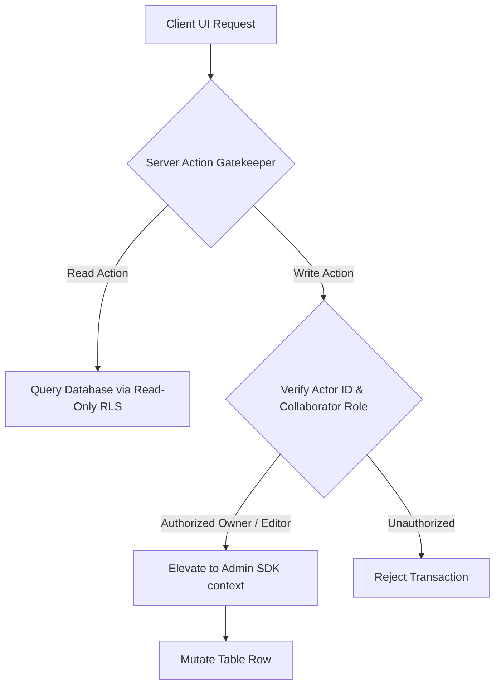

# Kylrix System Architecture & Unified Manifest 🏴

This blueprint serves as the single, authoritative architectural guide and features manifest for the Kylrix ecosystem. It defines the core security boundaries, cryptographic protocols, data infrastructure models, and execution flows within the codebase. It acts as an active conceptual ingest for engineers and agentic AI systems to understand the codebase's mechanics, synergies, and future expansion paths.

---

## 🏗️ Core Architectural Mandates & Design Patterns

All operations in the Kylrix ecosystem must adhere to four foundational architectural paradigms:

1.  **Web Ecosystem Security Protocol (WESP)**: We mathematically isolate active keys and decryption contexts in ephemeral, tab-scoped RAM. We enforce a zero-leak policy; no key material ever touches the database in plaintext, and all product chrome avoids opaque or solid gradients to maintain visual velocity.
2.  **Cascading-on-Demand (CoD) CRUD & Data Nexus**: A hybrid offline-first design. We aggressively minimize remote database reads using a high-performance in-memory and `localStorage` caching layer (Data Nexus). Any write operations asynchronously escalate privileges server-side while keeping the client snappier than traditional SPAs.
3.  **Global Unmount & Portal Containment**: To prevent hidden DOM trees from capturing mouse clicks or causing layout thrashing, all overlays, drawers, and sidebars are physically unmounted from the DOM when closed (`{isOpen && <Component />}`). We disable standard portal extraction (`disablePortal: true`) to keep components contextually native.
4.  **Least Privilege & Sovereign Data Control**: Database tables are configured with read-only RLS default policies. Client-side SDK calls cannot modify records directly. All modifications are routed through verified Server Actions which perform server-side verification before executing mutations via the Admin SDK context.

---

## I. CORE PLATFORM & SECURITY SUBSTRATE

### 1. Master Encryption Key (MEK) & PBKDF2 Stretching
The root cryptographic authority in Kylrix is the **Master Encryption Key (MEK)**. 
- **Generation**: A cryptographically secure 256-bit symmetric key generated locally using `window.crypto.subtle.generateKey` inside `lib/masterpass-crypto.ts`.
- **Zero-Knowledge RAM Isolation**: The raw MEK is never written to disk (`localStorage`, `sessionStorage`, or cookies). It lives exclusively in volatile, tab-scoped JavaScript memory and is lost instantly upon page close or tab termination.
- **Key Stretching**: The user's master password undergoes key stretching via PBKDF2 with **600,000 iterations** of HMAC-SHA-256 to derive the **Key Encryption Key (KEK)**. The KEK is used to wrap/unwrap the MEK envelope before syncing it with Appwrite user preferences. This computational cost prevents hardware-accelerated brute-force attacks on compromised envelopes.
- **Argon2id Double-Lock**: Modern vaults stretch the PBKDF2 key further through WebAssembly-compiled Argon2id (Memory: 64MB, Iterations: 3, Parallelism: 4) before unlocking the MEK.
- **PIN Piggybacking Deprecation**: Earlier iterations utilized temporary PIN-derived key wrappers. To mathematically prevent account lockouts and protect against memory-dumper exploits, **PIN logins are completely removed and prohibited** in favor of biometric WebAuthn credentials and temporal Sudo validation gates.

### 2. Row-Level Security (RLS) & Write Escalation
Kylrix operates a zero-trust database permission model:
- **Strict Read-Only Database ACL**: Appwrite database tables enforce read-only policies. Standard user sessions cannot write, update, or delete rows directly from the client.
- **Server Action Escalation**: All database mutations must go through Next.js Server Actions (defined inside `lib/actions/secure-ops.ts`). The Server SDK parses the caller's JWT to authenticate the `actorId`, verifies ownership or collaborator roles against the global collaborators database or row metadata, and dynamically executes writes using the elevated Admin SDK.
- **Ban on `Role.any()` Public Reads**: Slapping `Role.any()` on public assets enables scraping attacks. To prevent database scraping, public visibility is governed by an `isPublic: true` column value. The Row's ACL permissions remain private, and the Server SDK exposes the row through an explicit server-side escape hatch after sanitizing output.

### 3. Temporal MFA & Sudo Gates
- **Session Alignment Check**: To prevent session hijacking where an attacker bypasses MFA on a session created before MFA was enabled, `lib/mfa-session.ts` verifies that the `mfaUpdatedAt` timestamp is greater than or equal to the session's `$createdAt` timestamp.
- **Sudo Mode Gate**: High-risk actions (e.g. master password change, database wipe, full JSON export) require the user to re-enter their master credentials. Upon validation, the client enters a temporal Sudo Mode window lasting exactly **5 minutes** (stored as an in-memory timestamp in `context/SudoContext.tsx`). The Sudo token is strictly non-persistent and cannot be cached.

---

## II. HYBRID DATA INFRASTRUCTURE

### 1. Data Nexus Local Caching
To achieve snappiness and eliminate the "thundering herd" network problem on page load, `context/DataNexusContext.tsx` establishes a hybrid in-memory `Map` ref cache:
- **Deduplication**: Merges concurrent identical in-flight promises into a single request, executing a single network fetch and distributing the resolved data to all waiting widgets.
- **Temporal TTL**: Caches read-only queries with customizable time-to-live parameters, serving data instantly from local cache while fetching fresh updates in the background.

### 2. Localized Draft Autosaves
Accidental page refreshes or network drops do not result in data loss. The drafts system inside `lib/services/drafts.ts` segregates form metadata from heavy content:
- **Draft Manifest**: A lightweight map (`kylrix_flow_drafts_manifest`) containing only draft IDs, titles, and update times.
- **Draft Content**: Full JSON draft states cached under unique keys (`kylrix_flow_draft_id`).
- **SSR Safety**: All localStorage calls are wrapped in runtime guards (`typeof window === 'undefined'`) to prevent server-side rendering crashes during Next.js hydration.

---

## III. THE UNIFIED APPS SUITE

The mono-app is partitioned into four core workspaces that share the centralized WESP and identity frameworks:

1.  **Kylrix Note**: A markdown-first knowledge base featuring Doodle Canvas sketches serialized directly to JSON, and ephemeral Ghost Notes subject to automatic 7-day recursive purges.
2.  **Kylrix Vault**: High-security login, credential, and TOTP key manager with client-side zero-knowledge shared key mapping tables.
3.  **Kylrix Flow**: Productive checklist, task, and ingestion form manager. Enforces a strict limit of 8 collaborators per resource on the free tier to protect against WebSocket lag and concurrency conflicts.
4.  **Kylrix Connect**: Secure messaging and P2P video/audio huddles. Live group calls are strictly capped at 16 concurrent members to prevent database read permission overhead and WebSocket performance degradation.

---

## IV. TECHNICAL STACK & INTERACTIVITY SAFETY

### 1. Technical Stack
- **Frontend Framework**: Next.js 16 (Turbopack), React 19, TypeScript.
- **BaaS Substrate**: Appwrite (Authentication, Database, Buckets, Functions).
- **Styling & Theme**: Material UI (MUI) and Vanilla CSS. Gradients and translucent backgrounds are prohibited on product chrome.
- **Package Management**: PNPM only.

### 2. Stacking Context & Interactivity Safety
To prevent 'Non-Responsive UI' locks caused by hidden DOM structures capturing clicks:
- **Global Unmount Policy**: Closed drawers, modals, and sidebars are physically unmounted from the DOM (`{isOpen && <Component />}`). We disable standard portal extraction (`disablePortal: true`) to contain stacking contexts.
- **Pointer-Event Determinism**: Fixed-position layout wrappers use `pointer-events: none;` with interactive children explicitly using `pointer-events: auto;`.
- **Memoized Providers**: Global context values are wrapped inside `useMemo` with stable callback references to prevent massive re-render cascades in scrolling lists.

---

## V. VERIFIED DIRECTORY LAYOUT

- `app/`: Next.js App Router mapping path-based routes (e.g. `/note`, `/vault`, `/flow`, `/connect`, `/accounts`).
- `components/`: Specialized React UI widgets and dashboard elements grouped by workspace (e.g. `notes/`, `vault/`, `flow/`, `chat/`).
- `context/`: Centralized React Context providers coordinating state (e.g. `AuthContext.tsx`, `DataNexusContext.tsx`, `SectionContext.tsx`, `TaskContext.tsx`).
- `hooks/`: Custom state helpers and listeners (e.g. `useAutosave.ts`, `useRealtimeTable.ts`, `useWebRTC.ts`).
- `lib/`: Core service logic and server-side utilities:
  - `lib/actions/`: High-privilege Server Actions (e.g. `secure-ops.ts`, `cascade-delete.ts`, `telegram.ts`).
  - `lib/ecosystem/`: Centralized WESP security, broadcast channels, and identity contexts.
  - `lib/masterpass-crypto.ts`: Key derivation, wrapping, and PBKDF2/Argon2id algorithms.
  - `lib/appwrite/`: Client-side Appwrite database and storage adapters.
- `public/`: Static brand assets and SVG illustrations.

---

## VI. COMPLETE FEATURE MANIFEST & FLOW BLUEPRINTS

The following catalog provides a highly detailed engineering breakdown of the 56 active features, cryptographic systems, and integrations within the Kylrix suite.

---

### I. CORE PLATFORM & SECURITY (WESP & CRYPTO SUBSTRATE)

#### 1. Master Encryption Key (MEK)
*   **Mechanics & Substrate**: Local-first symmetric key generation utilizing the Web Crypto API (`window.crypto.subtle.generateKey` with `{ name: 'AES-GCM', length: 256 }`). Implemented in `lib/masterpass-crypto.ts`.
*   **Zero-Knowledge Boundary**: Plaintext key material never touches persistent storage (`localStorage`, `sessionStorage`, cookies) or remote databases. It resides purely within a volatile, private JavaScript memory variable inside the `WespContext` / `AuthContext`.
*   **Acute Architectural Rationale**: Prevents any browser extension, XSS payload, or malicious script from retrieving the key via standard disk-scraping vectors.
*   **Vivid End-to-End Execution Flow**:
    1.  User enters credentials / registers account.
    2.  `generateMEK()` triggers on the client, spawning a cryptographically secure 256-bit symmetric key.
    3.  Key is kept as a local RAM variable in `WespSecurity` state.
    4.  All subsequent decryption processes pull this volatile pointer.
*   **Ecosystem Synergy**: Functions as the root cryptographic authority for all local-first decryption, including Notes, Passwords, and chat sessions.
*   **Next-Gen Optimizations**: Hardware-backed MEK protection utilizing WebAuthn PRF (Pseudo-Random Function) extension, deriving the key directly from physical security keys or biometric hardware.

#### 2. PBKDF2 Key Stretching
*   **Mechanics & Substrate**: Master password derivation using PBKDF2 (Password-Based Key Derivation Function 2) configured with **600,000 iterations** of HMAC-SHA-256. Located inside `lib/masterpass-crypto.ts`.
*   **Zero-Knowledge Boundary**: Only the KEK (Key Encryption Key) is utilized to wrap the MEK before syncing the encrypted envelope to Appwrite user preferences. The raw password is encrypted and never sent to the network.
*   **Acute Architectural Rationale**: The massive iteration count introduces a significant computational delay (approx. 300-500ms on modern client devices), making offline dictionary and GPU/ASIC-accelerated brute-force attacks mathematically prohibitive.
*   **Vivid End-to-End Execution Flow**:
    1.  User enters Master Password.
    2.  `deriveKEKfromPassword()` runs PBKDF2 with 600,000 rounds of HMAC-SHA-256 using the user's static salt.
    3.  A 256-bit Key Encryption Key (KEK) is yielded.
    4.  The KEK wraps the MEK to allow safe persistence of the encrypted key block.
*   **Ecosystem Synergy**: Provides the initial secure handshake to unlock the MEK during user session recovery.
*   **Next-Gen Optimizations**: Dynamic iteration scaling based on client-side benchmark tests on signup, automatically adjusting the workload to optimize derivation time on high-performance devices.

#### 3. Double-Lock Argon2id Upgrade
*   **Mechanics & Substrate**: Key stretching migration wrapper utilizing WebAssembly-compiled Argon2id (`Argon2id` parameters: Memory: 64MB, Iterations: 3, Parallelism: 4) integrated inside `lib/masterpass-crypto.ts` and `components/onboarding/AccountHealthDrawers.tsx`.
*   **Zero-Knowledge Boundary**: Modernizes older PBKDF2 vaults by shifting key derivation to client-side Argon2id. It establishes a hybrid "Double-Lock" wrapping mechanism where the PBKDF2-derived key is subsequently stretched through Argon2id parameters before unlocking the MEK.
*   **Acute Architectural Rationale**: PBKDF2 is susceptible to ASIC parallelization. Argon2id is a memory-hard algorithm, meaning it requires dedicated RAM memory blocks to execute, leveling the playing field against ASIC-driven database cracks.
*   **Vivid End-to-End Execution Flow**:
    1.  Vault checks its health status inside `AccountHealthDrawers.tsx`.
    2.  If marked as legacy, the Double-Lock upgrade triggers.
    3.  The PBKDF2 stretched key is piped into the WebAssembly Argon2id runner.
    4.  The output Argon2id key re-wraps the MEK envelope.
    5.  The updated metadata is written to the user profile row.
*   **Ecosystem Synergy**: Connects directly with onboarding health flags to execute seamless migrations in the background.
*   **Next-Gen Optimizations**: Autonomous background credential rotation where keys are safely re-wrapped with updated WASM Argon2id profiles upon successful temporal Sudo validations.

#### 4. Web Ecosystem Security Protocol (WESP)
*   **Mechanics & Substrate**: Memory-space isolation and cross-tab lock orchestration utilizing tab-specific, RAM-only variable allocations and strict broadcast channel locks (`BroadcastChannel` API). Implemented in `lib/ecosystem/security.ts`.
*   **Zero-Knowledge Boundary**: If a tab is duplicated, cloned, or if an unauthorized script attempts to hijack the execution loop, the broadcast channel triggers an immediate lock, erasing all raw key pointers.
*   **Acute Architectural Rationale**: Avoids opaque or solid gradients on product chrome frames, forcing elements to remain transparent/glassmorphic. This allows users to visually inspect and track stacking contexts to easily spot clickjacking overlays.
*   **Vivid End-to-End Execution Flow**:
    1.  User opens a secondary tab.
    2.  `BroadcastChannel('kylrix_wesp_lock')` initiates handshakes.
    3.  If an unauthenticated state or clone is detected, a lock event is broadcast.
    4.  All open tabs clear their internal MEK RAM-cache instantly.
*   **Ecosystem Synergy**: Acts as the system-wide security context that guards all sub-app secrets.
*   **Next-Gen Optimizations**: Tab isolation using Web Workers for cryptographic computations, separating the main UI rendering thread entirely from raw cryptographic memory space.

#### 5. Zero-Knowledge Data-at-Rest
*   **Mechanics & Substrate**: Field-level E2EE (End-to-End Encryption). All Vault objects (passwords, usernames, TOTP secrets, file payloads) are encrypted client-side using `AES-GCM` with a 96-bit random IV before being written to Appwrite. Located in `lib/actions/secure-ops.ts`.
*   **Zero-Knowledge Boundary**: Appwrite database administrators only see base64-encoded encrypted ciphertexts. Column mappings use `dek` (Row Encryption Key) envelopes. A distinct DEK is generated per item, encrypted with the MEK, and stored alongside the encrypted payload.
*   **Acute Architectural Rationale**: Ensures that even if the host servers or database tables are completely compromised, the attacker acquires zero usable customer data.
*   **Vivid End-to-End Execution Flow**:
    1.  User enters password inside `VaultForm`.
    2.  A unique DEK (Row Encryption Key) is generated.
    3.  The password payload is encrypted with the DEK via AES-GCM.
    4.  The DEK itself is encrypted with the user's MEK.
    5.  The encrypted payload and encrypted DEK are written as a Row to the Appwrite `Vault` Table.
*   **Ecosystem Synergy**: Provides the core security model for the Password Vault and Note repositories.
*   **Next-Gen Optimizations**: Multi-recipient sharing via E2EE key wrapping, where an item's DEK is duplicated and wrapped separately with other users' public X25519 keys.

#### 6. X25519 Identity Nodes
*   **Mechanics & Substrate**: Key pairs for peer-to-peer (P2P) handshakes. Every user profile generates an ephemeral X25519 key pair via SubtleCrypto. Located in `lib/connect/identity.ts`.
*   **Zero-Knowledge Boundary**: The private X25519 key is encrypted with the MEK and cached locally, while the public key is published openly to the Connect Directory Table.
*   **Acute Architectural Rationale**: Enables participants in a chat thread or call to verify each other's identity and derive shared secrets without passing raw server keys.
*   **Vivid End-to-End Execution Flow**:
    1.  User registers or activates profile.
    2.  Client generates X25519 identity keypair.
    3.  Public key is pushed to the global `ConnectDirectory` Table.
    4.  Private key is encrypted with MEK and saved in the user's profile Row.
*   **Ecosystem Synergy**: Serves as the substrate for WebRTC call handshake processes and Matrix messaging exchanges.
*   **Next-Gen Optimizations**: Fully decentralized, offline-first WebRTC huddle handshakes using local QR code scans containing raw public X25519 identity keys.

#### 7. Ed25519 Node Key Diffing
*   **Mechanics & Substrate**: Deterministic P2P data synchronization. Kylrix uses Ed25519 signatures to sign state deltas (database rows). Located in `lib/core/federation/node-key.ts` and `lib/core/federation/diff-engine.ts`.
*   **Zero-Knowledge Boundary**: Allows offline clients to safely merge records without server mediation, preventing spoofed row mutations.
*   **Acute Architectural Rationale**: When peer databases sync, they exchange root state hashes. If a hash mismatch is detected, they exchange delta diffs signed by their respective Ed25519 keys, avoiding massive payload overhead.
*   **Vivid End-to-End Execution Flow**:
    1.  Two nodes trigger synchronization.
    2.  They compute alphabetical deterministic SHA-256 hashes of their table rows (excluding platform metadata fields like `$tableId`, `$permissions`, `$rowId`).
    3.  Differences are mapped to diff states (`missingLocally`, `outdatedRemotely`, etc.).
    4.  Deltas are exchanged alongside Ed25519 signatures, verifying update validity.
*   **Ecosystem Synergy**: Provides robust offline synchronization for Notes and database tables across federated nodes.
*   **Next-Gen Optimizations**: Merkle-tree diffing engine operating in an in-memory WASM library, syncing thousands of encrypted vault records over P2P WebRTC in milliseconds.

#### 8. Sudo Mode Gate
*   **Mechanics & Substrate**: Temporal authorization barrier inside `context/SudoContext.tsx` and `lib/sudo-mode.ts`.
*   **Zero-Knowledge Boundary**: Critical actions (master password change, database wipe, full JSON export) require the user to re-validate their master password. Once verified, the client enters a Sudo Mode window lasting exactly **5 minutes** (stored as an in-memory timestamp).
*   **Acute Architectural Rationale**: The Sudo token is strictly non-persistent and cannot be cached in disk storage, neutralizing attacks from temporary local device access.
*   **Vivid End-to-End Execution Flow**:
    1.  User clicks "Wipe Database".
    2.  `SudoContext` intercepts, checking if `sudoModeActive` is true.
    3.  If false, a Master Password modal prompts the user.
    4.  Upon verification, a 5-minute timer starts, and the action proceeds.
*   **Ecosystem Synergy**: Protects key settings and data exporter tools from automated scripting sweeps.
*   **Next-Gen Optimizations**: Dynamic, activity-based security scoring where Sudo Mode is triggered automatically if an agentic script attempts to fetch more than 10 credentials in quick succession.

#### 9. Non-Custodial Wallet Layer
*   **Mechanics & Substrate**: Embedded cryptocurrency keypair derivation inside `context/WalletOverlayContext.tsx`.
*   **Zero-Knowledge Boundary**: The MEK is used as entropy to deterministically derive a BIP-39 mnemonic seed phrase. From this seed, the client derives BIP-44 keypairs for Solana and EVM blockchains.
*   **Acute Architectural Rationale**: Enables zero-dependency Web3 funding, allowing autonomous agents in the workspace to stream micropayments to one another without third-party custodians.
*   **Vivid End-to-End Execution Flow**:
    1.  User opens Wallet view.
    2.  Mnemonic is derived from local MEK context.
    3.  Solana public/private keys are computed via SubtleCrypto and WASM libraries.
    4.  Transaction payloads are signed client-side and broadcasted to public RPCs.
*   **Ecosystem Synergy**: Connects with productivity and flow metrics, allowing merit-based distributions.
*   **Next-Gen Optimizations**: Zero-Knowledge proof generation for on-chain identity verification, allowing users to prove they own a secure credential without revealing the secret on-chain.

#### 10. Collaborative X25519 DH Sharing
*   **Mechanics & Substrate**: Zero-knowledge key exchange inside `lib/actions/secure-ops.ts`.
*   **Zero-Knowledge Boundary**: When a vault item is shared, the sender performs a Diffie-Hellman (DH) key exchange using their private X25519 key and the recipient's public key, deriving a shared secret. The item's encryption key (DEK) is encrypted with this shared secret and written to the `KeyMapping` Table.
*   **Acute Architectural Rationale**: The server acts as a simple mailbox, unable to read the derived shared secret or decrypt the mapping.
*   **Vivid End-to-End Execution Flow**:
    1.  User clicks "Share" on a credential, selecting a recipient.
    2.  Client fetches recipient's public X25519 key.
    3.  DH handshake yields a shared symmetric key.
    4.  The credential's DEK is encrypted with this shared key.
    5.  Encrypted mapping is saved as a Row in the Appwrite `KeyMapping` Table.
*   **Ecosystem Synergy**: Provides secure, trustless collaborative credential access.
*   **Next-Gen Optimizations**: Group DH key exchanges (e.g., using double ratchet algorithms) to support zero-knowledge multi-user workspace access controls.

#### 11. Universal JSON Export
*   **Mechanics & Substrate**: Ultimate portability exporter inside `lib/data-porter.ts`.
*   **Zero-Knowledge Boundary**: Fully decrypts the entire Vault (passwords, TOTP seeds, notes) client-side under active Sudo Mode and bundles them into a standardized, clear, non-proprietary JSON schema.
*   **Acute Architectural Rationale**: Zero lock-in. Promotes user data sovereignty, ensuring data remains completely portable and easily imported into competitor software.
*   **Vivid End-to-End Execution Flow**:
    1.  User initiates "Export All Data" under Settings.
    2.  Sudo Mode validates the user's master password.
    3.  Client fetches all encrypted Vault and Note records.
    4.  Local MEK decrypts all ciphertexts in-memory.
    5.  A clean JSON schema blob is compiled and triggered for download.
*   **Ecosystem Synergy**: Works alongside data import wizards to provide a seamless backup pipeline.
*   **Next-Gen Optimizations**: Fully encrypted offline HTML vault exports containing a mini WASM decryption engine, allowing users to unlock and read their backup directly in any offline browser.

#### 12. Progressive Rate Limiting
*   **Mechanics & Substrate**: exponential backoff algorithms inside `lib/auth-rate-limit.ts` and `lib/rate-limiter.ts`.
*   **Zero-Knowledge Boundary**: Tracks failed login and unlock attempts in memory (client-side) and via database logs (server-side). Successive failures increase cooldowns (2s, 4s, 8s... up to 1 hour).
*   **Acute Architectural Rationale**: Protects accounts from high-speed dictionary/brute-force attacks. Limits are bypassed only if the user verifies a temporal link sent to their registered, verified email address.
*   **Vivid End-to-End Execution Flow**:
    1.  User enters an incorrect password.
    2.  `AuthRateLimit` records the failure against their account identifier.
    3.  A 4-second lock is set.
    4.  Subsequent fast attempts return immediate errors before querying cryptographic layers.
*   **Ecosystem Synergy**: Forms the core defense shield against credential stuffing.
*   **Next-Gen Optimizations**: Network-wide coordinate-based heuristics that detect distributed bruteforce attempts targeting an account from multiple distinct IP addresses.

#### 13. Row-Level Security (RLS) Hardening
*   **Mechanics & Substrate**: Least-privileged database policies implemented across all Appwrite tables. Detailed in `lib/actions/secure-ops.ts`.
*   **Zero-Knowledge Boundary**: Database tables are locked to read-only default policies at the platform level. Clients are mathematically prevented from performing direct remote write requests.
*   **Acute Architectural Rationale**: All write operations must route through verified Server Actions (`lib/actions/secure-ops.ts`) which escalate privileges safely after performing strict server-side validation. This design blocks database scraping exploits and direct client-side table modifications.
*   **Vivid End-to-End Execution Flow**:
    1.  Client invokes `createNoteSecure` Action.
    2.  Action verifies actor JWT, validating the caller's identity.
    3.  Server validates the payload bounds.
    4.  Server calls the Admin SDK with elevated privileges to write the Row with read-only ACLs for the owner.
*   **Ecosystem Synergy**: Core data protection layer that enforces the integrity of every database row.
*   **Next-Gen Optimizations**: Cryptographically signed write transactions, where the server only executes database mutations accompanied by a valid user Ed25519 signature.

#### 14. Cross-App Linking Service
*   **Mechanics & Substrate**: Uniform cross-link patterns in markdown parsed by `components/LinkRenderer.tsx`.
*   **Zero-Knowledge Boundary**: We map relationships between resources using uniform cross-link patterns in text fields (e.g., `source:kylrixnote:id`, `source:kylrixvault:id`), completely eliminating heavy, vulnerable database relational join tables.
*   **Acute Architectural Rationale**: Reduces schema complexity while allowing the UI to intercept links and render contextual rich widgets inline.
*   **Vivid End-to-End Execution Flow**:
    1.  User types a link referencing `source:kylrixvault:credentialId` in a Note.
    2.  Markdown renderer parses the note.
    3.  `LinkRenderer` intercepts this pattern and replaces it with the dynamic `VaultTotpLink` component.
*   **Ecosystem Synergy**: Unifies Notes, Tasks, and Vault items under a clean, relational UX.
*   **Next-Gen Optimizations**: Graphical node visualizer inside the workspace, rendering all cross-linked tags as interactive, draggable 3D networks.

#### 15. Data Nexus Caching
*   **Mechanics & Substrate**: In-memory `Map` refs and an encrypted `localStorage` persistence layer managed by `context/DataNexusContext.tsx`.
*   **Zero-Knowledge Boundary**: Encrypts cached assets locally using keys derived from the active session context.
*   **Acute Architectural Rationale**: Merges concurrent identical in-flight promises into a single request, eliminating the "thundering herd" network problem on page load, and making the mono-app highly responsive.
*   **Vivid End-to-End Execution Flow**:
    1.  Three dashboard widgets request the active user profile simultaneously.
    2.  `DataNexusContext` intercepts the calls.
    3.  A single fetch promise is dispatched.
    4.  All widgets resolve their data from the single completed request.
*   **Ecosystem Synergy**: Drives the high performance of all dashboard UI surfaces.
*   **Next-Gen Optimizations**: Offline mutation queueing with background reconciliation, allowing the app to queue writes during network drops and sync seamlessly when online.

---

### II. KYLRIX NOTE (KNOWLEDGE MANAGEMENT)

#### 16. Rich Markdown Editor
*   **Mechanics & Substrate**: GitHub Flavored Markdown (GFM) text processor styled with Pitch Black design tokens, located in `components/notes/NoteEditor.tsx`.
*   **Zero-Knowledge Boundary**: Note contents are encrypted client-side using GCM before save operations.
*   **Acute Architectural Rationale**: Combines absolute server-blindness with a clean, distraction-free typography system. Integrates with the cross-linking renderer to inject inline widgets inside text flows.
*   **Vivid End-to-End Execution Flow**:
    1.  User types markdown into the editor.
    2.  `useAutosave` hook tracks modifications.
    3.  The text block is parsed to render typography, lists, and code blocks.
*   **Ecosystem Synergy**: Forms the primary interface for guides, checklists, and notes.
*   **Next-Gen Optimizations**: Inline LaTeX formatting and Mermaid diagrams parsed on the fly with GPU-accelerated transition animations.

#### 17. Doodle Canvas
*   **Mechanics & Substrate**: HTML5 Canvas vector-based drawing board implemented in `components/DoodleCanvas.tsx`.
*   **Zero-Knowledge Boundary**: Stroke sequences are serialized to standard, lightweight JSON and stored directly within the note's encrypted content Row, avoiding external binary storage files.
*   **Acute Architectural Rationale**: Zero external dependencies. Keeps the canvas data fully integrated inside the note lifecycle, allowing pressure-sensitive drawings to load and sync instantly.
*   **Vivid End-to-End Execution Flow**:
    1.  User clicks the Doodle tool inside a Note.
    2.  Canvas renders and tracks mouse/stylus inputs.
    3.  Stroke coordinates are written to a lightweight JSON vector array.
    4.  Vector payload is encrypted and saved inside the parent Note row.
*   **Ecosystem Synergy**: Embedded directly inside Notes, adding vector-sketching capabilities.
*   **Next-Gen Optimizations**: Real-time collaborative canvas syncing, allowing multiple users in a WebRTC call to sketch on the same vector whiteboard simultaneously.

#### 18. Ghost Notes
*   **Mechanics & Substrate**: Ephemeral zero-knowledge items marked as `isGhost: true` inside database schemas. Detailed in `lib/actions/secure-ops.ts`.
*   **Zero-Knowledge Boundary**: These notes are encrypted, stored, and verified via temporal lifecycles.
*   **Acute Architectural Rationale**: Subject to an automated, recursive 7-day purge sweep that purges expired records. Deletion cascades to storage files, reactions, comments, and voice files, guaranteeing absolute data hygiene.
*   **Vivid End-to-End Execution Flow**:
    1.  User creates a Ghost Note.
    2.  The note is stored with a 7-day expiration timestamp.
    3.  On the 7th day, the server cron job invokes the cascade delete action.
    4.  All traces of the note and its attachments are permanently erased.
*   **Ecosystem Synergy**: Ideal for highly sensitive temporary credentials or brain-dumps.
*   **Next-Gen Optimizations**: Multi-tier ghost notes with custom self-destruct countdowns (e.g. read-once, 1 hour, or 24 hours).

#### 19. Polymorphic Relay (Send)
*   **Mechanics & Substrate**: Universal zero-knowledge sharing engine located at `/send`, implemented in `components/send/SendReceiveClient.tsx`.
*   **Zero-Knowledge Boundary**: The secret key is stored in the URL hash fragment (`/send/[id]#[key]`), which is never sent to the server.
*   **Acute Architectural Rationale**: Standard routing redirects unauthenticated traffic to `/send` immediately. This "Zero-Idle Onboarding" lets visitors experience E2EE sharing immediately, converting them to users organically.
*   **Vivid End-to-End Execution Flow**:
    1.  User drops a file or text block into the `/send` interface.
    2.  A 256-bit symmetric key is generated.
    3.  The payload is encrypted client-side.
    4.  Encrypted data is saved to Appwrite.
    5.  Client yields a sharing URL with the key appended in the hash fragment.
*   **Ecosystem Synergy**: Integrates with Vault and Chats to send secure ephemeral files instantly.
*   **Next-Gen Optimizations**: One-time-download ghost files that immediately delete themselves from Appwrite storage buckets the microsecond the download stream completes.

#### 20. Recursive Cascade Deletion
*   **Mechanics & Substrate**: Parallelized batch cleaning service implemented in `lib/actions/cascade-delete.ts`.
*   **Zero-Knowledge Boundary**: Absolute data hygiene. Deleting a parent Note or Task recursively purges all linked items in parallel.
*   **Acute Architectural Rationale**: Rather than performing slow, single-row fetches that block threads, the engine fetches and deletes child rows in concurrent batches using `Promise.all`. Fault-tolerant execution ensures missing files don't block the database purge.
*   **Vivid End-to-End Execution Flow**:
    1.  User deletes a Note.
    2.  `executeCascadeDeleteSecure` is called with the Note ID.
    3.  Parallel queries find all comments, reactions, resource tags, and voice files.
    4.  Storage files are wiped first; database rows are pruned in parallel batches of 10.
*   **Ecosystem Synergy**: Guarantees zero orphan records exist anywhere in the platform tables.
*   **Next-Gen Optimizations**: Offload cleanup triggers to server-side database hooks, ensuring recursive deletion executes even if the user closes their browser instantly.

#### 21. Note Revisions
*   **Mechanics & Substrate**: Encrypted delta revision history tracking inside `lib/revisions.ts`.
*   **Zero-Knowledge Boundary**: Every save operation generates a delta diff of the note content, which is encrypted client-side with the MEK and saved as sub-rows.
*   **Acute Architectural Rationale**: Retains complete history of note states without leaking note contents or context to the server admin.
*   **Vivid End-to-End Execution Flow**:
    1.  User edits a Note.
    2.  `useAutosave` triggers a save.
    3.  The client diffs the new text against the previous revision.
    4.  The generated delta diff is encrypted with the MEK and appended as a new revision row.
*   **Ecosystem Synergy**: Integrates directly with the markdown editor to show revision visual timelines.
*   **Next-Gen Optimizations**: Local branch-merging for notes, allowing users to fork version branches and merge them using Ed25519 delta diffing.

#### 22. Cross-Link Tagging
*   **Mechanics & Substrate**: Relational mappings parsed dynamically inside text fields by `components/LinkRenderer.tsx`.
*   **Zero-Knowledge Boundary**: Replaces complex database relational join tables with a clean, text-based schema: `[Link Name](source:kylrixvault:credentialId)`.
*   **Acute Architectural Rationale**: Maintains optimal database schema performance while enabling rich visual interactions contextually inside notes.
*   **Vivid End-to-End Execution Flow**:
    1.  User inputs `source:kylrixvault:id` into a Note.
    2.  `LinkRenderer` scans the text during render.
    3.  The link is swapped for a custom interactive component that displays a live 2FA code inline.
*   **Ecosystem Synergy**: Unifies knowledge records with other tools in the workspace.
*   **Next-Gen Optimizations**: Automatic cross-link recommendation, using local content hashes to suggest related credentials or tasks while typing.

#### 23. Note-to-Huddle Promotion
*   **Mechanics & Substrate**: Thread conversion utilities in `lib/actions/secure-ops.ts`.
*   **Zero-Knowledge Boundary**: Promotes static notes into live discussion channels. The note content forms the header, and an active huddle is spawned in the note's comments section.
*   **Acute Architectural Rationale**: Fuses knowledge management with real-time collaboration seamlessly without duplicate workspace setups.
*   **Vivid End-to-End Execution Flow**:
    1.  User clicks "Promote to Huddle" on a Note.
    2.  Notes service creates a related chat thread mapping.
    3.  Comments panel opens, enabling real-time WebSocket messaging.
*   **Ecosystem Synergy**: Links Notes with Connect communication grids.
*   **Next-Gen Optimizations**: Automatic huddle recording archiving, where audio/video calls in a promoted note are transcribed and attached directly as a note revision.

---

### III. KYLRIX VAULT (PASSWORD & SECRET MANAGER)

#### 24. Login Credential Management
*   **Mechanics & Substrate**: Zero-knowledge credential storage vaults managed in `lib/actions/secure-ops.ts`.
*   **Zero-Knowledge Boundary**: Encrypts logins, usernames, passwords, and custom fields client-side via AES-GCM before database writes.
*   **Acute Architectural Rationale**: Favicon URLs are fetched through a secure proxy or loaded from local cache to prevent DNS leakage of user accounts to external third parties.
*   **Vivid End-to-End Execution Flow**:
    1.  User enters login credentials.
    2.  Client encrypts values using the Vault DEK.
    3.  Row is written to the database.
    4.  UI loads icons via the secure favicon proxy.
*   **Ecosystem Synergy**: Main store of identity secrets across the ecosystem.
*   **Next-Gen Optimizations**: Browser extension auto-fill adapter, securely passing credentials from the vault to input fields using the local WESP context.

#### 25. TOTP Authenticator Seeds
*   **Mechanics & Substrate**: 2FA token generation utilizing `otplib` client-side, located in `components/vault/TotpCard.tsx`.
*   **Zero-Knowledge Boundary**: TOTP secret seeds are decrypted in volatile memory only and updated every second to generate 6-digit tokens.
*   **Acute Architectural Rationale**: Eliminates server-side TOTP generation, ensuring seeds never leave the browser client in plaintext.
*   **Vivid End-to-End Execution Flow**:
    1.  User displays TOTP list.
    2.  The encrypted seed is decrypted in memory using the MEK.
    3.  `otplib` derives the current 6-digit code.
    4.  A visual timer wheel tracks token expiration.
*   **Ecosystem Synergy**: Pairs with tooltips to render 2FA codes directly inside Notes and Tasks.
*   **Next-Gen Optimizations**: Support for Steam Guard and custom 8-digit or SHA-256 TOTP profiles.

#### 26. Password-to-TOTP Linking
*   **Mechanics & Substrate**: Composite vault mapping managed in `lib/actions/secure-ops.ts`.
*   **Zero-Knowledge Boundary**: Credentials contain an optional `totpId` column linking to a separate authenticator seed Row.
*   **Acute Architectural Rationale**: Allows the credentials manager to fetch the associated TOTP record in a single transaction, showing the website password and active 2FA token side-by-side.
*   **Vivid End-to-End Execution Flow**:
    1.  User opens a password detail view.
    2.  The database query fetches the credential row.
    3.  If `totpId` is present, the associated TOTP Row is retrieved in parallel.
    4.  Both password and active code render together.
*   **Ecosystem Synergy**: Boosts Vault login efficiency.
*   **Next-Gen Optimizations**: Automated 2FA setup parsing, extracting the seed and issuer parameters from uploaded screenshots or QR codes locally in the browser.

#### 27. Keychain Item Sharing
*   **Mechanics & Substrate**: Zero-knowledge credential delegation inside `lib/actions/secure-ops.ts`.
*   **Zero-Knowledge Boundary**: Re-wraps the credential's DEK with the recipient's public X25519 key.
*   **Acute Architectural Rationale**: The shared key is stored in the secure key mapping table, enabling the recipient to read the credential under read-only RLS restrictions without exposing the owner's MEK.
*   **Vivid End-to-End Execution Flow**:
    1.  Owner clicks "Share Key".
    2.  DH key exchange generates a shared key wrapper.
    3.  DEK is re-wrapped and written to the mapping Table.
    4.  Recipient's client decrypts the DEK using their private key and reads the secret.
*   **Ecosystem Synergy**: Enables E2EE team credential sharing.
*   **Next-Gen Optimizations**: Temporal keys that automatically expire and invalidate the mapping after a preset duration (e.g. 1 hour).

#### 28. Secure Folders
*   **Mechanics & Substrate**: Folder organization mappings inside `lib/actions/secure-ops.ts`.
*   **Zero-Knowledge Boundary**: All folder names and metadata are encrypted client-side using the MEK.
*   **Acute Architectural Rationale**: Prevents metadata leakage, hiding the user's category names and organizing taxonomy from server administrators.
*   **Vivid End-to-End Execution Flow**:
    1.  User creates a secure folder "Work Secrets".
    2.  The title is encrypted to ciphertext via AES-GCM.
    3.  A folder row is written to the database.
*   **Ecosystem Synergy**: Visual organization layer for all credentials.
*   **Next-Gen Optimizations**: Nested folder systems with inherited group permissions, allowing workspaces to share entire secret categories at once.

#### 29. Security Audit Log
*   **Mechanics & Substrate**: Immutable access tracking inside `lib/audit.ts` and `lib/actions/secure-ops.ts`.
*   **Zero-Knowledge Boundary**: Captures mutations and read access to credentials, storing them in the `SecurityLogs` Table.
*   **Acute Architectural Rationale**: IP addresses and User-Agents are securely hashed using SHA-256 with a daily salt to audit breaches without tracking user location or violating privacy.
*   **Vivid End-to-End Execution Flow**:
    1.  User reads a Vault password.
    2.  `recordAnonymizedTelemetrySecure` triggers on the server.
    3.  IP and User-Agent are salted and hashed.
    4.  A log Row is saved with the transaction signature.
*   **Ecosystem Synergy**: Provides audit trails for compliance and threat detection.
*   **Next-Gen Optimizations**: Real-time push notifications via the Telegram bridge if a critical credential is read from an unfamiliar device signature.

---

## IV. KYLRIX FLOW (PRODUCTIVITY & ORCHESTRATION)

#### 30. Collaborative Goal Engine
*   **Mechanics & Substrate**: Multi-role task tracking (assignees, organizers, viewers) with cascading permissions. Managed in `context/TaskContext.tsx` and `lib/actions/secure-ops.ts`.
*   **Zero-Knowledge Boundary**: All task scopes and updates are verified via the verified Server Action layer.
*   **Acute Architectural Rationale**: Workspaces are kept free and unlimited up to **8 collaborators per resource** to protect against concurrency bugs (WebSocket lag, race conditions, browser DOM thrashing) while avoiding paywall blocks.
*   **Vivid End-to-End Execution Flow**:
    1.  User creates a Task.
    2.  Client verifies collaborator count is <= 8 on the free plan.
    3.  The task is created with strict user permissions.
*   **Ecosystem Synergy**: Integrates with Projects and Calendars to coordinate work.
*   **Next-Gen Optimizations**: Automated subtask distribution where the system assigns nested tasks to appropriate agents based on capacity.

#### 31. Autonomous Ingestion Forms
*   **Mechanics & Substrate**: Public-facing form submission pipeline at `/flow/forms`, implemented in `components/forms/UnifiedFormContent.tsx`.
*   **Zero-Knowledge Boundary**: Inputs are saved locally inside `localStorage` using the Drafts Autosave Service to prevent loss on refreshes.
*   **Acute Architectural Rationale**: Submissions are automatically converted into actionable tasks or milestones inside a linked project, streamlining project ingestion.
*   **Vivid End-to-End Execution Flow**:
    1.  Visitor fills out a public ingestion form.
    2.  Form data is autosaved locally to prevent data loss.
    3.  On submission, the data is pushed to the server.
    4.  A related task Row is generated inside the linked Project.
*   **Ecosystem Synergy**: Bridges external contacts with internal workspaces.
*   **Next-Gen Optimizations**: Fully encrypted form responses, allowing users to submit feedback that only the project owner can decrypt with their MEK.

#### 32. Nested Subtask Arrays
*   **Mechanics & Substrate**: Recursive JSON trees inside tasks, managed in `context/TaskContext.tsx`.
*   **Zero-Knowledge Boundary**: Permissions automatically cascade from parent tasks to children.
*   **Acute Architectural Rationale**: Reduces database row lookups by nesting subtask states directly inside the parent Row, avoiding high-frequency database reads.
*   **Vivid End-to-End Execution Flow**:
    1.  User adds a subtask.
    2.  Client updates the local JSON task tree.
    3.  `updateNoteSecure` writes the updated tree to the database.
*   **Ecosystem Synergy**: Detailed sub-checklists inside task cards.
*   **Next-Gen Optimizations**: Inter-subtask dependency mapping, blocking a subtask from starting until its parent task is marked completed.

#### 33. Form-to-Article Pipeline
*   **Mechanics & Substrate**: Text compilation tools inside `lib/actions/secure-ops.ts`.
*   **Zero-Knowledge Boundary**: Aggregates verified form inputs and task results to generate public Markdown articles.
*   **Acute Architectural Rationale**: Minimizes manual copy-pasting by compiling raw database inputs into structured, publication-ready public guides.
*   **Vivid End-to-End Execution Flow**:
    1.  User runs the "Compile Article" action on a project.
    2.  Client gathers linked task updates and form texts.
    3.  Text is structured into clean Markdown.
    4.  A public Note Row is saved to the database.
*   **Ecosystem Synergy**: Promotes internal progress updates to public readouts.
*   **Next-Gen Optimizations**: Static site generator API export, publishing compiled articles directly to platforms like Vercel or Netlify.

#### 34. Ecosystem Calendar Sync
*   **Mechanics & Substrate**: High-performance calendar visualizer inside `components/events/EventDialog.tsx` and `lib/actions/secure-ops.ts`.
*   **Zero-Knowledge Boundary**: Only events verified by active user sessions are displayed.
*   **Acute Architectural Rationale**: Dynamically maps task due dates and project milestones onto a central calendar timeline, avoiding slow third-party API fetches.
*   **Vivid End-to-End Execution Flow**:
    1.  User opens Calendar view.
    2.  `EventDialog` queries active tasks.
    3.  Milestones are placed on the calendar grid.
*   **Ecosystem Synergy**: Launches instant live voice huddles directly from active calendar events.
*   **Next-Gen Optimizations**: Bi-directional external sync (iCal/Google Calendar) using zero-knowledge sync channels.

#### 35. Project Gravity Wells
*   **Mechanics & Substrate**: The flagship unified workspace dashboard implemented in `lib/services/workflows.ts` and `lib/actions/workflows.ts`.
*   **Zero-Knowledge Boundary**: Links notes, tasks, credentials, and huddle threads into a single, cohesive dashboard, where project owners inherit full read/write CRUD over child resources.
*   **Acute Architectural Rationale**: We build **retention through utility** rather than gimmicky paywalls, locking in users by providing an elite, zero-dependency collaborative workspace experience.
*   **Vivid End-to-End Execution Flow**:
    1.  User opens a Project workspace.
    2.  `getProjectContext` fetches the project row and all related resource mappings in parallel.
    3.  Dashboard populates tasks, notes, and huddle feeds contextually.
*   **Ecosystem Synergy**: The ultimate glue that synergizes the entire Kylrix product suite.
*   **Next-Gen Optimizations**: Drag-and-drop file organization, instantly generating a `/send` ghost link when dropping an external file into the workspace.

---

## V. KYLRIX CONNECT (COMMUNICATION & SOCIAL)

#### 36. Secure Matrix Messaging
*   **Mechanics & Substrate**: End-to-end encrypted messaging engine inside `lib/services/internal/chat.ts` and `lib/actions/chat.ts`.
*   **Zero-Knowledge Boundary**: Uses P2P-derived X25519 shared secrets to encrypt message payloads before database commits.
*   **Acute Architectural Rationale**: Messages are stored in the database in fully encrypted ciphertext forms, rendering them completely opaque to Appwrite database administrators.
*   **Vivid End-to-End Execution Flow**:
    1.  User types a chat message.
    2.  Client resolves participant public X25519 keys.
    3.  DH handshake yields a symmetric key.
    4.  Payload is encrypted and written to the database.
*   **Ecosystem Synergy**: Safe communications for workspaces.
*   **Next-Gen Optimizations**: Decentralized chat backups distributed across peer devices using Ed25519 node key diffing.

#### 37. Project Discussion Threads
*   **Mechanics & Substrate**: Contextual huddle threads managed in `components/chat/HuddleChatWindow.tsx`.
*   **Zero-Knowledge Boundary**: Comment rows inherit the parent object's encryption properties, enabling E2EE chat threads contextually.
*   **Acute Architectural Rationale**: Keeps communication next to the action items, avoiding external app switching.
*   **Vivid End-to-End Execution Flow**:
    1.  User opens a Task.
    2.  Comments drawer is activated.
    3.  WebSocket channels push updates matching the task ID.
*   **Ecosystem Synergy**: Fuses communication with project tasks.
*   **Next-Gen Optimizations**: Thread grouping using cryptographic thread-specific keys, allowing users to invite guests to a specific thread without exposing the parent note.

#### 38. Hangouts (Group Groups)
*   **Mechanics & Substrate**: Capped high-efficiency group communications inside `lib/actions/secure-ops.ts`.
*   **Zero-Knowledge Boundary**: Capped at exactly **16 concurrent members** to prevent database read-permission overhead, excessive WebSocket lag, and typing indicator latency.
*   **Acute Architectural Rationale**: Enforces optimal resource limits to preserve fluid P2P WebRTC calls and real-time state synchronization.
*   **Vivid End-to-End Execution Flow**:
    1.  User initiates group chat creation.
    2.  System checks participant count <= 16.
    3.  Group row is created.
*   **Ecosystem Synergy**: Bridges teams with immediate communication channels.
*   **Next-Gen Optimizations**: Dynamic group key rotations, regenerating group encryption keys whenever a member leaves or is removed.

#### 39. WebRTC Live Huddles
*   **Mechanics & Substrate**: Peer-to-peer audio/video mesh, supporting direct P2P connection or Cloudflare SFU transport fallback modes. Detailed in `hooks/useWebRTC.ts`.
*   **Zero-Knowledge Boundary**: Ephemeral connection handshakes are encrypted via X25519 keys.
*   **Acute Architectural Rationale**: Provides fluid communication grids. Embeds MediaRecording archives to record and save calls directly as audio binaries in Appwrite storage.
*   **Vivid End-to-End Execution Flow**:
    1.  User clicks "Start Huddle".
    2.  WebRTC handshakes exchange network configurations.
    3.  Direct P2P streams are established.
*   **Ecosystem Synergy**: Embedded directly inside Chats and Tasks.
*   **Next-Gen Optimizations**: Ephemeral screen-sharing channels utilizing the tab-scoped WESP keys to prevent video frame capturing outside the active viewport.

#### 40. Voice Note Mesh
*   **Mechanics & Substrate**: High-fidelity audio payloads managed by `components/notes/VoiceNotePlayer.tsx`.
*   **Zero-Knowledge Boundary**: Audio recordings are limited to exactly **2 minutes** and saved inside the voice storage bucket.
*   **Acute Architectural Rationale**: Integrates with recursive cascade deletion: deleting a note automatically cleans up all associated voice files, preventing database bloat.
*   **Vivid End-to-End Execution Flow**:
    1.  User records a 2-minute voice note.
    2.  File is uploaded to the secure bucket.
    3.  Audio waveform renders inline.
*   **Ecosystem Synergy**: Voice notes render perfectly in-line inside Notes and Chat lists.
*   **Next-Gen Optimizations**: Real-time, browser-based voice pitch visualization and offline voice note speed controllers.

#### 41. Unorganic Email Dispatch
*   **Mechanics & Substrate**: Queue-based notification engine located in `lib/unorganic-email-api.ts`.
*   **Zero-Knowledge Boundary**: Mapped to clean email templates, logging transactions securely in the internal ledger.
*   **Acute Architectural Rationale**: Enforces strict anti-spam limits (max 1 alert per 30 minutes) to keep communications organic and prevent inbox spamming.
*   **Vivid End-to-End Execution Flow**:
    1.  System generates a notification.
    2.  `UnorganicEmail` checks the dispatch queue.
    3.  If the cooldown cap is clear, the email is dispatched.
*   **Ecosystem Synergy**: Alerts users of collaborative changes safely.
*   **Next-Gen Optimizations**: Zero-Knowledge notifications, sending encrypted emails that the user can decrypt locally inside their email client using their MEK.

#### 42. Moment Feed
*   **Mechanics & Substrate**: Real-time updates feed aggregator inside `components/moments/MomentFeed.tsx`.
*   **Zero-Knowledge Boundary**: Combines user activities, huddle events, and presence signals.
*   **Acute Architectural Rationale**: Keeps track of unread message offsets in local memory cache to keep rendering Snappy.
*   **Vivid End-to-End Execution Flow**:
    1.  User opens Moment feed.
    2.  Local cache offsets are checked.
    3.  Updates populate the stream instantly.
*   **Ecosystem Synergy**: The central social timeline of the platform.
*   **Next-Gen Optimizations**: Dynamic action links inside Moment Feed cards, enabling users to accept project invites or join active voice huddles in one click.

#### 43. Telegram Notification Bridge
*   **Mechanics & Substrate**: Push notification service integrated in `lib/services/internal/telegram-dispatch.ts` and `lib/actions/telegram.ts`.
*   **Zero-Knowledge Boundary**: Chat IDs are saved securely against user profiles.
*   **Acute Architectural Rationale**: Bypasses Apple APNs and Google FCM developer fee structures and platform audits, maintaining complete store detachment and developer autonomy.
*   **Vivid End-to-End Execution Flow**:
    1.  An event triggers a notification (e.g. key shared).
    2.  Server queries the user's Telegram Chat ID.
    3.  A secure POST request is dispatched via Telegram's Bot API.
*   **Ecosystem Synergy**: Instant notifications delivered to any device.
*   **Next-Gen Optimizations**: Bi-directional command executions, enabling users to query vault lock statuses or trigger database wipes by replying to Telegram messages.

#### 44. Group Join Request Gating
*   **Mechanics & Substrate**: Invite validation engine inside `lib/actions/secure-ops.ts`.
*   **Zero-Knowledge Boundary**: Generates invite hashes using SHA-256 derived from `inviterId + projectId + timestamp`.
*   **Acute Architectural Rationale**: Enforces strict temporal expiration checks, immediately rejecting join requests if invite links are expired or tampered with.
*   **Vivid End-to-End Execution Flow**:
    1.  Invite link is generated.
    2.  Recipient clicks the link.
    3.  Server computes the SHA-256 hash and verifies timestamp validity before granting access.
*   **Ecosystem Synergy**: Guards collaborative Project workspaces.
*   **Next-Gen Optimizations**: Blind signature join requests, allowing users to invite guests without revealing the host project's ID to unauthorized users.

---

### VI. COMPOSITE INTEGRATIONS & SHIPPED SYNERGIES

#### 45. Contextual TOTP Peek for Cross-Linked Vault Items
*   **shipped Mechanism & Substrate**: Intercepts `source:kylrixvault:credentialId` markdown links inside notes and tasks using the [VaultTotpLink](file:///home/nathfavour/code/kylrix/kylrix/components/LinkRenderer.tsx) component.
*   **Data Nexus Memory Optimization**: Checks the local `v_totp_total_${userId}` and `v_creds_total_${userId}` cache maps first to resolve the secret, preventing secondary database fetches.
*   **Inline Security Promotion**: If the security vault is locked, the link triggers the standard `MasterPassDrawer` inline. Once unlocked, the component swaps the lock placeholder for a premium glassmorphic tooltip containing the active 6-digit TOTP code and an interactive, decaying circular timer wheel with a copy button.
*   **Acute Architectural Rationale**: Fuses knowledge records with credential authenticators, eliminating context switching completely.
*   **Vivid End-to-End Execution Flow**:
    1.  User hovers over a vault link in a checklist.
    2.  `VaultTotpLink` checks the local cache.
    3.  If verified, the decrypted seed is used to compute the live TOTP.
    4.  A decaying visual wheel is rendered inline with a one-click copy tool.
*   **Next-Gen Optimizations**: Auto-focus copying, allowing the user to press a hotkey when hovering over the vault link to copy the code immediately without even showing the tooltip.

#### 46. Connect-to-Ghost Input Upgrader
*   **shipped Mechanism & Substrate**: Keyboard hotkey listener (`Ctrl + G`) configured inside chat textareas in `components/chat/ChatList.tsx` and detail views.
*   **Zero-Knowledge Upgrading**: Grabs the input buffer, encrypts it in-place using SubtleCrypto `encryptGhostData`, and registers an ephemeral Ghost Note object via `AppwriteService.createSendGhostObject` expiring in **7 days**.
*   **Relay Swapping**: Replaces the textarea buffer with the secure `/send/${noteId}/${noteKey}` link. The created note is cached inside `localStorage('kylrix_send_sparks')` so the user can easily manage and claim it on the `/send` dashboard.
*   **Acute Architectural Rationale**: Upgrades sensitive chat comments to zero-knowledge status on the fly without manual copy-pasting or switching views.
*   **Vivid End-to-End Execution Flow**:
    1.  User types an API secret into a chat input.
    2.  User presses `Ctrl + G`.
    3.  Input text is captured and encrypted client-side.
    4.  An ephemeral Ghost Note is saved.
    5.  Input is replaced with the secure Polymorphic Relay link.
*   **Next-Gen Optimizations**: Upgrader templates, allowing users to select preset formatting structures (e.g. code snippet, API credentials) when upgrading their input box.

#### 47. Autonomous Local Injection & Flap-Over Previews for Secure Relays
*   **shipped Mechanism & Substrate**: URL interceptor matching `/send/[id]/[key]` inside markdown content.
*   **Inline Preview Injection**: Resolves note metadata locally through `/note/api/shared/${id}` (caching results inside Data Nexus `send_relay_${id}`) and extracts the secure object kind to inject a custom, highly styled glassmorphic micro-card into the text.
*   **dedicated Flap-Over Drawer**: Bypasses traditional page redirection. Clicking the preview card slides out a dedicated right-hand panel (`SendFlapOver`) that decrypts and visualizes the secure object contextually (Username/Password fields, live TOTP circular counts, or inline file decryption and binary downloads) without breaking active viewport flow.
*   **Acute Architectural Rationale**: Enables rapid reading of shared assets without interrupting focus or dropping the active viewport state.
*   **Vivid End-to-End Execution Flow**:
    1.  User views a chat containing a `/send` link.
    2.  Client intercepts and fetches metadata.
    3.  A glassmorphic card renders inline.
    4.  User clicks the card; `SendFlapOver` drawer slides out, decrypts the contents locally, and displays it.
*   **Next-Gen Optimizations**: Multi-link stacks, displaying a unified sidebar with aggregated secure relay panels if multiple `/send` links are present inside the same row.

#### 48. Project -> Credential Delegation
*   **Mechanics & Substrate**: Delegated key envelopes managed in `lib/actions/secure-ops.ts`.
*   **Zero-Knowledge Boundary**: Project owners assign secure credentials to team members using shared keychain entries.
*   **Acute Architectural Rationale**: Prevents credential cloning; members can read and use the credential but cannot view the raw master key envelope.
*   **Vivid End-to-End Execution Flow**:
    1.  Owner shares project containing credentials.
    2.  Collaborators are assigned read access via key mappings.
    3.  Collaborator client decrypts credential values without seeing the root MEK.
*   **Ecosystem Synergy**: Unifies project execution with access control.
*   **Next-Gen Optimizations**: Automated key rotation, where the database dynamically re-encrypts the credential DEK whenever a workspace member is removed.

#### 49. Task -> Call Interface
*   **Mechanics & Substrate**: Collaborative Call anchors inside `context/TaskContext.tsx`.
*   **Zero-Knowledge Boundary**: Spawns an active WebRTC huddle directly inside a task milestone view.
*   **Acute Architectural Rationale**: Connects project milestones directly with live communication grids, boosting feedback loops.
*   **Vivid End-to-End Execution Flow**:
    1.  User views a Task.
    2.  Clicks "Start Milestone Call".
    3.  A huddle panel opens contextually, establishing WebRTC connections.
*   **Ecosystem Synergy**: Links productive tasks with real-time audio/video call meshes.
*   **Next-Gen Optimizations**: Action item extraction, using local WebRTC voice transcripts to automatically generate and link subtasks during the call.

#### 50. Wallet -> Agent Streaming
*   **Mechanics & Substrate**: Wallet micropayment dispatchers inside `context/WalletOverlayContext.tsx`.
*   **Zero-Knowledge Boundary**: Wallet keys are derived locally using MEK entropy.
*   **Acute Architectural Rationale**: Enables workspaces to stream micro-tokens (e.g. SOL, USDC) to autonomous code-sweeping or backup agents.
*   **Vivid End-to-End Execution Flow**:
    1.  Task completion triggers a micropayment.
    2.  Wallet derives keypair client-side.
    3.  Payment transaction is broadcasted to fund the target agent.
*   **Ecosystem Synergy**: Incentivizes workspace agents dynamically.
*   **Next-Gen Optimizations**: Programmable payment contracts, allowing users to set daily funding limits or performance milestones for active workspace agents.

#### 51. Zero-Idle Redirect
*   **Mechanics & Substrate**: Route middleware redirecting anonymous traffic to `/send`, located in `middleware.ts`.
*   **Zero-Knowledge Boundary**: Minimizes friction during onboarding.
*   **Acute Architectural Rationale**: Converts passive traffic into active users instantly by allowing them to experience E2EE sharing before signing up.
*   **Vivid End-to-End Execution Flow**:
    1.  Anonymous user visits the landing domain.
    2.  Middleware redirects the traffic to `/send`.
    3.  User immediately shares a secure file.
*   **Ecosystem Synergy**: Optimizes user acquisition.
*   **Next-Gen Optimizations**: Single-keystroke onboarding, instantly generating a temporary guest account when a visitor types their first note on `/send`.

#### 52. Recursive Ghost Cleanup
*   **Mechanics & Substrate**: Multi-table automated pruning inside `lib/actions/cascade-delete.ts`.
*   **Zero-Knowledge Boundary**: Atomic cleanup sweep that purges all traces of expired Ghost Notes and Relays.
*   **Acute Architectural Rationale**: Cleans up all comments, files, and voice recordings attached to the purged note, keeping database tables pristine.
*   **Vivid End-to-End Execution Flow**:
    1.  Server cron job runs.
    2.  Finds Ghost Note rows expired for > 7 days.
    3.  Wipes linked audio and file storage.
    4.  Prunes comments and reaction rows.
*   **Ecosystem Synergy**: Hardened data hygiene.
*   **Next-Gen Optimizations**: Fully decentralized garbage collection, where client instances coordinate to check and sweep expired records collaboratively.

#### 53. Connect Directory Profile Sync
*   **Mechanics & Substrate**: Global profile lookup and caching inside `lib/connect/identity.ts` and `context/DataNexusContext.tsx`.
*   **Zero-Knowledge Boundary**: Profile names and avatars are cached in the Data Nexus layer.
*   **Acute Architectural Rationale**: Eliminates redundant database read queries during list scrolling, providing fluid visual rendering.
*   **Vivid End-to-End Execution Flow**:
    1.  Chat list renders.
    2.  Profile details are fetched.
    3.  Identities cache holds data, neutralizing thundering herds on reload.
*   **Ecosystem Synergy**: Drives cohesive visual identities across Chats, Moments, and Teams.
*   **Next-Gen Optimizations**: Cryptographically signed user profiles, preventing profile spoofing or unauthorized identity changes across the network.

#### 54. Drawer State Auto-Caching (Unsaved Changes Preservation)
*   **Mechanics & Substrate**: High-fidelity local drafts manager utilizing `localStorage` and memory hooks inside `context/UnifiedDrawerContext.tsx` and `hooks/useAutosave.ts`.
*   **Zero-Knowledge Boundary**: Caches uncommitted item inputs locally. If the security vault is locked, the cached states are encrypted client-side using the tabSessionSecret key.
*   **Acute Architectural Rationale**: If a user is filling out a complex form (e.g. creating a credentials entry, composing a detailed checklist, or setting up an event) and closes the drawer accidentally, they lose all input momentum. Standard applications annoy users with popping alert windows. We solve this by caching the incomplete state silently. Re-opening the drawer loads the incomplete object instantly with zero context loss.
*   **Vivid End-to-End Execution Flow**:
    1.  User opens a creation drawer and types detailed information.
    2.  The `useAutosave` hook intercepts keystrokes and caches form fields to `localStorage` under `kylrix_drawer_spark_draft`.
    3.  User closes the drawer (intentionally or by clicking outside).
    4.  DOM unmounts the drawer completely to protect interaction threads.
    5.  User re-opens the drawer later.
    6.  Ecosystem checks the local spark cache, populates the inputs immediately, and displays the work intact.
*   **Ecosystem Synergy**: Deeply integrates with the Global Unmount Policy, providing safety without compromising UX.
*   **Next-Gen Optimizations**: Real-time cross-device sync of incomplete drawer states using Ed25519 diffing, allowing users to start filling out a form on mobile and complete it seamlessly on desktop.

#### 55. In-Line Typographic Voice Note Formatting (Markdown Waveforms)
*   **Mechanics & Substrate**: Markdown AST (Abstract Syntax Tree) compiler and waveform rendering wrapper inside `components/LinkRenderer.tsx` and `components/notes/VoiceNotePlayer.tsx`.
*   **Zero-Knowledge Boundary**: Voice note audio clips are limited to exactly **2 minutes**, encrypted, and saved inside the voice storage bucket.
*   **Acute Architectural Rationale**: Most editors treat voice recordings as block-level attachments that break paragraph flows. Kylrix parses a special inline tag `[Voice](source:kylrixvoice:fileId)` seamlessly within paragraph content. This ensures voice notes flow naturally in-between words or sections without clashing with standard markdown layout blocks.
*   **Vivid End-to-End Execution Flow**:
    1.  User clicks the microphone tool inside a paragraph and records a voice snippet.
    2.  The audio file is encrypted and saved to the voice bucket.
    3.  A reference `[Voice](source:kylrixvoice:fileId)` is inserted inline inside the text content.
    4.  Markdown AST parses the note.
    5.  `LinkRenderer` intercepts the tag and replaces it with a stylish, compact waveform player that fits perfectly in-line with the surrounding text.
*   **Ecosystem Synergy**: Elevates Markdown Notes and Secure Chats with natural voice components.
*   **Next-Gen Optimizations**: Client-side speech-to-text generation, overlaying subtle, transparent transcripts beneath the waveform player on hover.

#### 56. Universal Browser-to-TUI Collaboration Sharing Protocol
*   **Mechanics & Substrate**: High-flexibility sharing protocol utilizing socket events, targeted public-key encryptions, and peer registration systems inside `app/(app)/connect/clients/page.tsx` and `/share`.
*   **Zero-Knowledge Boundary**: Supports targeted sharing to user IDs (`--to`), read-only (`--ro`) vs read-write (`--rw`) access control permissions, and secure client handshakes.
*   **Acute Architectural Rationale**: Developers frequently switch between browser viewports and Terminal User Interfaces (TUI). This protocol leverages a unified `baseUri/shared/{id}` structure (resolving with `DefaultBaseURI`) to bridge TUI client nodes and browser clients securely without creating central API attack surfaces.
*   **Vivid End-to-End Execution Flow**:
    1.  Developer runs a sharing request from their terminal client or browser workspace.
    2.  A sharing Row is generated under `baseUri/shared/{id}`.
    3.  If targeted via `--to`, the item's key is wrapped with the target's public key.
    4.  TUI or peer client registers via `/connect` and `/clients`, establishes client authentication, and syncs the shared row.
*   **Ecosystem Synergy**: Fuses Terminal and Web browser environments under a single secure collaboration pipeline.
*   **Next-Gen Optimizations**: Edge-network peer handshakes, automatically establishing direct P2P socket communication between the terminal and browser clients if they are on the same local network.

#### 57. Active-Presence Pulse on Cross-Linked Milestones
*   **shipped Mechanism & Substrate**: Intercepts `source:kylrixflow:taskId` and `source:kylrixgoal:taskId` markdown links inside notes and tasks using the `FlowPresencePulseLink` component. Also integrates with individual task list rows in `components/tasks/TaskItem.tsx`.
*   **Data Nexus Caching & Presence Optimization**: Checks `resourcePresence` states from `PresenceProvider.tsx` using `usePresence()`, detecting active collaborator sessions inside huddle channels or project discussion threads contextually.
*   **Inline Presence Pulse & Non-Blocking Flap-Over**: If teammates are active, a subtle, ash-colored pulsing dot glows right next to the task. Clicking it suppresses standard viewport page redirection and opens a dedicated, slide-out drawer panel (`FlowPresenceFlapOver`) showing the live WebRTC Live Huddle action trigger and the embedded `HuddleChatWindow` discussion thread.
*   **Acute Architectural Rationale**: Eliminates the remote silo effect completely. teases teammates where current execution focus is happening in real time and lets them join instantly contextually without losing their original workspace page location.
*   **Ecosystem Synergy**: Unifies productive task items with real-time audio/video call meshes and comment discussion threads.
*   **Next-Gen Optimizations**: Graphical visualizer showing active collaboration energy levels as color temperature shifts in the task pulse.

---

**Build freely. Work while you sleep.** 🌙
