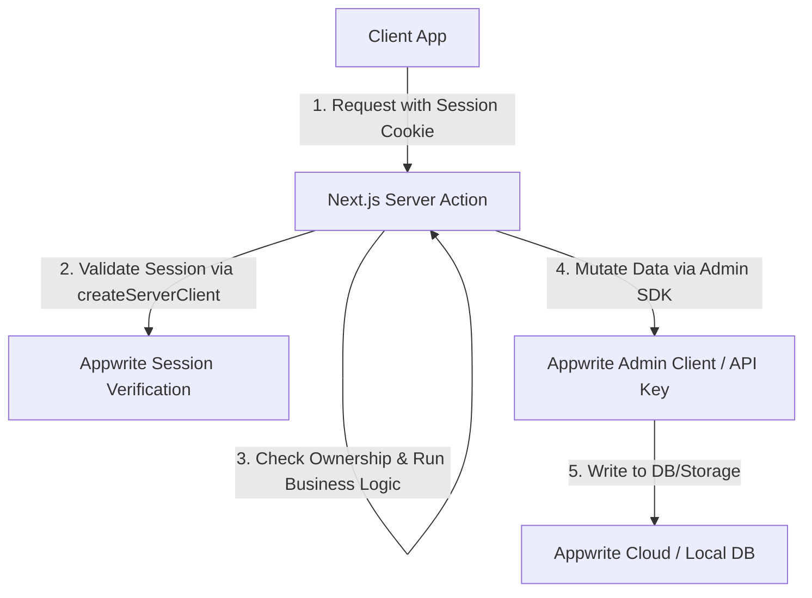
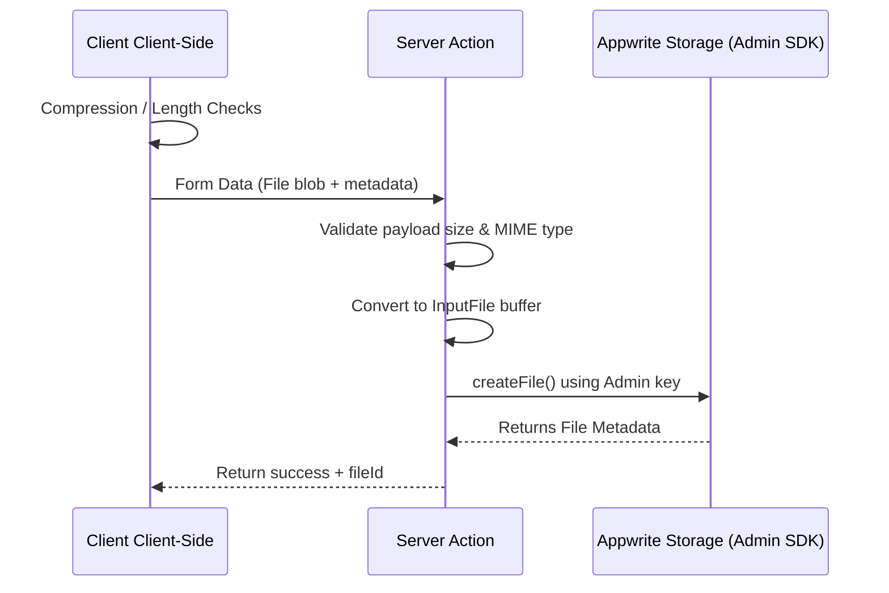

# TECHNICAL SPECIFICATION: SERVER-SIDE STORAGE & DATABASE VERIFICATION PIPELINE

This document describes the engineering strategy, streaming protocols, payload validation, and cryptographic isolation policies required to transition the Kylrix storage and database layers to a zero-trust server-side paradigm.

---

## 1. ENGINEERING STRATEGY & ARCHITECTURE

The objective is to replace direct client SDK database/storage operations with Server Actions. The system boundary will be redrawn to follow these rules:



### Authentication & Authorization Pipeline
1. **Session Resolution:** Server Actions will initialize `createServerClient()` which reads cookies (specifically `a_session_${projectId}`) to establish an authenticated session.
2. **Actor Verification:** Call `account.get()` to retrieve the authenticated user profile (`actor.$id`). If unauthenticated (401), reject immediately.
3. **Ownership Validation:** For updates and deletions, the server action will first fetch the document using `createAdminTablesDB()` or `createAdminClient()`. It will verify that:
   $$\text{actor.\$id} = \text{document.userId}$$
   If the actor does not own the document and is not a verified collaborator or system admin, the request returns a forbidden (403) status.
4. **Admin Execution:** The server action performs the actual write, update, or delete mutation using the Admin Client.

---

## 2. FILE HANDLING & STREAMING PIPELINE

Direct client uploads to Appwrite storage buckets are prohibited. All file uploads (Profile Pictures, Voice Notes, Attachments) are routed through Next.js Server Actions.



### A. Next.js Server Action File Streaming
Server Actions accept standard `FormData` payloads containing file blobs.
- Because Next.js Server Actions automatically parse `multipart/form-data` streams, files are temporarilybuffered.
- To prevent memory exhaustion on serverless runtime nodes, file size boundaries are strictly checked before reading the stream.
- Using the `node-appwrite` SDK, files are converted to `InputFile` streams:
  ```typescript
  import { InputFile } from 'node-appwrite';
  
  const buffer = Buffer.from(await file.arrayBuffer());
  const inputFile = InputFile.fromBuffer(buffer, file.name, file.type);
  ```

### B. Storage Validation Limits & Hard Thresholds

#### 1. Profile Picture Bucket (`profile_pictures`)
- **Client-Side Compression:** Images are drawn on an offscreen canvas and downscaled to a maximum of 512x512 pixels, then exported as high-compression JPEG or WebP files.
- **Client-Side Size Cap:** Block uploads if size exceeds **1 MB**.
- **Server-Side Verification:** The server action asserts the incoming file size is under **1 MB** and asserts the MIME type is strictly `image/jpeg`, `image/png`, or `image/webp`.

#### 2. Voice Note Bucket (`voice`)
- **Client-Side Encoding:** Voice recordings are limited to **120 seconds (2 minutes)**. The client records using the MediaRecorder API, encoding immediately to Opus inside an Ogg/WebM container at a low constant bitrate (e.g., 24kbps).
- **Client-Side Hard Cap:** The UI recorder physically terminates recording at exactly 120,000 milliseconds.
- **Server-Side Verification:** The server action reads the file buffer, asserts that the size is under **2 MB** (the theoretical ceiling for 2 minutes of highly compressed Opus audio), and verifies the audio MIME type.

#### 3. General Attachments (`notes_attachments`, `messages`, `kylrix_send`)
- **Size Limits:** Hard-capped at **10 MB** for free tier users, **50 MB** for premium users.
- **Streaming Transfer:** Files are streamed in chunks to the server and uploaded to Appwrite using the Admin SDK.

---

## 3. CRYPTOGRAPHIC ISOLATION POLICY (END-TO-END SECURITY)

Transitioning to a server-side validated state does **not** change the zero-knowledge guarantee of Kylrix private data. The security model maintains absolute cryptographic separation:

### A. The End-to-End Cryptographic Boundary
- **Zero-Knowledge Storage:** For private Notes, Vault Credentials, and Chat messages, all encryption and decryption operations are performed exclusively on the client-side within the browser context.
- **Key Location:** Decryption keys (e.g., Master Password derivatives, Conversation AES keys) are never transmitted to, processed by, or cached on the Next.js server or the Appwrite database.
- **Opaque Payloads:** The Server Actions receive pre-encrypted, opaque ciphertext strings and store them in the database exactly as received. If a malicious actor compromises the Next.js server or Appwrite backend, they will only see unreadable ciphertext blobs.

### B. Public Note Partitioning & SEO Optimization
- **Plaintext Toggling:** When a note is marked "Public", the client-side editor decrypts the note using its local key, and submits the plaintext markdown to the Server Action.
- **Server Rendering (SSR):** The public note is stored unencrypted in the Appwrite database. This allows the Next.js server to render the note layout statically (SSR) for fast page load times and optimal SEO search engine crawling.
- **Public Interaction Integration:** Public note comments, reaction tallies, and view metrics are managed strictly in plaintext, making engagement fast, responsive, and completely free of complex cryptographic keys.
