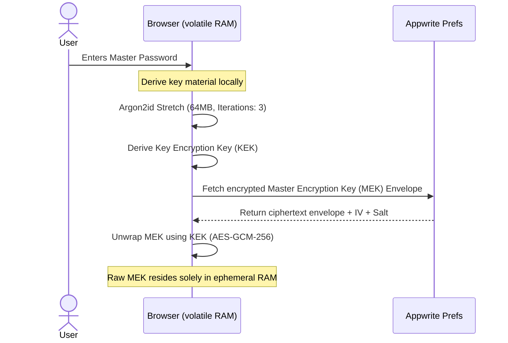

# Encryption & Security Infrastructure 🔐

Kylrix operates under a zero-trust model designed to keep secrets secure even if the backing databases are completely compromised.

---

## 1. Zero-Knowledge Cryptographic Key Management



### Key stretching & derivation
When unlocking the vault or performing high-security actions, the key derivation pipeline uses **Argon2id** as the primary hashing mechanism, falling back to **PBKDF2** for legacy clients.

*   **Argon2id (Primary)**: Memory: `65536 KB` (64 MB), Iterations: `3`, Parallelism: `4`, producing a 256-bit Key Encryption Key (KEK) using [hash-wasm](file:///home/nathfavour/code/kylrix/kylrix/lib/masterpass-crypto.ts#L43-L60).
*   **PBKDF2 (Legacy)**: Key material derived via HMAC-SHA-256 with **`600,000` iterations** using browser Web Crypto APIs [PBKDF2](file:///home/nathfavour/code/kylrix/kylrix/lib/masterpass-crypto.ts#L64-L89).

> ### WHY this is done this way:
> 
> *   **PBKDF2 stretching iterations**: We chose `600,000` iterations of PBKDF2 as it aligns directly with OWASP guidelines. The high computational cost makes hardware-accelerated dictionary attacks on compromised envelopes infeasible.
> *   **Argon2id default**: We prioritized Argon2id over basic PBKDF2 because Argon2id is memory-hard. By requiring 64MB of RAM per derivation, it creates a massive economic barrier against GPU- or ASIC-based cracking rigs.
> *   **Volatile RAM containment**: The unwrapped **Master Encryption Key (MEK)** is never written to cookies, `localStorage`, or `sessionStorage`. It resides purely in volatile JavaScript heap variables (within the [MasterPassCrypto](file:///home/nathfavour/code/kylrix/kylrix/lib/masterpass-crypto.ts) class instance). When the tab is closed, the key is permanently lost, preventing local file-system extractors from compromising credentials.
> *   **PIN Piggybacking Deprecation**: PINs have low entropy. Deriving keys directly from them makes brute-force attacks trivial. By deprecating PIN logins, we enforce that all symmetric encryption uses high-entropy derived master credentials or WebAuthn keys.

---

## 2. Row-Level Security (RLS) & Server Action Escalation

Kylrix implements a Zero-Trust permission model on the backing Appwrite database:

1.  **Read-Only RLS Defenses**: The backing database tables are configured to forbid direct client mutation calls.
2.  **Server Action Mutators**: All writes, updates, and deletes are funneled through verified server operations located in [lib/actions/secure-ops.ts](file:///home/nathfavour/code/kylrix/kylrix/lib/actions/secure-ops.ts).
3.  **Client-Side Proxy Redirection**: Client-side SDK database writes are intercepted using a standard JavaScript Proxy pattern [lib/appwrite/client.ts](file:///home/nathfavour/code/kylrix/kylrix/lib/appwrite/client.ts) to transparently route mutations through Server Actions.

> ### WHY this is done this way:
> 
> *   **Escalated Admin Context**: Client-side keys are easily intercepted. By forcing all updates through Next.js Server Actions, the server can inspect caller JWTs, sanitize payloads, verify business logic (e.g. anti-duplication rules, subscription status validation), and write changes securely using the elevated Appwrite Admin SDK client ([createServerClient](file:///home/nathfavour/code/kylrix/kylrix/lib/appwrite/server.ts)).
> *   **The Guest Rule Isolation**: Direct `Role.any()` public access on rows triggers scraping vulnerabilities. Our mandate requires public access to map to `isPublic: true` and `isGuest: true` flags, which the server action filters explicitly. This ensures that assets shared publicly automatically allow guest views while keeping private assets protected behind strict RLS.

---

## 3. High-Security React Taint Boundaries

To prevent system-level secrets from being serialized and leaked to client-side code, we enable Next.js experimental React Taint capabilities:

```typescript
// Registered on startup in server action bootstrapping
import { experimental_taintUniqueValue, experimental_taintObjectReference } from 'react';

experimental_taintUniqueValue(
  'Sensitive secret must never be sent to the client!',
  process.env.APPWRITE_API
);
```

> ### WHY this is done this way:
> 
> *   **Mathematical Leak Prevention**: Developers might accidentally return an admin configuration object or pass a process environment variable directly to a client component. By configuring React Taint to throw compile-time or run-time exceptions, we ensure that API keys and elevated clients never cross the server-client boundary.

---

## 4. Temporal Sudo Gates

For critical actions (such as exporting vault backups or modifying the master credentials), Kylrix prompts the user for their master password to activate a temporal **Sudo Mode**.

*   **Lifetime**: Exactly **5 minutes**.
*   **Storage**: Volatile, in-memory state inside [SudoContext.tsx](file:///home/nathfavour/code/kylrix/kylrix/context/SudoContext.tsx).

> ### WHY this is done this way:
> 
> *   **Session Hijacking Mitigation**: If a user leaves their computer unlocked or is targeted by a cross-site scripting attack, a long-lived authenticated state would allow adversaries to overwrite credentials or wipe the database. The 5-minute Sudo Mode limits this window of vulnerability, ensuring high-risk commands require fresh verification.
