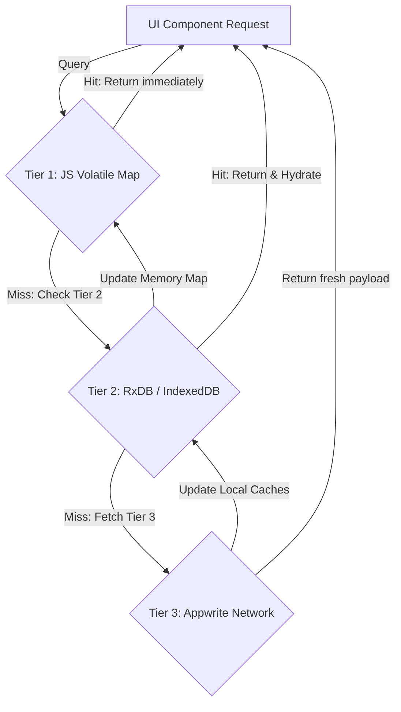

# Hybrid Data Nexus & Cache Infrastructure 🚀

Kylrix operates an offline-first data model using a hybrid synchronization layout called the **Data Nexus**. This framework coordinates local cache reads, IndexDB storage engines, and remote database requests.

---

## 1. The 3-Tier Caching Architecture

To prevent network congestion on page load, [DataNexusContext.tsx](file:///home/nathfavour/code/kylrix/kylrix/context/DataNexusContext.tsx) routes all database queries through three tiers:



### Cache Tiers

1.  **Tier 1: Volatile JavaScript Memory**: An in-memory cache mapped to active React contexts. Reading from here has zero latency.
2.  **Tier 2: RxDB Persistent Local Database**: Uses IndexedDB via [RxDBManager.ts](file:///home/nathfavour/code/kylrix/kylrix/lib/webrtc/RxDBManager.ts). Data is split into 6 schemas (`notes`, `tags`, `tasks`, `forms`, `events`, `cache`).
3.  **Tier 3: Appwrite Database**: The source of truth. Queried only when Tiers 1 and 2 miss, or during forced sync events.

---

## 2. In-Flight Request Deduplication

When multiple components attempt to load the same resource simultaneously, the Data Nexus deduplicates the promises:

```typescript
const inFlightRequests = new Map<string, Promise<any>>();

export function fetchDeduplicated(cacheKey: string, fetcher: () => Promise<any>): Promise<any> {
  if (inFlightRequests.has(cacheKey)) {
    return inFlightRequests.get(cacheKey)!;
  }
  const promise = fetcher().finally(() => inFlightRequests.delete(cacheKey));
  inFlightRequests.set(cacheKey, promise);
  return promise;
}
```

> ### WHY this is done this way:
> 
> *   **Thundering Herd Mitigation**: Without deduplication, complex pages rendering multiple widgets would execute duplicate HTTP fetches for the same user profile or settings payload. Deduplication guarantees only a single network roundtrip is performed.
> *   **Offline Capability**: RxDB acts as a resilient buffer. If the user loses network connectivity, the application continues to run out of local IndexedDB state. Mutations are stored as local drafts and queued for sync once connectivity returns.
> *   **CRDT Bidirectional Replication**: Collaborative notes sync character-level changes using a Conflict-Free Replicated Data Type (CRDT) plugin. This avoids complex locking mechanisms and prevents editors from overwriting each other's changes.

---

## 3. Reload Storm & Chained Redirect Circuit Breaker

The Next.js middleware implements network defenses in [middleware.ts](file:///home/nathfavour/code/kylrix/kylrix/middleware.ts):

*   **Reload Storm Defense**: Limits requests if a client reloads pages too rapidly (e.g. >30 times in 5 seconds). The middleware triggers a `429 Too Many Requests` response.
*   **Redirect Loop Circuit Breaker**: Tracks redirection depth using `_rd` query variables. If a user encounters a redirect loop (e.g., redirect depth > 5), the circuit breaks and forces a redirect to the landing page `/`.

> ### WHY this is done this way:
> 
> *   **Prevent Server Exhaustion**: Reload storms drain our server resources and exceed Appwrite connections. Rate-limiting at the edge protects the server infrastructure.
> *   **UX Fail-Safe**: Chained redirect loops can freeze browsers and consume bandwidth. Breaking the loop helps users recover their session if state synchronization breaks down.
