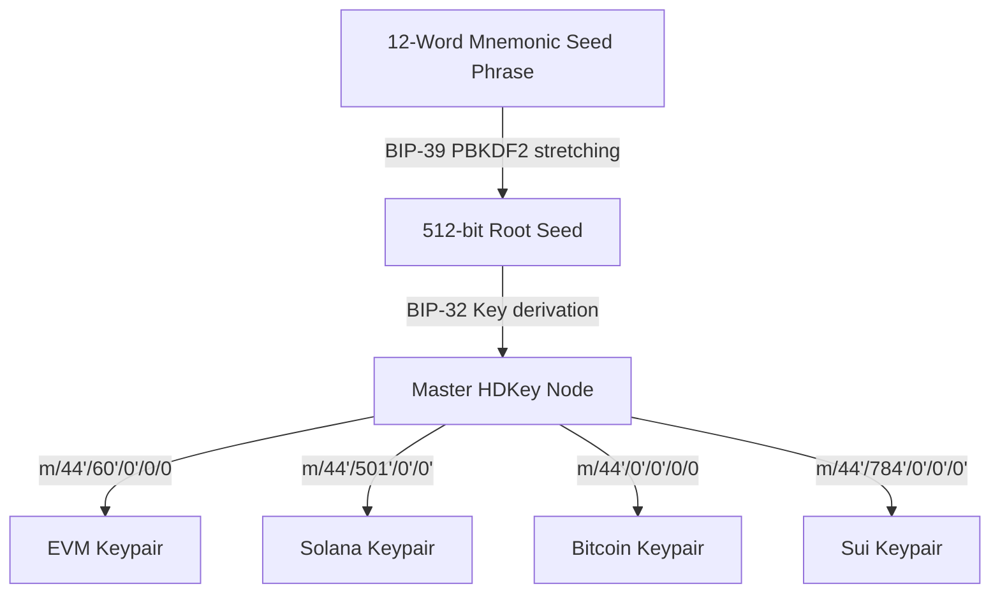

# Wallet & Multichain Integration 💳

Kylrix includes a zero-knowledge, HD (Hierarchical Deterministic) wallet substrate capable of generating keys and addresses across multiple blockchain families from a single root seed phrase.

---

## 1. Cryptographic Key Derivation Flow



The wallet implementation [lib/sdk/wallet/index.ts](file:///home/nathfavour/code/kylrix/kylrix/lib/sdk/wallet/index.ts) supports four major blockchain families:

| Chain Family | Derivation Path | Key Type | Target Chains / Tokens |
|---|---|---|---|
| **EVM** | `m/44'/60'/0'/0/0` | ECDSA (secp256k1) | Ethereum, Base, Polygon, Arbitrum, USDC |
| **Solana** | `m/44'/501'/0'/0'` | Ed25519 | Solana (SOL) |
| **Bitcoin** | `m/44'/0'/0'/0/0` | ECDSA (secp256k1) | Bitcoin (SegWit / Bech32) |
| **Sui** | `m/44'/784'/0'/0'/0'` | Ed25519 | Sui (SUI) |

---

## 2. Derivation Algorithms & Address Generation

### EVM Address Generation
EVM keys are derived using standard ECDSA `secp256k1` curves. Addresses are derived by hashing the public key with Keccak-256 and extracting the last 20 bytes:

```typescript
// From lib/sdk/wallet/index.ts
const publicKeyBytes = hdKey.publicKey;
const uncompressedPubKey = secp256k1.ProjectivePoint.fromHex(publicKeyBytes).toRawBytes(false).slice(1);
const hash = keccak_256(uncompressedPubKey);
const address = '0x' + Buffer.from(hash.slice(-20)).toString('hex');
```

> ### WHY this is done this way:
> 
> *   **Standardized Paths**: We utilize standard BIP-44 co-path identifiers (`60'` for Ethereum, `501'` for Solana, `0'` for Bitcoin, `784'` for Sui). This allows users to export their mnemonic to standard third-party wallets (like MetaMask or Phantom) and recover the exact same accounts and assets without fragmentation.
> *   **Pure TS/JS Cryptography Substrate**: We rely on pure cryptographic dependencies (`@scure/bip39`, `@scure/bip32`, `@noble/secp256k1`, `@noble/ed25519`) instead of heavy Web3 dependencies. This keeps our JS package bundles small, reduces dependencies, and avoids native node C++ bindings that fail in standard edge runtimes.
> *   **Local Decryption & Signing**: The backing seed phrase is encrypted using the user's Master Encryption Key (MEK) before writing to the Appwrite database. Decryption and key derivation occur purely on-device in the user's volatile memory. This guarantees that Kylrix server operators cannot access, inspect, or sign transactions on behalf of users.
